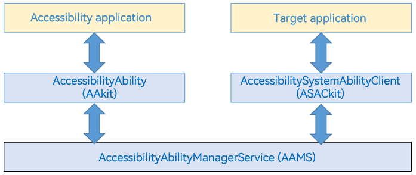

# AccessibilityExtensionAbility

The **AccessibilityExtensionAbility** module provides accessibility extension capabilities based on the **ExtensionAbility** framework. You can develop your accessibility applications by applying the **AccessibilityExtensionAbility** template to enhance usability.

> **Environment Requirements**
>
> IDE: DevEco Studio 3.0 Beta3 (3.0.0.900) or later
>
> SDK: API version 9 or later
>
> Model: stage

## AccessibilityExtensionAbility Overview

Accessibility is about giving equal access to everyone so that they can access and use information equally and conveniently under any circumstances. It helps narrow the digital divide between people of different classes, regions, ages, and health status in terms of information understanding, information exchange, and information utilization, so that they can participate in social life more conveniently and enjoy the benefits of technological advances.

AccessibilityExtensionAbility is an accessibility extension service framework. It allows you to develop your own extension services and provides a standard mechanism for exchanging information between applications and extension services. You can make use of the provided capabilities and APIs to develop accessibility features for users with disabilities or physical limitations. For example, you can develop a screen reader for users with vision impairments.

Below shows the AccessibilityExtensionAbility framework.



1. Accessibility app: extension service application developed based on the AccessibilityExtensionAbility framework, for example, a screen reader application.
2. Target app: application assisted by the accessibility app.
3. AccessibilityAbilityManagerService (AAMS): main service of the AccessibilityExtensionAbility framework, which is used to manage the lifecycle of accessibility apps and provide a bridge for information exchange between accessibility apps and target apps.
4. AccessibilityAbility (AAkit): ability that is used by the accessibility app to build an extension service ability operating environment and that provides interfaces for the accessibility app to query and operate the target app, including performing click/long press operations.
5. AccessibilitySystemAbilityClient (ASACkit): used by the target app to send accessibility events, such as content change events, to AAMS, and respond to the instructions (such as performing click/long press operations) sent by the accessibility app through AAMS.

## Creating an Accessibility Extension Service

You can create an accessibility extension service by creating a project from scratch or adding the service to an existing project. Only one accessibility extension service can be created for a project.

### Creating a Project

Perform the following steps in DevEco Studio:
1. From the upper left corner of DevEco Studio, choose **File** > **New** > **Create Project**.
2. By following the project creation wizard, click the **OpenHarmony** tab, select the **Empty Ability** template, and then click **Next**.
3. Set **Project type** to **Application**, **Compile API** (or **Compile SDK**, depending on the version used) to **9**, and **Model** to **Stage**, and then click **Finish**.

### Creating an AccessibilityExtAbility File

To add an accessibility extension service to a project, create the **AccessibilityExtAbility** folder in the **ets** folder of the project, create the **AccessibilityExtAbility.ts** file in the new folder, and add the following code to the new file:

```typescript
import AccessibilityExtensionAbility from '@ohos.application.AccessibilityExtensionAbility';

class AccessibilityExtAbility extends AccessibilityExtensionAbility {
    onConnect() {
        console.info('AccessibilityExtAbility onConnect');
    }

    onDisconnect() {
        console.info('AccessibilityExtAbility onDisconnect');
    }

    onAccessibilityEvent(accessibilityEvent) {
        console.info('AccessibilityExtAbility onAccessibilityEvent: ' + JSON.stringify(accessibilityEvent));
    }
}

export default AccessibilityExtAbility;
```

The APIs defined in the file are as follows.

| API| Description|
| ---- | ---- |
| onConnect(): void | Called when a connection with the extension service is set up.|
| onDisconnect(): void | Called when the connection with the extension service is severed.|
| onAccessibilityEvent(event: AccessibilityEvent): void | Called when an accessibility event occurs|

## Processing an Accessibility Event

You can process the service logic for accessibility events in the **onAccessibilityEvent()** API. For details about the events, see [AccessibilityEvent](../reference/apis/js-apis-application-accessibilityExtensionAbility.md#accessibilityevent). The following code snippet uses the **pageStateUpdate** event as an example.

```typescript
onAccessibilityEvent(accessibilityEvent) {
    console.info('AccessibilityExtAbility onAccessibilityEvent: ' + JSON.stringify(accessibilityEvent));
    if (accessibilityEvent.eventType === 'pageStateUpdate') {
        console.info('AccessibilityExtAbility onAccessibilityEvent: pageStateUpdate');
        // TODO: Develop custom logic.
    }
}
```
For an accessibility event, you can use the APIs of the [AccessibilityExtensionContext](../reference/apis/js-apis-inner-application-accessibilityExtensionContext.md) module to configure the concerned information, obtain root information, and inject gestures.

You can also process physical key events in the accessibility extension service. For details, see [onKeyEvent](../reference/apis/js-apis-application-accessibilityExtensionAbility.md#accessibilityextensionabilityonkeyevent).

## Declaring Capabilities of Accessibility Extension Services

After developing the custom logic for an accessibility extension service, you must add the configuration information of the service to the corresponding module-level **module.json5** file in the project directory. In the file, the **srcEntry** tag indicates the path to the accessibility extension service. Make sure the value of the **type** tag is fixed at **accessibility**. Otherwise, the connection to the service will fail.

```json
"extensionAbilities": [
  {
    "name": "AccessibilityExtAbility",
    "srcEntry": "./ets/AccessibilityExtAbility/AccessibilityExtAbility.ts",
    "label": "$string:MainAbility_label",
    "description": "$string:MainAbility_desc",
    "type": "accessibility",
    "metadata": [
      {
        "name": "ohos.accessibleability",
        "resource": "$profile:accessibility_config"
      }
    ]
  }
]
```
**accessibility_config** is the specific configuration of the accessibility extension service. You need to create the **accessibility_config.json** file in **resources/base/profile/** and declare the [capabilities](../reference/apis/js-apis-accessibility.md#capability) of the service in the file.
```json
{
  "accessibilityCapabilities": [
    "retrieve",
    "gesture"
  ]
}
```
## Enabling a Custom Accessibility Extension Service

To enable or disable an accessibility extension service, run the following command:
- To enable the service: **accessibility enable -a AccessibilityExtAbility -b com.example.demo -c rg**
- To disable the service: **accessibility disable -a AccessibilityExtAbility -b com.example.demo**

In the preceding commands, **AccessibilityExtAbility** indicates the name of the accessibility extension service, **com.example.demo** indicates the bundle name, and **rg** indicates the capabilities (**r** is short for retrieve).

If the service is enabled or disabled successfully, the message "enable ability successfully" or "disable ability successfully" is displayed.

