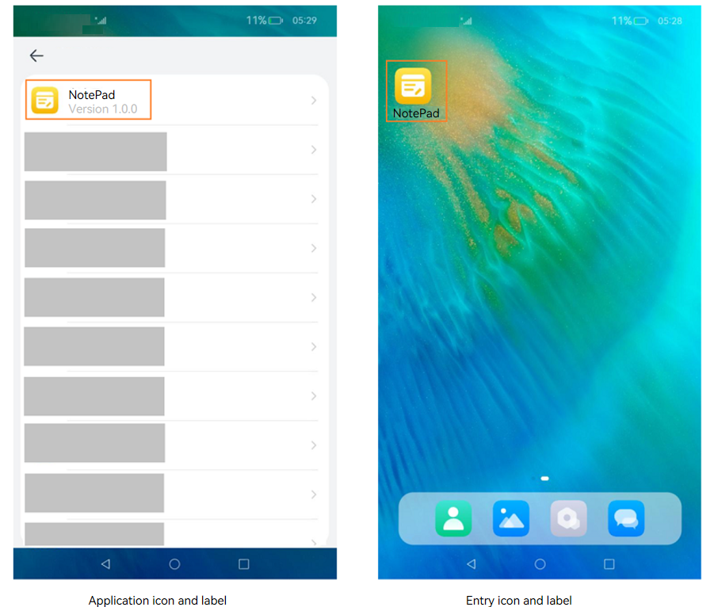

# Application- or Component-Level Configuration (Stage Model)


When developing an application, you may need to configure certain tags to identify the application, such as the bundle name and application icon. This topic describes key tags that need to be configured during application development. Icons and labels are usually configured together. There is the application icon, application label, entry icon, and entry label, which correspond to the **icon** and **label** fields in the [app.json5 file](../quick-start/app-configuration-file.md) and [module.json5 file](../quick-start/module-configuration-file.md). The application icon and label are used in **Settings**. For example, they are displayed in the application list in **Settings**. The entry icon is displayed on the device's home screen after the application is installed. The entry icon maps to a [UIAbility](uiability-overview.md) component. Therefore, an application can have multiple entry icons and labels. When you touch one of them, the corresponding UIAbility page is displayed.


  **Figure 1** Icons and labels 




- **Configuring the bundle name**
  
  The bundle name is specified by the **bundleName** field in the [app.json5 file](../quick-start/app-configuration-file.md) in the **AppScope** directory of the project. This field uniquely identifies an application. You are advised to use the reverse domain name notion, for example, *com.example.demo*, where the first part is the domain suffix **com**, the second part is the vendor/individual name, and the third part is the application name, which can be of multiple levels.
  
- **Configuring the application icon and label**

  The application icon is specified by the **icon** field in the [app.json5 file](../quick-start/app-configuration-file.md) in the **AppScope** directory of the project. The **icon** field must be set to the index of an image so that the image is displayed as the application icon. The application icon is usually displayed in an application list, for example, the application list in **Settings**.

  The application label is specified by the **label** field in the [app.json5 file](../quick-start/app-configuration-file.md) in the **AppScope** module of the project. The **label** field specifies the application name displayed to users. It must be set to the index of a string resource.

  The **icon** and **label** fields in the **app.json5** file are under **app**, as follows:   

  ```json
    {
      "app": {
        "icon": "$media:app_icon",
        "label": "$string:app_name"
        // ...
      }
    }
  ```

- **Configuring the entry icon and label**
  
    The entry icon and label are configured by specifying **icon** and **label** under **abilities** in the [module.json5 file](../quick-start/module-configuration-file.md). For example, if you want to display the icon and label of the UIAbility component on the home screen, add **entity.system.home** to **entities** and **action.system.home** to **actions** under **skills**. If the preceding fields are configured for multiple UIAbility components of an application, multiple icons and labels are displayed on the home screen, corresponding to their respective UIAbility component.
  
  ```json
  {
    "module": {
      // ...
      "abilities": [
        {
          // The information starting with $ is the resource value.
          "icon": "$media:icon",
          "label": "$string:EntryAbility_label",
          "skills": [
            {
              "entities": [
                "entity.system.home"
              ],
              "actions": [
                "action.system.home"
              ]
            }
          ],
        }
      ]
    }
  }
  ```
- **Configuring application version declaration**
  
  To declare the application version, configure the **versionCode** and **versionName** fields in the [app.json5 file](../quick-start/app-configuration-file.md) in the **AppScope** directory of the project. **versionCode** specifies the version number of the application. The value is a 32-bit non-negative integer. It is used only to determine whether a version is later than another version. A larger value indicates a later version. **versionName** provides the text description of the version number.
  
- **Configuring device types supported by the module**

  To configure the device types supported by the module, set the **deviceTypes** field in the [module.json5 file](../quick-start/module-configuration-file.md). If a certain device type is added to **deviceTypes**, the module can run on that device.

- **Configuring the module permission**

  The **requestPermission** field in the [module.json5 file](../quick-start/module-configuration-file.md) is used to configure the permission information required by the module to access the protected part of the system or other applications. This field declares the name of the permission to request, the reason for requesting the permission, and the scenario where the permission is used.

 <!--no_check--> 