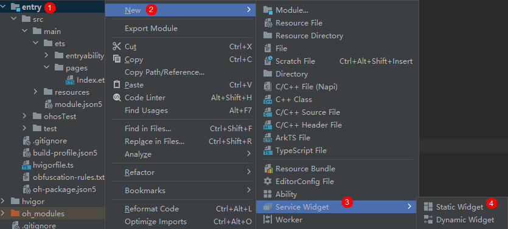
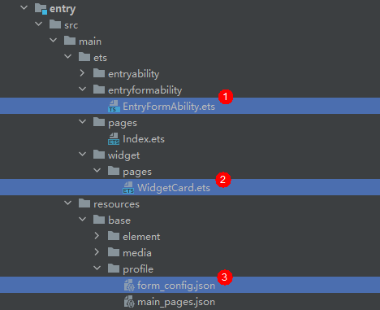

# Creating an ArkTS Widget

You can create a widget in either of the following modes:

- When creating a project, select **Application**. The project created this way does not have a widget by default. You can right-click a module folder and choose **New** > **Service Widget** to create a widget.
- When creating a project, select **Atomic Service**. The project created this way has a widget by default. You can right-click a module folder and choose **New** > **Service Widget** to create a widget.

To create an ArkTS widget in an existing project, perform the following steps:

1. Right-click a module folder and choose **New** > **Service Widget**.
   
   
   
2. Select a widget template based on the actual service scenario.

   

3. Set **Language** to **ArkTS** and click **Finish**.

   

After an ArkTS widget is created, the following widget-related files are automatically added to the project directory: **EntryFormAbility.ets** (widget lifecycle management file), **WidgetCard.ets** (widget page file), and **form_config.json** (widget configuration file).

