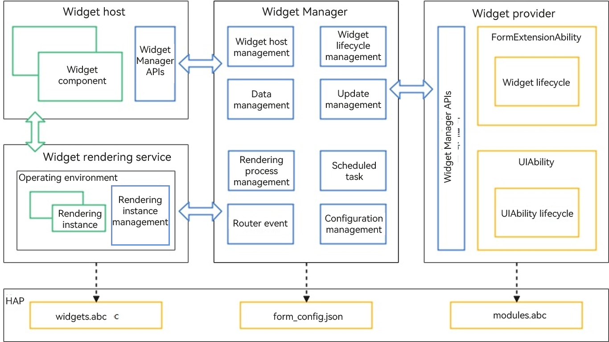
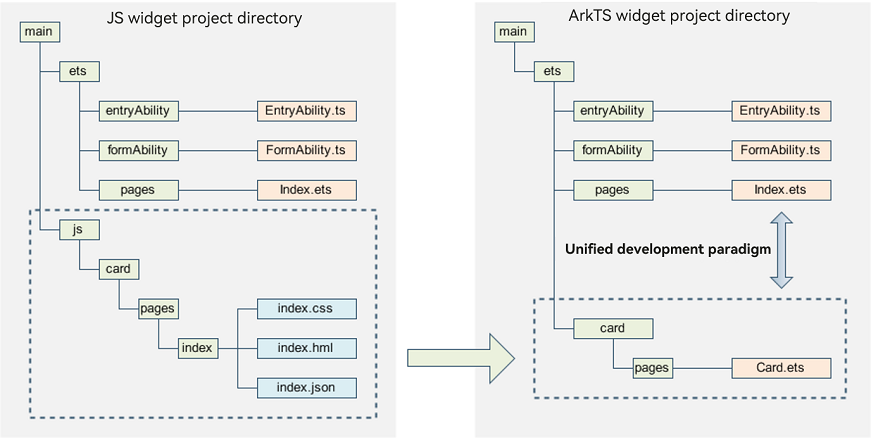

# ArkTS Widget Working Principles

## Implementation Principles

  **Figure 1** ArkTS widget implementation principles 

- Widget host: an application that displays the widget content and controls the widget location. Only the system application can function as a widget host.

- Widget provider: an application that provides the widget content to display and controls how widget components are laid out and how they interact with users.

- Widget Manager: a resident agent that manages widgets in the system. It provides the [formProvider](../reference/apis/js-apis-app-form-formProvider.md) and [formHost](../reference/apis/js-apis-app-form-formHost.md) APIs as well as widget management, usage, and periodic updates. 

- Widget rendering service: a service that manages widget rendering instances. Widget rendering instances are bound to the [widget components](../reference/arkui-ts/ts-basic-components-formcomponent.md) on the widget host on a one-to-one basis. The widget rendering service runs the widget page code **widgets.abc** for rendering, and sends the rendered data to the corresponding widget component on the widget host.

  **Figure 2** Working principles of the ArkTS widget rendering service 

Unlike JS widgets, ArkTS widgets support logic code running. To avoid potential ArkTS widget issues from affecting the use of applications, the widget page code **widgets.abc** is executed by the widget rendering service, which is managed by the Widget Manager. Each widget component of a widget host corresponds to a rendering instance in the widget rendering service. Rendering instances of an application provider run in the same virtual machine operating environment, and rendering instances of different application providers run in different virtual machine operating environments. In this way, the resources and state data are isolated between widgets of different application providers. During development, pay attention to the use of the [globalThis](uiability-data-sync-with-ui.md#using-globalthis-between-uiability-and-page) object. Use one **globalThis** object for widgets by the same application provider, and different **globalThis** objects for widgets by different application providers.

## Advantages of ArkTS Widgets

As a quick entry to applications, ArkTS widgets have the following advantages over JS widgets:

- Improved development experience and efficiency, thanks to the unified development paradigm
  ArkTS widgets share the same declarative UI development framework as application pages. This means that the page layouts can be directly reused in widgets, improving development experience and efficiency.

    **Figure 3** Comparison of widget project structures 
  

- More widget features
  - Animation: The ArkTS widget supports the [attribute animation](../reference/arkui-ts/ts-animatorproperty.md) and [explicit animation](../reference/arkui-ts/ts-explicit-animation.md) capabilities, which can be leveraged to deliver a more engaging experience.
  - Custom drawing: The ArkTS widget allows you to draw graphics with the [Canvas](../reference/arkui-ts/ts-components-canvas-canvas.md) component to present information more vividly.
  - Logic code execution: The capability to run logic code in widgets means that service logic can be self-closed in widgets, expanding the service application scenarios of widgets.

## Constraints on ArkTS Widgets

Compared with JS widgets, ArkTS widgets provide more capabilities, but they are also more prone to malicious behavior. The ArkTS widget is displayed in the widget host, which is usually the home screen. To ensure user experience and power consumption, the ArkTS widget capability is restricted as follows:

- The .so file cannot be loaded.

- The native programming language cannot be used for development.

- Only [partial](arkts-ui-widget-page-overview.md) components, events, animations, data management, state management, and API capabilities of the declarative paradigm are supported.

- The event processing of the widget is independent of that of the widget host. It is recommended that you do not use the left and right sliding components when the widget host supports left and right swipes to prevent gesture conflicts.

The following features are coming to ArkTS widgets in later versions:

- Breakpoint debugging

- import statements

- Instant preview
