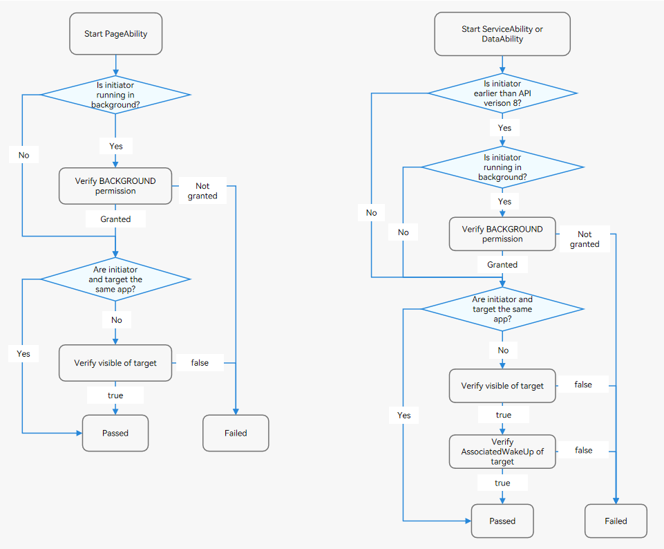

# Component Startup Rules (FA Model)

Component startup refers to the behavior of starting or connecting to an application component.

- Start the PageAbility and ServiceAbility. For example, you can use **startAbility()**.

- Connect to the ServiceAbility and DataAbility. For example, you can use **connectAbility()** and **acquireDataAbilityHelper()**.

To deliver a better user experience, OpenHarmony restricts the following behavior:

- A background application randomly displays a dialog box, such as an ad pop-up.

- Background applications wake up each other. This type of behavior occupies system resources and increases power consumption, or even causes system frozen.

- A foreground application randomly redirects to another application, for example, redirecting to the payment page of another application. This type of behavior poses security risks.

In view of this, OpenHarmony formulates a set of component startup rules, as follows:

- **Before starting a component of another application, verify the visible field of the target component.**
  - This rule applies only to cross-application scenarios.
  - If the **visible** field of the target component is **false**, verify the **ohos.permission.START_INVISIBLE_ABILITY** permission.
  - For details, see [Component Visible Configuration](../quick-start/module-configuration-file.md#abilities).

- **Before starting a component of a background application, verify the BACKGROUND permission.**
  > **NOTE**
  > 
  > Applications developed using the SDK of API version 8 or earlier are not restricted by this restriction when starting the ServiceAbility or DataAbility.

  - An application is considered as a foreground application only when the application process gains focus or its UIAbility component is running in the foreground.
  - Verify the **ohos.permission.START_ABILITIES_FROM_BACKGROUND** permission.

- **Before starting the ServiceAbility or DataAbility component of an application, verify the AssociateWakeUp field of the target application.**
  - This rule applies only to cross-application scenarios.
  - This rule is valid only when the target component is ServiceAbility or DataAbility.
  - The ServiceAbility and DataAbility of an application can be accessed by other applications only when **AssociateWakeUp** of the target application is set to **true**.
  - The **AssociateWakeUp** field can be configured only for preset applications. For other applications, this field is set to **false** by default.

> **NOTE**
> 1. Component startup control has been implemented since OpenHarmony v3.2 Release.
> 
> 2. The new component startup rules are more strict than the original ones. Get familiar with the new startup rules to prevent service exceptions.

 

## Intra-Device Component Startup Rules

  The rules for starting components on the same device vary in the following scenarios:

- Starting a PageAbility

- Starting a ServiceAbility or DataAbility

## Inter-Device Component Startup Rules

  The rules for starting components on a different device vary in the following scenarios:

- Starting a PageAbility

- Starting a ServiceAbility

