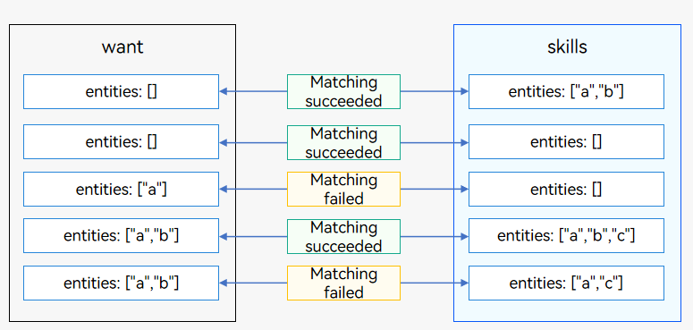
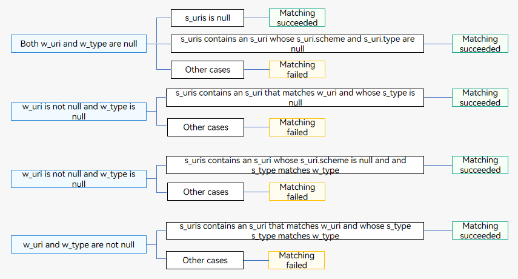

# Matching Rules of Explicit Want and Implicit Want

Both explicit Want and implicit Want can be used to match an ability to start based on certain rules. These rules determine how the parameters set in Want match the configuration file declared by the target ability.

## Matching Rules of Explicit Want

| Name| Type| Matching Item| Mandatory| Rule Description|
| -------- | -------- | -------- | -------- | -------- |
| deviceId | string | Yes| No| If this field is unspecified, only abilities on the local device are matched.|
| bundleName | string | Yes| Yes| If **abilityName** is specified but **bundleName** is unspecified, the matching fails.|
| moduleName | string | Yes| No| If this field is unspecified and multiple modules with the same ability name exist in the application, the first ability is matched by default.|
| abilityName | string | Yes| Yes| To use explicit Want, this field must be specified.|
| uri | string | No| No| This field is not used for matching. It is passed to the target ability as a parameter.|
| type | string | No| No| This field is not used for matching. It is passed to the target ability as a parameter.|
| action | string | No| No| This field is not used for matching. It is passed to the target ability as a parameter.|
| entities | Array&lt;string&gt; | No| No| This field is not used for matching. It is passed to the target ability as a parameter.|
| flags | number | No| No| This field is not used for matching and is directly transferred to the system for processing. It is generally used to set runtime information, such as URI data authorization.|
| parameters | {[key:&nbsp;string]:&nbsp;any} | No| No| This field is not used for matching. It is passed to the target ability as a parameter.|

## Matching Rules for Implicit Want

| Name       | Type                          | Matching Item| Mandatory| Rule Description                                                        |
| ----------- | ------------------------------ | ------ | ---- | ------------------------------------------------------------ |
| deviceId    | string                         | Yes    | No  | Implicit invoking is not supported across devices.                                  |
| abilityName | string                         | No    | No  | To use implicit Want, this field must be left unspecified.                                |
| bundleName  | string                         | Yes    | No  | - When only **bundleName** is specified, matching is limited to that application. - When both **bundleName** and **moduleName** are specified, matching is limited to that module in that application. - When only **moduleName** is specified, the setting is invalid.   These fields will be used for implicit matching.|
| moduleName  | string                         | Yes    | No  |                                                              |
| uri         | string                         | Yes    | No  |                                                              |
| type        | string                         | Yes    | No  |                                                              |
| action      | string                         | Yes    | No  |                                                              |
| entities    | Array&lt;string&gt;            | Yes    | No  |                                                              |
| flags       | number                         | No    | No  | This field is not used for matching and is directly transferred to the system for processing. It is generally used to set runtime information, such as URI data authorization.|
| parameters  | {[key:&nbsp;string]:&nbsp;any} | No    | No  | This field is not used for matching. It is passed to the target ability as a parameter.         |

## Interpretation of Implicit Want Matching Rules
Get familiar with the following about implicit Want:

- The **want** parameter passed by the caller indicates the operation to be performed by the caller. It also provides data and application type restrictions.

- The **skills** field declares the capabilities of the target ability. For details, see [the skills tag](../quick-start/module-configuration-file.md#skills) in the [module.json5 file](../quick-start/module-configuration-file.md).

The system matches the **want** parameter (including the **action**, **entities**, **uri**, and **type** attributes) passed by the caller against the **skills** configuration (including the **actions**, **entities**, **uris**, and **type** attributes) of the abilities one by one. When all the four attributes are matched, a dialog box is displayed for users to select a matched application.

### Matching Rules of action in the want Parameter

The system matches the **action** attribute in the **want** parameter passed by the caller against **actions** under **skills** of the abilities.

- If **action** in the passed **want** parameter is specified but **actions** under **skills** of an ability is unspecified, the matching fails.

- If **action** in the passed **want** parameter is unspecified but **actions** under **skills** of an ability is specified, the matching is successful.

- If **action** in the passed **want** parameter is specified, and **actions** under **skills** of an ability is specified and contains **action** in the passed **want** parameter, the matching is successful.

- If **action** in the passed **want** parameter is specified, and **actions** under **skills** of an ability is specified but does not contain **action** in the passed **want** parameter, the matching fails.

  **Figure 1** Matching rules of action in the want parameter

    

### Matching Rules of entities in the want Parameter

The system matches the **entities** attribute in the **want** parameter passed by the caller against **entities** under **skills** of the abilities.

- If **entities** in the passed **want** parameter is unspecified but **entities** under **skills** of an ability is specified, the matching is successful.

- If **entities** in the passed **want** parameter is unspecified but **entities** under **skills** of an ability is unspecified, the matching is successful.

- If **entities** in the passed **want** parameter is specified but **entities** under **skills** of an ability is unspecified, the matching fails.

- If **entities** in the passed **want** parameter is specified, and **entities** under **skills** of an ability is specified and contains **entities** in the passed **want** parameter, the matching is successful.

- If **entities** in the passed **want** parameter is specified, and **entities** under **skills** of an ability is specified but does not contain **entities** in the passed **want** parameter, the matching fails.

  **Figure 2** Matching rule of entities in the want parameter

    

### Matching Rules of uri and type in the want Parameter

When the **uri** and **type** parameters are specified in the **want** parameter to initiate a component startup request, the system traverses the list of installed components and matches the **uris** array under **skills** of the abilities one by one. If one of the **uris** arrays under **skills** matches the **uri** and **type** in the passed **want**, the matching is successful.

There are four combinations of **uri** and **type** settings. The matching rules are as follows:

- Neither **uri** or **type** is specified in the **want** parameter.
  - If the **uris** array under **skills** of an ability is unspecified, the matching is successful.
  - If the **uris** array under **skills** of an ability contains an URI element whose **scheme** and **type** are unspecified, the matching is successful.
  - In other cases, the matching fails.

- Only **uri** is specified in the **want** parameter.
  - If the **uris** array under **skills** of an ability is unspecified, the matching fails.
  - If the **uris** array under **skills** of an ability contains an element whose [uri is matched](#matching-rules-of-uri) and **type** is unspecified, the matching is successful. Otherwise, the matching fails.

- Only **type** is specified in the **want** parameter.
  - If the **uris** array under **skills** of an ability is unspecified, the matching fails.
  - If the **uris** array under **skills** of an ability contains an URI element whose **scheme** is unspecified and [type is matched](#matching-rules-of-type), the matching is successful. Otherwise, the matching fails.

- Both **uri** and **type** are specified in the **want** parameter, as shown in Figure 3.
  - If the **uris** array under **skills** of an ability is unspecified, the matching fails.
  - If the **uris** array under **skills** of an ability contains an element whose [uri is matched](#matching-rules-of-uri) and [type is matched](#matching-rules-of-type), the matching is successful. Otherwise, the matching fails.

Leftmost URI matching: When only **scheme**, a combination of **scheme** and **host**, or a combination of **scheme**, **host**, and **port** is configured in the **uris** array under **skills** of the ability,
the matching is successful only if the leftmost URI in the passed **want** parameter matches **scheme**, the combination of **scheme** and **host**, or the combination of **scheme**, **host**, and **port**.

**Figure 3** Matching rules when uri and type are specified in the want parameter

    

To simplify the description, **uri** and **type** passed in the **want** parameter are called **w_uri** and **w_type**, respectively; the **uris** array under **skills** of an ability to match is called **s_uris**; each element in the array is called **s_uri**. Matching is performed from top to bottom.

**Figure 4** Matching rules of uri and type in the want parameter

  

### Matching Rules of uri

To simplify the description, **uri** in the passed **want** parameter is called **w_uri**; **uri** under **skills** of an ability to match is called **s_uri**. The matching rules are as follows:

- If **scheme** of **s_uri** is unspecified and **w_uri** is unspecified, the matching is successful. Otherwise, the matching fails.

- If **host** of **s_uri** is unspecified and **scheme** of **w_uri** and **scheme** of **s_uri** are the same, the matching is successful. Otherwise, the matching fails.

- If **port** of **s_uri** is unspecified and the combination of **scheme** and **host** of **w_uri** is the same as the combination of **scheme** and **host** of **s_uri**, the matching is successful. Otherwise, the matching fails.

- If **path**, **pathStartWith**, and **pathRegex** of **s_uri** are unspecified and the combination of **scheme**, **host**, and **port** of **w_uri** is the same as the combination of **scheme**, **host**, and **port** of **s_uri**, the matching is successful. Otherwise, the matching fails.

- If **path** of **s_uri** is specified and the **full path expressions** of **w_uri** and **s_uri** are the same, the matching is successful. Otherwise, the matching of **pathStartWith** continues.

- If **pathStartWith** of **s_uri** is specified and **w_uri** contains the prefix expression of **s_uri**, the matching is successful. Otherwise, **pathRegex** matching continues.

- If **pathRegex** of **s_uri** is specified and **w_uri** meets the regular expression of **s_uri**, the matching is successful. Otherwise, the matching fails.

> **NOTE**
>
> The **scheme**, **host**, **port**, **path**, **pathStartWith**, and **pathRegex** attributes of **uris** under **skills** of an ability are concatenated. If **path**, **pathStartWith**, and **pathRegex** are declared in sequence, **uris** can be concatenated into the following expressions:
> 
> - **Full path expression**: scheme://host:port/path
> 
> - **Prefix expression**: scheme://host:port/pathStartWith
> 
> - **Regular expression**: scheme://host:port/pathRegex
>
> - **Prefix URI expression**: When only **scheme**, a combination of **scheme** and **host**, or a combination of **scheme**, **host**, and **port** is configured in the configuration file, the matching is successful if a URI prefixed with the configuration file is passed in.
>     * `scheme://`
>     * `scheme://host`
>     * `scheme://host:port`

### Matching Rules of type

> **NOTE**
>
> The matching rules of **type** described in this section are based on the fact that **type** in the **want** parameter is specified. If **type** is unspecified, follow the [matching rules of uri and type in the want parameter](#matching-rules-of-uri-and-type-in-the-want-parameter).

To simplify the description, **uri** in the passed **want** parameter is called **w_type**, and **type** of **uris** under **skills** of an ability to match is called **s_type**. The matching rules are as follows:

- If **s_type** is unspecified, the matching fails.

- If **s_type** or **w_type** contains the wildcard `*/*`, the matching is successful.

- If the last character of **s_type** is the wildcard `*`, for example, `prefixType/*`, the matching is successful only when **w_type** contains `prefixType/`.

- If the last character of **w_type** is the wildcard `*`, for example, `prefixType/*`, the matching is successful only when **s_type** contains `prefixType/`.
