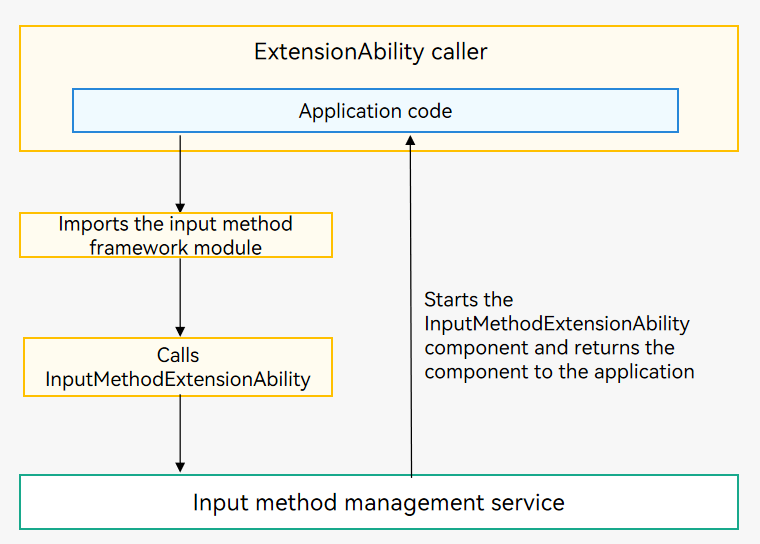

# ExtensionAbility Component Overview

The ExtensionAbility component is used for specific scenarios such as widgets and input methods.

An [ExtensionAbilityType](../reference/apis/js-apis-bundleManager.md#extensionabilitytype) is provided for every specific scenario. All types of ExtensionAbility components are managed by the corresponding system services in a unified manner. For example, the InputMethodExtensionAbility component is managed by the input method management service. The following ExtensionAbility types are supported:

- [FormExtensionAbility](../reference/apis/js-apis-app-form-formExtensionAbility.md): ExtensionAbility component of the form type, which provides APIs related to widgets.

- [WorkSchedulerExtensionAbility](../reference/apis/js-apis-resourceschedule-workScheduler.md): ExtensionAbility component of the work_scheduler type, which provides APIs for registering, canceling, and querying Work Scheduler tasks.

- [InputMethodExtensionAbility](../reference/apis/js-apis-inputmethod.md): ExtensionAbility component of the input_method type, which provides an input method framework that can be used to hide the keyboard, obtain the list of installed input methods, display the dialog box for input method selection, and more.

- [ServiceExtensionAbility](../reference/apis/js-apis-app-ability-serviceExtensionAbility.md): ExtensionAbility component of the service type, which provides APIs related to background service scenarios.

- [AccessibilityExtensionAbility](../reference/apis/js-apis-application-accessibilityExtensionAbility.md): ExtensionAbility component of the accessibility type, which provides APIs related to the accessibility feature.

- [DataShareExtensionAbility](../reference/apis/js-apis-application-dataShareExtensionAbility.md): ExtensionAbility component of the data_share type, which provides APIs for data sharing.

- [StaticSubscriberExtensionAbility](../reference/apis/js-apis-application-staticSubscriberExtensionAbility.md): ExtensionAbility component of the static_subscriber type, which provides APIs for static broadcast.

- [WindowExtensionAbility](../reference/apis/js-apis-application-windowExtensionAbility.md): ExtensionAbility component of the window type, which allows system applications to display UIs of other applications.

- [EnterpriseAdminExtensionAbility](../reference/apis/js-apis-EnterpriseAdminExtensionAbility.md): ExtensionAbility component of the enterprise_admin type, which provides APIs for processing enterprise management events, such as application installation events on devices and events indicating too many incorrect screen-lock password attempts.

## Using ExtensionAbility of the Specified Type

All types of ExtensionAbility components are started by the corresponding system management service, rather than applications, so that their lifecycles are under control by the system. The caller of the ExtensionAbility component does not need to care about its lifecycle.

The following uses [InputMethodExtensionAbility](../reference/apis/js-apis-inputmethod.md) as an example. As shown in the figure below, when an application calls the InputMethodExtensionAbility component, the input method management service is called first. The input method management service starts the InputMethodExtensionAbility component, returns the component to the application, and starts to manage its lifecycle.

**Figure 1** Using the InputMethodExtensionAbility component

## Implementing ExtensionAbility of the Specified Type

The following uses [FormExtensionAbility](../reference/apis/js-apis-app-form-formExtensionAbility.md) as an example. The widget framework provides the base class [FormExtensionAbility](../reference/apis/js-apis-app-form-formExtensionAbility.md). You derive this base class to create your own class (such as **MyFormExtensionAbility**), implement the callbacks, such as **onCreate()** and **onUpdateForm()**, to provide specific widget functionalities. For details, see [FormExtensionAbility](Widget-development-stage.md).

You do not need to care when to add or delete a widget. The lifecycle of the FormExtensionAbility instance and the lifecycle of the ExtensionAbility process where the FormExtensionAbility instance is located are scheduled and managed by FormManagerService.

> **NOTE**
>
> For an application, all ExtensionAbility components of the same type run in an independent process, whereas UIAbility, ServiceExtensionAbility, and DataShareExtensionAbility run in another independent process. For details, see [Process Model (Stage Model)](process-model-stage.md).
>
> For example, an application has one UIAbility component, one ServiceExtensionAbility, one DataShareExtensionAbility, two FormExtensionAbility, and one ImeExtensionAbility. When the application is running, there are three processes:
>
> - UIAbility, ServiceExtensionAbility, and DataShareExtensionAbility run in an independent process.
>
> - The two FormExtensionAbility components run in an independent process.
>
> - The two ImeExtensionAbility components run in an independent process.
