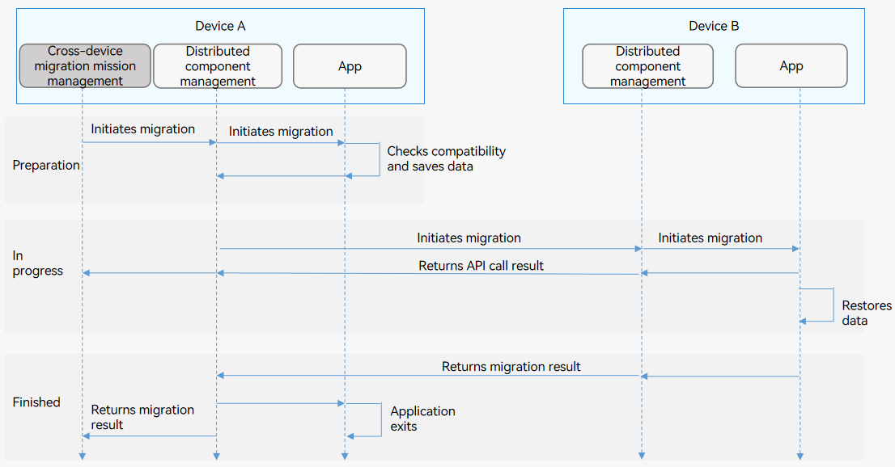

# Cross-Device Migration (for System Applications Only)


## When to Use

The main task of cross-device migration is to migrate the current task (including the page control status) of an application to the target device so that the task can continue on it. Cross-device migration supports the following functionalities:

- Storage and restoration of custom data

- Storage and restoration of page routing information and page control status data

- Application compatibility detection


## Cross-Device Migration Process

The following figure shows the cross-device migration process.

**Figure 1** Cross-device migration process 



## Constraints

- Since cross-device migration task management is not available, you can only develop applications that support cross-device migration. Your application cannot initiate migration.

- Cross-device migration can be performed between the same UIAbility component. In other words, the components must have the same **bundleName**, **abilityName**, and **signature**.


## Best Practices

For better user experience, you are advised to use the **wantParam** parameter to transmit data smaller than 100 KB.


## Available APIs

The table below describes the main APIs used for cross-device migration. For details, see [API Reference](../reference/apis/js-apis-app-ability-uiAbility.md).

**Table 1** Cross-device migration APIs

| **API**| Description|
| -------- | -------- |
| onContinue(wantParam : {[key: string]: any}): OnContinueResult | Called by the initiator to store the data required for migration and indicate whether the migration is accepted.<br>- **AGREE**: The migration is accepted.<br>- **REJECT**: The migration is rejected.<br>- **MISMATCH**: The version does not match.|
| onCreate(want: Want, param: AbilityConstant.LaunchParam): void; | Called by the target to restore the data and UI page in the multi-instance migration scenario.|
| onNewWant(want: Want, launchParams: AbilityConstant.LaunchParam): void; | Called by the target to restore the data and UI page in the singleton migration scenario.|


## How to Develop

1. Request the **ohos.permission.DISTRIBUTED_DATASYNC** permission. For details, see [Declaring Permissions in the Configuration File](../security/accesstoken-guidelines.md#declaring-permissions-in-the-configuration-file).

2. Display a dialog box to ask authorization from the user when the application is started for the first time. For details, see [Requesting User Authorization](../security/accesstoken-guidelines.md#requesting-user-authorization).

3. Configure the fields related to cross-device migration in the configuration file.

   Configure the application to support migration.
   Set the **continuable** field in the **module.json5** file to **true**. The default value is **false**. If this parameter is set to **false**, the application cannot be continued on the target device.
   
   
      ```json
      {
        "module": {
          // ...
          "abilities": [
            {
              // ...
              "continuable": true,
            }
          ]
        }
      }
      ```

   Configure the application launch type. For details, see [UIAbility Component Launch Type](uiability-launch-type.md).

4. Implement [onContinue()](../reference/apis/js-apis-app-ability-uiAbility.md#abilityoncontinue) in the UIAbility of the initiator.
   [onContinue()](../reference/apis/js-apis-app-ability-uiAbility.md#abilityoncontinue) is called on the initiator. You can save the  data in this method to implement application compatibility check and migration decision.
   - Saving migrated data: You can save the data to be migrated in key-value pairs in **wantParam**.

   - Checking application compatibility: You can obtain the version number of the target application from **wantParam** and check the compatibility between the target application and the current application.

   - Making a migration decision: You can determine whether to support the migration based on the return value of **onContinue()**. For details about the return value, see [Available APIs](#available-apis).

     The sample code is as follows:
     
     ```ts
     import UIAbility from '@ohos.app.ability.UIAbility';
     import AbilityConstant from '@ohos.app.ability.AbilityConstant';
     
     onContinue(wantParam : {[key: string]: any}) {         
         console.info(`onContinue version = ${wantParam.version}, targetDevice: ${wantParam.targetDevice}`)         
         let workInput = AppStorage.Get<string>('ContinueWork');         
         // Set the user input data into wantParam.        
         wantParam["work"] = workInput // set user input data into want params         
         console.info(`onContinue input = ${wantParam["input"]}`);         
         return AbilityConstant.OnContinueResult.AGREE     
     }
     ```

5. Implement **onCreate()** and **onNewWant()** in the UIAbility of the target application to implement data restoration.
   - Implementation example of **onCreate** in the multi-instance scenario
      - The target device determines whether the startup is **LaunchReason.CONTINUATION** based on **launchReason** in **onCreate()**.
      - You can obtain the saved migration data from the **want** parameter.
      - After data restoration is complete, call **restoreWindowStage()** to trigger page restoration.
        
         ```ts
         import UIAbility from '@ohos.app.ability.UIAbility'; 
         import AbilityConstant from '@ohos.app.ability.AbilityConstant';
         import distributedObject from '@ohos.data.distributedDataObject';  
         
         export default class EntryAbility extends UIAbility {     
             storage : LocalStorage;     
             onCreate(want, launchParam) {         
                 console.info(`EntryAbility onCreate ${AbilityConstant.LaunchReason.CONTINUATION}`)         
                 if (launchParam.launchReason == AbilityConstant.LaunchReason.CONTINUATION) {             
                     // Obtain the user data from the want parameter.            
                     let workInput = want.parameters.work             
                     console.info(`work input ${workInput}`)             
                     AppStorage.SetOrCreate<string>('ContinueWork', workInput)             
                     this.storage = new LocalStorage();             
                     this.context.restoreWindowStage(this.storage);         
                 }     
             } 
         }
         ```
   - For a singleton ability, use **onNewWant()** to achieve the same implementation.
