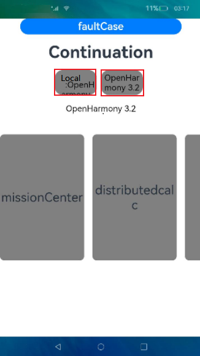
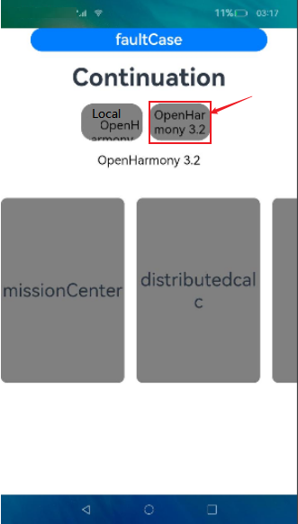
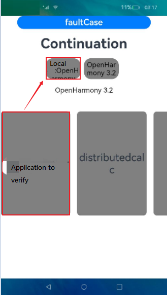

# Cross-Device Migration

## When to Use

Cross-device migration is used to migrate the current mission (including the page component status) of an application to the target device so that the mission can continue on that device. Cross-device migration supports the following features:

- Saving and restoring custom data
- Saving and restoring page routing information and page component status data
- Checking application compatibility
- Dynamically setting the mission continuation state (**ACTIVE** by default)

  For example, for an editing application, only the text editing page needs to be migrated to the target device. In this case, you can call [setMissionContinueState](../reference/apis/js-apis-inner-application-uiAbilityContext.md#uiabilitycontextsetmissioncontinuestate10) for precise control.
- Determining whether to restore the page stack (restored by default)

  If an application wants to customize the page to be displayed after being migrated to the target device, you can use [SUPPORT_CONTINUE_PAGE_STACK_KEY](../reference/apis/js-apis-app-ability-wantConstant.md#wantconstantparams) for precise control.
- Determining whether to exit the application on the initiator after a successful migration (application exit by default)

  You can use [SUPPORT_CONTINUE_SOURCE_EXIT_KEY](../reference/apis/js-apis-app-ability-wantConstant.md#wantconstantparams) for precise control.


## Cross-Device Migration Process

The following figure shows the cross-device migration process.

**Figure 1** Cross-device migration process


## Constraints

- The initiation of mission migration depends on system application control. You can implement the control capabilities by following the instructions provided in [Verification Guide](#verification-guide).
- Cross-device migration must be performed between the same UIAbility component. In other words, **bundleName**, **abilityName**, and **signature** of the component on the two devices must be the same.
- For better user experience, you are advised to use the **wantParam** parameter to transmit data smaller than 100 KB.


## Available APIs

The table below describes the main APIs used for cross-device migration. For details, see [API Reference](../reference/apis/js-apis-app-ability-uiAbility.md).

**Table 1** Cross-device migration APIs

| **API**| Description|
| -------- | -------- |
| onContinue(wantParam : {[key: string]: Object}): OnContinueResult | Called by the initiator to save the data required for migration and specify whether the migration is accepted.<br>- **AGREE**: The migration is accepted.<br>- **REJECT**: The migration is rejected. If the application is abnormal in **onContinue**, which results in abnormal display during data restoration, this error code is returned.<br>- **MISMATCH**: The version does not match. The application on the initiator can obtain the version of the target application from **onContinue**. If the migration cannot be performed due to version mismatch, this error code is returned.|
| onCreate(want: Want, launchParam: AbilityConstant.LaunchParam): void; | Called by the target to restore the data and UI page if the target uses cold start or the target is a multiton application and uses hot start. For details, see [UIAbility Component Launch Type](uiability-launch-type.md).|
| onNewWant(want: Want, launchParam: AbilityConstant.LaunchParam): void; | Called by the target to restore the data and UI page if the target is a singleton application and uses hot start. For details, see [UIAbility Component Launch Type](uiability-launch-type.md).|


## How to Develop

1. Request the **ohos.permission.DISTRIBUTED_DATASYNC** permission.

   For details, see [Declaring Permissions in the Configuration File](../security/accesstoken-guidelines.md#declaring-permissions-in-the-configuration-file).

2. Display a dialog box to ask for authorization from the user when the application is started for the first time. 

   For details, see [Requesting User Authorization](../security/accesstoken-guidelines.md##requesting-user-authorization).

3. Configure the fields related to cross-device migration in the configuration file.

   Configure the application to support migration. Set the **continuable** field in the **module.json5** file to **true**. The default value is **false**. If this parameter is set to **false**, the application cannot be continued on the target device.

   ```json
   {
     "module": {
       ...
       "abilities": [
         {
           ...
           "continuable": true,
         }
       ]
     }
   }
   ```

   Configure the application launch type. For details, see [UIAbility Component Launch Type](uiability-launch-type.md).

4. Implement [onContinue](../reference/apis/js-apis-app-ability-uiAbility.md#abilityoncontinue) in the UIAbility of the initiator.

   [onContinue](../reference/apis/js-apis-app-ability-uiAbility.md#abilityoncontinue) is called on the initiator. You can save the data in this method to implement application compatibility check and migration decision-making.

- Saving data to migrate: You can save the data to migrate in key-value pairs in **wantParam**.

- Checking application compatibility: You can obtain the version of the target application from **wantParam.version** of the **onContinue** callback. Then you can check the compatibility between that version and the version of the current application.

- Making a migration decision: You can determine migration is supported based on the return value of **onContinue**. For details about the return values, see [Available APIs](#available-apis).

  The sample code is as follows:
  
  ```ts
  import UIAbility from '@ohos.app.ability.UIAbility';
  import AbilityConstant from '@ohos.app.ability.AbilityConstant';
  
  onContinue(wantParam : {[key: string]: Object}) {
      console.info(`onContinue version = ${wantParam.version}, targetDevice: ${wantParam.targetDevice}`) // Prepare data to migrate.
      let continueInput = 'Data to migrate';
      // Save the data to migrate in the custom field (for example, data) of wantParam.
      wantParam["data"] = continueInput       
      console.info(`onContinue input = ${wantParam["input"]}`);
      return AbilityConstant.OnContinueResult.AGREE
  }
  ```

5. Restore data and load the UI.

   In the stage model, applications with different launch types can call different APIs to restore data and load the UI, as shown below.

   

   Implement **onCreate** and **onNewWant** in the UIAbility on the target device to implement data restoration.

- Implementation example of **onCreate**
   - The target device determines whether the startup is **LaunchReason.CONTINUATION** based on **launchReason** in **onCreate**.
   - You can obtain the saved data from the **want** parameter.
   - After data restoration is complete, call **restoreWindowStage** to trigger page restoration, including page stack information.
     
      ```ts
      import UIAbility from '@ohos.app.ability.UIAbility'; 
      import AbilityConstant from '@ohos.app.ability.AbilityConstant';  
      
      export default class EntryAbility extends UIAbility {     
          storage : LocalStorage;     
          onCreate(want, launchParam) {         
              console.info(`EntryAbility onCreate ${AbilityConstant.LaunchReason.CONTINUATION}`)         
              if (launchParam.launchReason == AbilityConstant.LaunchReason.CONTINUATION) {             
                  // Obtain the data saved.            
                  let continueInput = want.parameters.data             
                  console.info(`continue input ${continueInput}`) 
                  // Display the data on the current page.
                  this.storage = new LocalStorage();             
                  this.context.restoreWindowStage(this.storage);         
              }     
          } 
      }
      ```
- For a singleton application, you must also implement **onNewWant**, in the same way as **onCreate**.

   Determine the migration scenario, restore data, and trigger page restoration in **onNewWant**.

      ```ts  
      export default class EntryAbility extends UIAbility {     
          storage : LocalStorage;     
          onNewWant(want, launchParam) {         
              console.info(`EntryAbility onNewWant ${AbilityConstant.LaunchReason.CONTINUATION}`)         
              if (launchParam.launchReason == AbilityConstant.LaunchReason.CONTINUATION) {             
                  // Obtain the user data from the want parameter.            
                  let continueInput = want.parameters.data             
                  console.info(`continue input ${continueInput}`)          
                  this.storage = new LocalStorage();             
                  this.context.restoreWindowStage(this.storage);         
              }     
          } 
      }
      ```


## Configuring Optional Migration Features

### Dynamically Setting the Mission Continuation State

Since API version 10, you can dynamically set the mission continuation state. Specifically, you can enable or disable mission migration as required by calling [setMissionContinueState](../reference/apis/js-apis-inner-application-uiAbilityContext.md#uiabilitycontextsetmissioncontinuestate10). By default, **ACTIVE** is set for an application that supports migration, indicating that mission continuation is enabled.

| Value                            | Description                  |
| :------------------------------------- | ---------------------- |
| AbilityConstant.ContinueState.ACTIVE   | Mission continuation is enabled for the application.|
| AbilityConstant.ContinueState.INACTIVE | Mission continuation is disabled for the application.|

**Time for Setting the Mission Continuation State**

The change of the mission migration state can be implemented based on service requirements. Typical methods are as follows:

Call the API in the **onCreate** callback function of the UIAbility to set the mission continuation state when the application is created.

```ts
// EntryAbility.ets
onCreate(want, launchParam) {
  ...
  this.context.setMissionContinueState(AbilityConstant.ContinueState.ACTIVE, (result) => {
    console.info('setMissionContinueState ACTIVE result: ', JSON.stringify(result));
  };
  ...
}
```

Call the API in the **onPageShow** callback function of the page to set the mission continuation state when a single page is displayed.

```ts
// PageName.ets
struct PageName {
  Build() {
    ...
  }
  ...
  onPageShow(){
  // When the page is displayed, set the mission continuation state to ACTIVE.
    this.context.setMissionContinueState(AbilityConstant.ContinueState.ACTIVE, (result) => {
      console.info('setMissionContinueState ACTIVE result: ', JSON.stringify(result));
    };
  }
}
```

Set the mission continuation state in the event of a component. For example, set the state in the **onClick** event of the **Button** component.

```ts
// xxx.ets
Button(){
  ...
}
.onClick(()=>{
  // When the button is clicked, set the mission continuation state to ACTIVE.
  this.context.setMissionContinueState(AbilityConstant.ContinueState.ACTIVE, (result) => {
    console.info('setMissionContinueState ACTIVE result: ', JSON.stringify(result));
  };
})
```

**Ensuring Mission Continuation Continuity**

During UI page loading, the target application may have executed the command to set its own mission continuation state (for example, set the state to **INACTIVE** in **onCreate** during cold start or to **INACTIVE** during hot start since the peer has opened a page that cannot be migrated). To ensure a migration back to the initiator, you must set the mission continuation state to **ACTIVE** in **onCreate** and **onNewWant**.

```ts
// EntryAbility.ets
onCreate(want, launchparam) {
  ...
  // Set the mission continuation state to ACTIVE when the launch is caused by continuation. This setting copes with cold start.
  if (launchParam.launchReason == AbilityConstant.LaunchReason.CONTINUATION) {
    this.context.setMissionContinueState(AbilityConstant.ContinueState.ACTIVE, (result) => {
      console.info('setMissionContinueState ACTIVE result: ', JSON.stringify(result));
    };
  }
}

onNewWant(want, launchparam) {
  ...
  // Set the mission continuation state to ACTIVE when the launch is caused by continuation. This setting copes with hot start.
  if (launchParam.launchReason == AbilityConstant.LaunchReason.CONTINUATION) {
    this.context.setMissionContinueState(AbilityConstant.ContinueState.ACTIVE, (result) => {
      console.info('setMissionContinueState ACTIVE result: ', JSON.stringify(result));
    };
  }
}
```

### Migrating the Page Stack on Demand

Configure whether to restore the page stack. By default, the page stack is restored. If an application does not want to use the page stack restored by the system, you can set the page to be displayed on the target device in **onWindowStageRestore**. For details about the configuration, see [SUPPORT_CONTINUE_PAGE_STACK_KEY](../reference/apis/js-apis-app-ability-wantConstant.md#wantconstantparams).

The index and second routes exist in the page stack of the initiator. However, the target application wants to display a specified page, rather than that of the initiator.

Example: An application does not want automatically restored page stack information.

    ```ts
    import UIAbility from '@ohos.app.ability.UIAbility';
    import wantConstant from '@ohos.app.ability.wantConstant';
    
    onContinue(wantParam :  {[key: string]: Object}) {
        console.info(`onContinue version = ${wantParam.version}, targetDevice: ${wantParam.targetDevice}`)         
        wantParam[wantConstant.Params.SUPPORT_CONTINUE_PAGE_STACK_KEY] = false;
        return AbilityConstant.OnContinueResult.AGREE;
    }
    
    onWindowStageRestore(windowStage) {
        // Set the page to be displayed after the migration.
        windowStage.setUIContent(this.contex, "pages/index", null);
    }
    ```

### Exiting the Application on Demand

Configure whether to exit the application on the initiator after a successful migration. By default, the application on the initiator exits. If you do not want the application on the initiator to automatically exit after a successful migration, set the [SUPPORT_CONTINUE_SOURCE_EXIT_KEY](../reference/apis/js-apis-app-ability-wantConstant.md#wantconstantparams) parameter.

Example: An application on the initiator does not exit after a successful migration.

    ```ts
    import UIAbility from '@ohos.app.ability.UIAbility';
    import wantConstant from '@ohos.app.ability.wantConstant';
    
    onContinue(wantParam :  {[key: string]: Object}) {
        console.info(`onContinue version = ${wantParam.version}, targetDevice: ${wantParam.targetDevice}`)         
        wantParam[wantConstant.Params.SUPPORT_CONTINUE_SOURCE_EXIT_KEY] = false;
        return AbilityConstant.OnContinueResult.AGREE;
    }
    ```

## Verification Guide

A mission center demo is provided for you to verify the mission continuation capability of your application. The following walks you through on how to verify mission continuation by using the demo.

### Compiling and Installing the Demo

#### Environment Configuration

[Switch to the full SDK](../faqs/full-sdk-switch-guide.md) on DevEco Studio. This is because the mission center uses the system API [@ohos.distributedDeviceManager](../reference/apis/js-apis-distributedDeviceManager.md), which is not provided in the public SDK.

**NOTE**: The screenshots in this section are for reference only. The DevEco Studio and SDK versions in use prevail.

#### Demo Download

Download the mission center demo from [Sample Code](https://gitee.com/openharmony/ability_dmsfwk/tree/master/services/dtbschedmgr/test/missionCenterDemo/dmsDemo/entry/src/main).

#### Building Project Files

1. Create an empty OpenHarmony project and replace the corresponding folders with the downloaded files.


2. Complete the signature, build, and installation.

   The default signature permission provided by the automatic signature template of DevEco Studio is normal. The mission center demo requires the **ohos.permission.MANAGE_MISSIONS** permission, which is at the system_core level. Therefore, you must escalate the permission to the system_core level. Specifically, change **"apl":"normal_core"** to **"apl":"system_core"** in the **UnsgnedReleasedProfileTemplate.json** file in **openharmony\*apiVersion*\toolchains\lib**. Then sign the files as follows:

   1. Choose **File > Project Structure**.

      

   2. Click **Signing Configs** and click **OK**.

      

   3. Connect to the developer board and run the demo.

### Device Networking

1. Open the calculators of devices A and B.

2. Click the arrow in the upper right corner to select device B.

3. Select a trusted device on device B. The PIN is displayed.

4. Enter the PIN on device A.

5. Verify the networking. Enter a number on device A. If the number is displayed on device B, the networking is successful.

### Initiation Migration

1. Open your application on device B, and open the mission center demo on device A. The name of device A (Local: OpenHarmony 3.2) and the name of device B (OpenHarmony 3.2) are displayed on device A.



2. Click the name of device B. The application of device B is displayed.



3. Drag the application to the name of device A. The application on device A is started, and the application on device B exits.


