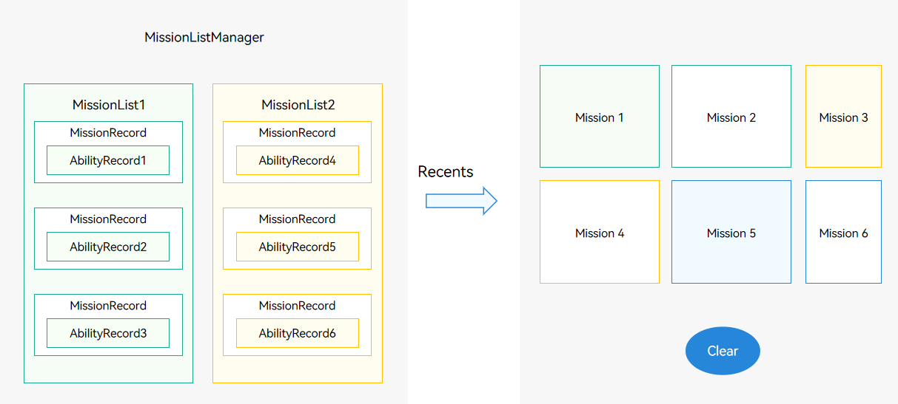

# Mission Management Scenarios


Before getting started with the development of mission management, be familiar with the following concepts related to mission management:


- AbilityRecord: minimum unit for the system service to manage a UIAbility instance. It corresponds to a UIAbility component instance of an application.

- MissionRecord: minimum unit for mission management. One MissionRecord has only one AbilityRecord. In other words, a UIAbility component instance corresponds to a mission.

- MissionList: a list of missions started from the home screen. It records the startup relationship between missions. In a MissionList, an above mission is started by the mission under it, and the mission at the bottom is started by the home screen.

- MissionListManager: system mission management module that maintains all the MissionLists and is consistent with the list in **Recents**.
  
  **Figure 1** Mission management 
  


Missions are managed by system applications (such as home screen), rather than third-party applications. Users interact with missions through **Recents**. After creating a mission, users can perform the following operations on **Recents**:


- Delete a mission.

- Lock or unlock a mission. (Locked missions are not cleared when users attempt to clear all missions in **Recents**.)

- Clear all missions in **Recents**.

- Switch a mission to the foreground.


A UIAbility instance corresponds to an independent mission. Therefore, when an application calls [startAbility()](../reference/apis/js-apis-inner-application-uiAbilityContext.md#uiabilitycontextstartability) to start a UIAbility, a mission is created.


To call [missionManager](../reference/apis/js-apis-application-missionManager.md) to manage missions, the home screen application must request the **ohos.permission.MANAGE_MISSIONS** permission. For details about the configuration, see [Permission Application Guide](../security/accesstoken-guidelines.md#declaring-permissions-in-the-configuration-file).


You can use **missionManager** to manage missions, for example, listening for mission changes, obtaining mission information or snapshots, and clearing, locking, or unlocking missions. The sample code is as follows:


```ts
import missionManager from '@ohos.app.ability.missionManager'

let listener = {
    // Listen for mission creation.
    onMissionCreated: function (mission) {
        console.info("--------onMissionCreated-------")
    },
    // Listen for mission destruction.
    onMissionDestroyed: function (mission) {
        console.info("--------onMissionDestroyed-------")
    },
    // Listen for mission snapshot changes.
    onMissionSnapshotChanged: function (mission) {
        console.info("--------onMissionSnapshotChanged-------")
    },
    // Listen for switching the mission to the foreground.
    onMissionMovedToFront: function (mission) {
        console.info("--------onMissionMovedToFront-------")
    },
    // Listen for mission icon changes.
    onMissionIconUpdated: function (mission, icon) {
        console.info("--------onMissionIconUpdated-------")
    },
    // Listen for mission name changes.
    onMissionLabelUpdated: function (mission) {
        console.info("--------onMissionLabelUpdated-------")
    },
    // Listen for mission closure events.
    onMissionClosed: function (mission) {
        console.info("--------onMissionClosed-------")
    }
};

// 1. Register a mission change listener.
let listenerId = missionManager.on('mission', listener);

// 2. Obtain the latest 20 missions in the system.
missionManager.getMissionInfos("", 20, (error, missions) => {
    console.info("getMissionInfos is called, error.code = " + error.code);
    console.info("size = " + missions.length);
    console.info("missions = " + JSON.stringify(missions));
});

// 3. Obtain the detailed information about a mission.
let missionId = 11; // The mission ID 11 is only an example.
let mission = missionManager.getMissionInfo("", missionId).catch(function (err) {
    console.info(err);
});

// 4. Obtain the mission snapshot.
missionManager.getMissionSnapShot("", missionId, (error, snapshot) => {
    console.info("getMissionSnapShot is called, error.code = " + error.code);
    console.info("bundleName = " + snapshot.ability.bundleName);
})

// 5. Obtain the low-resolution mission snapshot.
missionManager.getLowResolutionMissionSnapShot("", missionId, (error, snapshot) => {
    console.info("getLowResolutionMissionSnapShot is called, error.code = " + error.code);
    console.info("bundleName = " + snapshot.ability.bundleName);
})

// 6. Lock or unlock the mission.
missionManager.lockMission(missionId).then(() => {
    console.info("lockMission is called ");
});

missionManager.unlockMission(missionId).then(() => {
    console.info("unlockMission is called ");
});

// 7. Switch the mission to the foreground.
missionManager.moveMissionToFront(missionId).then(() => {
    console.info("moveMissionToFront is called ");
});

// 8. Clear a single mission.
missionManager.clearMission(missionId).then(() => {
    console.info("clearMission is called ");
});

// 9. Clear all missions.
missionManager.clearAllMissions().catch(function (err) {
    console.info(err);
});

// 10. Deregister the mission change listener.
missionManager.off('mission', listenerId, (error) => {
    console.info("unregisterMissionListener");
})
```
