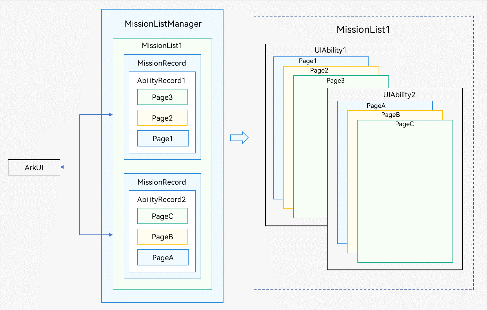
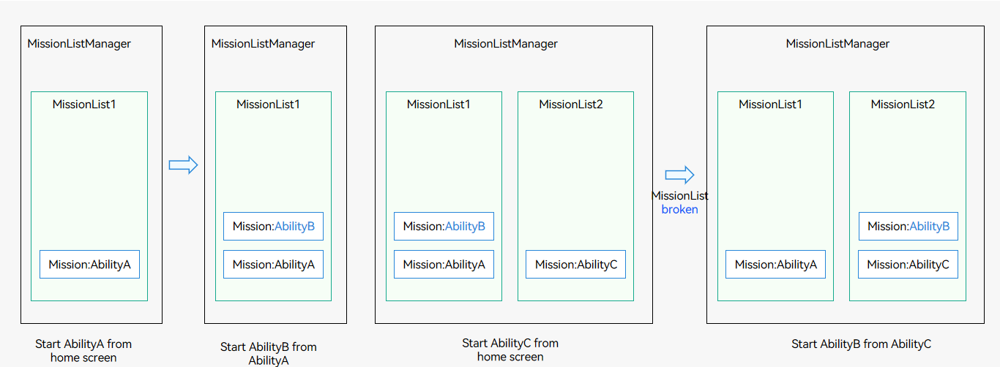

# Page Stack and MissionList

## Page Stack

A single UIAbility component can implement multiple pages and redirection between these pages. The redirection relationship inside the UIAbility component is called page stack, which is managed by the ArkUI framework. For example, Page1 -&gt; Page2 -&gt; Page3 of UIAbility1 and PageA -&gt; PageB -&gt; PageC of UIAbility2 in the figure below are two page stacks.

  **Figure 1** Page stack 

- A page stack is formed as follows (Steps 2, 3, 5, and 6 are page redirection and managed by ArkUI):
  1. Touch the icon on the home screen. The [startAbility](../reference/apis/js-apis-inner-application-uiAbilityContext.md#abilitycontextstartability) method is called to start UIAbility1, whose initial page is Page1.

  2. Touch a button on Page1. The [Navigator](../reference/arkui-ts/ts-container-navigator.md) method is called to redirect you to Page2.

  3. Touch a button on Page2. The [Navigator](../reference/arkui-ts/ts-container-navigator.md) method is called to redirect you to Page3.

  4. Touch a button on Page3. The [startAbility](../reference/apis/js-apis-inner-application-uiAbilityContext.md#abilitycontextstartability) method is called to start UIAbility2, whose initial page is PageA.

  5. Touch a button on PageA. The [Navigator](../reference/arkui-ts/ts-container-navigator.md) method is called to redirect you to PageB.

  6. Touch a button on PageB. The [Navigator](../reference/arkui-ts/ts-container-navigator.md) method is called to redirect you to PageC.

- The page stack return is as follows (Steps 1, 2, 4, and 5 are page redirection and managed by ArkUI):
  1. Touch the **Back** button on PageC of UIAbility2 to return to PageB.

  2. Touch the **Back** button on PageB of UIAbility2 to return to PageA.

  3. Touch the **Back** button on PageA of UIAbility2 to return to Page3 of UIAbility1.

  4. Touch the **Back** button on Page3 of UIAbility1 to return to Page2.

  5. Touch the **Back** button on Page2 of UIAbility1 to return to Page1 of UIAbility1.

  6. Touch the **Back** button on Page1 of UIAbility1 to return to the home screen.

## MissionList

As described above, you can keep touching the **Back** button on the page of Ability2 to return to a page of Ability1. The MissionList records the startup relationship between missions. If Ability1 starts Ability2 through **startAbility()**, a MissionList is formed: Ability1 -> Ability2. Therefore, when you touch the **Back** button on the initial page of Ability2, a page of Ability1 is displayed.

The mission startup relationship recorded by the MissionList may be broken in the following cases:

- A user moves a mission in the middle of the MissionList to the foreground.
  

- A user deletes a mission in the MissionList.
  

- A UIAbility singleton is repeatedly started by different missions. For example, AbilityB in the figure below is a singleton.
  
