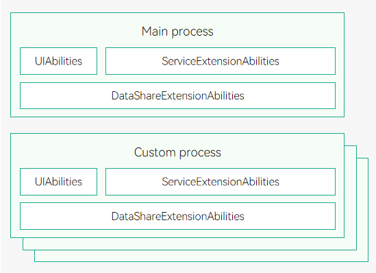

# Process Model (Stage Model)

The OpenHarmony process model is shown below.

- All UIAbility, ServiceExtensionAbility, and DataShareExtensionAbility components of an application (with the same bundle name) run in an independent process, which is **Main process** in green in the figure.

- The ExtensionAbility components of the same type (except ServiceExtensionAbility and DataShareExtensionAbility) of an application (with the same bundle name) run in an independent process, which is **FormExtensionAbility process**, **InputMethodExtensionAbility process**, and other **ExtensionAbility process** in blue in the figure.

- WebView has an independent rendering process, which is **Render process** in yellow in the figure.

  **Figure 1** Process model 

> NOTE
>
> You can create ServiceExtensionAbility and DataShareExtensionAbility only for system applications.

A system application can apply for multi-process permissions (as shown in the following figure) and configure a custom process for an HAP. UIAbility, DataShareExtensionAbility, and ServiceExtensionAbility in the HAP run in the custom process. Different HAPs run in different processes by configuring different process names.

**Figure 2** Multi-process 

OpenHarmony provides two inter-process communication (IPC) mechanisms.

- [Common Events](common-event-overview.md): This mechanism is used in one-to-many communication scenarios. Multiple subscribers may receive events at the same time.

- [Background Services](background-services.md): This mechanism is implemented through [ServiceExtensionAbility](serviceextensionability.md).
