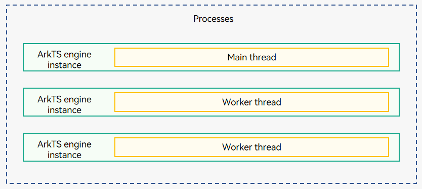

# Thread Model (Stage Model)

For an OpenHarmony application, each process has a main thread to provide the following functionalities:

- Manage other threads.

- Enable multiple UIAbility components of the same application to share the same main thread.

- Distribute input events.

- Draw the UI.

- Invoke application code callbacks (event processing and lifecycle callbacks).

- Receive messages sent by the worker thread.

In addition to the main thread, there is an independent thread, named worker. The worker thread is mainly used to perform time-consuming operations. It cannot directly operate the UI. The worker thread is created in the main thread and is independent of the main thread. A maximum of seven worker threads can be created.

Based on the OpenHarmony thread model, different services run on different threads. Service interaction requires inter-thread communication. Threads can communicate with each other in Emitter or Worker mode. Emitter is mainly used for event synchronization between threads, and Worker is mainly used to execute time-consuming tasks.

> **NOTE**
> 
> The stage model provides only the main thread and worker thread. Emitter is mainly used for event synchronization within the main thread or between the main thread and worker thread.
