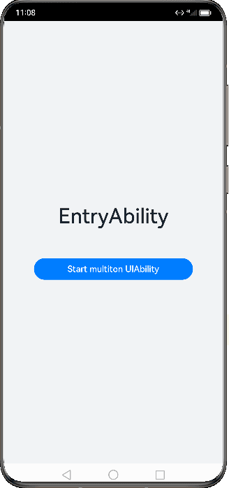
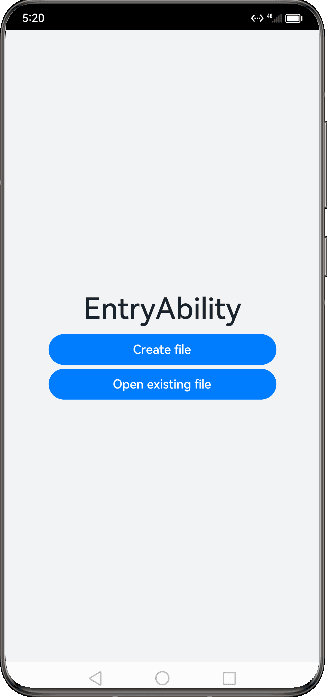

# UIAbility Launch Type


The launch type of the UIAbility component refers to the state of the UIAbility instance at startup. Three launch types are available:


- [Singleton](#singleton)

- [Multiton](#multiton)

- [Specified](#specified)


## Singleton

**singleton** is the default launch type.

Each time [startAbility()](../reference/apis/js-apis-inner-application-uiAbilityContext.md#uiabilitycontextstartability) is called, if a UIAbility instance of this type already exists in the application process, the instance is reused. In other words, UIAbility of this type can have only one instance in the system, meaning that only one mission is displayed in the system application Recents.

**Figure 1** Demonstration effect in singleton mode

  

> **NOTE**
>
> If [startAbility()](../reference/apis/js-apis-inner-application-uiAbilityContext.md#uiabilitycontextstartability) is called to start an existing UIAbility instance in singleton mode, that instance is started, and no new UIAbility instance is created. In this case, the [onNewWant()](../reference/apis/js-apis-app-ability-uiAbility.md#uiabilityonnewwant) callback is invoked, but the [onCreate()](../reference/apis/js-apis-app-ability-uiAbility.md#uiabilityoncreate) and [onWindowStageCreate()](../reference/apis/js-apis-app-ability-uiAbility.md#uiabilityonwindowstagecreate) callbacks are not.

To use the singleton mode, set **launchType** in the [module.json5 file](../quick-start/module-configuration-file.md) to **singleton**.


```json
{
  "module": {
    ...
    "abilities": [
      {
        "launchType": "singleton",
        ...
      }
    ]
  }
}
```


## Multiton

In multiton mode, each time [startAbility()](../reference/apis/js-apis-inner-application-uiAbilityContext.md#uiabilitycontextstartability) is called, a new UIAbility instance is created in the application process. Multiple missions are displayed for UIAbility of this type in Recents.  

**Figure 2** Demonstration effect in multiton mode

  

To use the multiton mode, set **launchType** in the [module.json5 file](../quick-start/module-configuration-file.md) to **multiton**.


```json
{
  "module": {
    ...
    "abilities": [
      {
        "launchType": "multiton",
        ...
      }
    ]
  }
}
```


## Specified

The **specified** mode is used in some special scenarios. For example, in a document application, you may want a document instance to be created each time you create a document, and you may also want to use the same document instance when you open an existing document.

**Figure 3** Demonstration effect in specified mode

  

In the following example, there are two UIAbility components: EntryAbility and SpecifiedAbility (with the launch type **specified**). To start SpecifiedAbility from EntryAbility, proceed as follows:

1. In SpecifiedAbility, set **launchType** in the [module.json5 file](../quick-start/module-configuration-file.md) to **specified**.

   ```json
   {
     "module": {
       ...
       "abilities": [
         {
           "launchType": "specified",
           ...
         }
       ]
     }
   }
   ```

2. Create a unique string key for the SpecifiedAbility instance. Each time [startAbility()](../reference/apis/js-apis-inner-application-uiAbilityContext.md#uiabilitycontextstartability) is called, the application, based on the key, identifies the UIAbility instance used to respond to the request. In EntryAbility, add a custom parameter, for example, **instanceKey**, to the **want** parameter in [startAbility()](../reference/apis/js-apis-inner-application-uiAbilityContext.md#uiabilitycontextstartability) to distinguish the UIAbility instances.

   ```ts
   // Configure a unique key for each UIAbility instance.
   // For example, in the document usage scenario, use the document path as the key.
   import common from '@ohos.app.ability.common';
   import Want from '@ohos.app.ability.Want';
   import { BusinessError } from '@ohos.base';

   function getInstance() {
     return 'key';
   }
   
   let context:common.UIAbilityContext = ...; // context is the UIAbilityContext of the initiator UIAbility.
   let want: Want = {
     deviceId: '', // An empty deviceId indicates the local device.
     bundleName: 'com.example.myapplication',
     abilityName: 'SpecifiedAbility',
     moduleName: 'specified', // moduleName is optional.
     parameters: { // Custom information.
       instanceKey: getInstance(),
     },
   }
   
   context.startAbility(want).then(() => {
     console.info('Succeeded in starting ability.');
   }).catch((err: BusinessError) => {
     console.error(`Failed to start ability. Code is ${err.code}, message is ${err.message}`);
   })
   ```

3. Before SpecifiedAbility is started, the [onAcceptWant()](../reference/apis/js-apis-app-ability-abilityStage.md#abilitystageonacceptwant) callback of the corresponding AbilityStage instance is invoked to obtain the key of the target UIAbility. If a UIAbility instance matching the key exists, the system starts the UIAbility instance and invokes its [onNewWant()](../reference/apis/js-apis-app-ability-uiAbility.md#abilityonnewwant) callback. Otherwise, the system creates a new UIAbility instance and invokes its [onCreate()](../reference/apis/js-apis-app-ability-uiAbility.md#uiabilityoncreate) and [onWindowStageCreate()](../reference/apis/js-apis-app-ability-uiAbility.md#uiabilityonwindowstagecreate) callbacks.

   In the sample code, the [onAcceptWant()](../reference/apis/js-apis-app-ability-abilityStage.md#abilitystageonacceptwant) callback uses the passed **want** parameter to obtain the custom parameter **instanceKey**. The service logic returns a key string based on the **instanceKey** parameter to identify the UIAbility instance. If the returned key maps to a started UIAbility instance, the system pulls the UIAbility instance back to the foreground and gives it the focus. If the returned key does not map to a started UIAbility instance, the system creates a new UIAbility instance and starts it.

   ```ts
   import AbilityStage from '@ohos.app.ability.AbilityStage';
   import Want from '@ohos.app.ability.Want';
   
   export default class MyAbilityStage extends AbilityStage {
     onAcceptWant(want: Want): string {
       // In the AbilityStage instance of the callee, a key string corresponding to a UIAbility instance is returned for UIAbility whose launch type is specified.
       // In this example, SpecifiedAbility of module1 is returned.
       if (want.abilityName === 'SpecifiedAbility') {
         // The returned key string is a custom string.
         if (want.parameters) {
           return `SpecifiedAbilityInstance_${want.parameters.instanceKey}`;
         }
       }
   
       return '';
     }
   }
   ```

   > **NOTE**
   >
   > - If [startAbility()](../reference/apis/js-apis-inner-application-uiAbilityContext.md#uiabilitycontextstartability) is called to start an existing UIAbility instance in specified mode, and the [onAcceptWant()](../reference/apis/js-apis-app-ability-abilityStage.md#abilitystageonacceptwant) callback of [AbilityStage](../reference/apis/js-apis-app-ability-abilityStage.md) matches that UIAbility instance, that instance is started, and no new UIAbility instance is created. In this case, the [onNewWant()](../reference/apis/js-apis-app-ability-uiAbility.md#abilityonnewwant) callback is invoked, but the [onCreate()](../reference/apis/js-apis-app-ability-uiAbility.md#uiabilityoncreate) and [onWindowStageCreate()](../reference/apis/js-apis-app-ability-uiAbility.md#uiabilityonwindowstagecreate) callbacks are not.
   >
   > - AbilityStage is not automatically generated by default in the project of DevEco Studio. For details about how to create an AbilityStage file, see [AbilityStage Component Container](abilitystage.md).
   

For example, in the document application, different keys are bound to different document instances. Each time a document is created, a new key (for example, file path) is passed in, and a new UIAbility instance is created when UIAbility is started in AbilityStage. However, when an existing document is opened, the same UIAbility instance is started again in AbilityStage.

The following steps are used as an example.

   1. Open file A. A UIAbility instance, UIAbility instance 1, is started.
   2. Close the process of file A in Recents. UIAbility instance 1 is destroyed. Return to the home screen and open file A again. A new UIAbility instance, UIAbility instance 2, is started.
   3. Return to the home screen and open file B. A new UIAbility instance, UIAbility instance 3, is started.
   4. Return to the home screen and open file A again. UIAbility instance 2 is started. This is because the system automatically matches the key with the UIAbility instance and starts the UIAbility instance that has a matching key. In this example, UIAbility instance 2 has the same key as file A. Therefore, the system pulls back UIAbility instance 2 and focuses it without creating a new instance.
