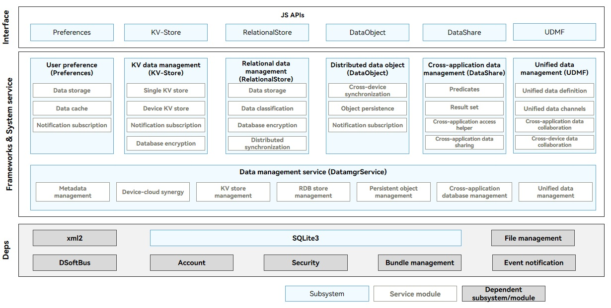

# Data Management Overview

## Function

Data management provides data storage, management, and synchronization capabilities. For example, you can store the Contacts application data in database for secure management and shared access, and synchronize the Contacts information with a smart watch.

- Data storage: provides data persistence capabilities, which can be classified into user preferences, key-value (KV) stores, and relational database (RDB) stores by data characteristics.

- Data management: provides efficient data management capabilities, including permission management, data backup and restoration, and dataShare framework.

- Data synchronization: provides data synchronization across devices. For example, distributed data objects support sharing of memory objects across devices, and distributed databases support database access across devices.

The database stores created by an application are saved to the application sandbox. When the application is uninstalled, the database stores are automatically deleted.

## Working Principles

The data management module includes preferences, KV data management (KV-Store), relational data management (RelatoinalStore), distributed data object (DataObject), cross-application data management (DataShare), and unified data management framework (UDMF). The interface layer provides standard JavaScript APIs for application development. The Frameworks&System service layer implements storage and synchronization of component data, and provides dependencies for SQLite and other subsystems.

**Figure 1** Data management architecture

- **Preferences**: implements persistence of lightweight configuration data and supports subscription of data change notifications. Preferences are used to store application configuration information and user preference settings and do not support distributed synchronization.

- **KV-Store**: implements read, write, encryption, and manual backup of data in KV stores and notification subscription. When an application needs to use the distributed capabilities of KV stores, KV-Store sends a synchronization request to DatamgrService to implement data synchronization across devices.

- **RelationalStore**: implements addition, deletion, modification, query, encryption, manually backup of data in RDB stores, and notification subscription. When an application needs to use the distributed capabilities of an RDB store, RelationalStore sends a synchronization request to DatamgrService to implement data synchronization across devices.

- **DataObject**: independently provides distributed capabilities for the data of object structs. For the object data that is still required after the restart of an application (either the cross-device application or local device application), the **DatamgrService** implements temporary storage of the object data.

- **DataShare**: provides the data provider-consumer mode to implement addition, deletion, modification, and query of cross-application data on a device, and notification subscription. **DataShare** is not bound to any database and can interact with RDB and KV stores. You can also encapsulate your own databases for C/C++ applications.  In addition to the provider-consumer mode, **DataShare** provides silent access, which allows direct access to the provider's data via the DatamgrService proxy instead of starting the provider. Currently, only the RDB stores support silent access.

- **UDMF**: defines the data language and standards for cross-application and cross-device data interaction, improving data interaction efficiency. The UDMF provides secure and standard data transmission channels and supports different levels of data access permissions and lifecycle management policies. It helps implement efficient data sharing across applications and devices.

- **DatamgrService**: implements synchronization and cross-application sharing for other components, including cross-device synchronization of **RelationalStore** and **KV-Store**, silent access to provider data of **DataShare**, and temporary storage of **DataObject** synchronization object data.

