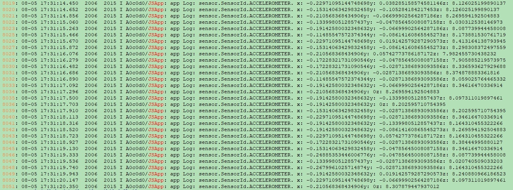

# Sensor Development


## When to Use

With the sensor module, a device can obtain sensor data. For example, the device can subscribe to data of the orientation sensor to detect its own orientation, and data of the pedometer sensor to learn the number of steps the user walks every day.

For details about the APIs, see [Sensor](../reference/apis/js-apis-sensor.md).


## Available APIs

| Module| API| Description|
| -------- | -------- | -------- |
| ohos.sensor | sensor.on(sensorId, callback:AsyncCallback&lt;Response&gt;): void | Subscribes to data changes of a type of sensor.|
| ohos.sensor | sensor.once(sensorId, callback:AsyncCallback&lt;Response&gt;): void | Subscribes to only one data change of a type of sensor.|
| ohos.sensor | sensor.off(sensorId, callback?:AsyncCallback&lt;void&gt;): void | Unsubscribes from sensor data changes.|


## How to Develop

1. Before obtaining data from a type of sensor, check whether the required permission has been configured.<br>
     The system provides the following sensor-related permissions:
   - ohos.permission.ACCELEROMETER

   - ohos.permission.GYROSCOPE

   - ohos.permission.ACTIVITY_MOTION

   - ohos.permission.READ_HEALTH_DATA

   For details about how to configure a permission, see [Declaring Permissions](../security/accesstoken-guidelines.md).
   
2. Subscribe to data changes of a type of sensor. The following uses the acceleration sensor as an example.
  
   ```ts
   import sensor from "@ohos.sensor";

   sensor.on(sensor.SensorId.ACCELEROMETER, function (data) {
   console.info("Succeeded in obtaining data. x: " + data.x + "y: " + data.y + "z: " + data.z); // Data is obtained.
   });
   ```
   
   

3. Unsubscribe from sensor data changes.
  
   ```ts
   import sensor from "@ohos.sensor";
   sensor.off(sensor.SensorId.ACCELEROMETER);
   ```
   
   

4. Subscribe to only one data change of a type of sensor.
  
   ```ts
   import sensor from "@ohos.sensor";

   sensor.once(sensor.SensorId.ACCELEROMETER, function (data) {
   console.info("Succeeded in obtaining data. x: " + data.x + "y: " + data.y + "z: " + data.z); // Data is obtained.
   });
   ```
   
   

   If the API fails to be called, you are advised to use the **try/catch** statement to capture error information that may occur in the code. Example:

    ```ts
   import sensor from "@ohos.sensor";

   try {
   sensor.once(sensor.SensorId.ACCELEROMETER, function (data) {
      console.info("Succeeded in obtaining data. x: " + data.x + "y: " + data.y + "z: " + data.z); // Data is obtained.
   });
   } catch (error) {
   console.error(`Failed to get sensor data. Code: ${error.code}, message: ${error.message}`);
   }
    ```
