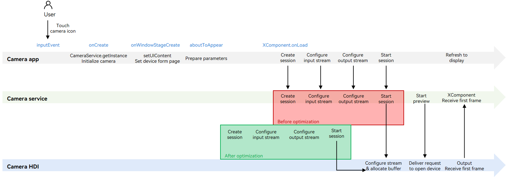
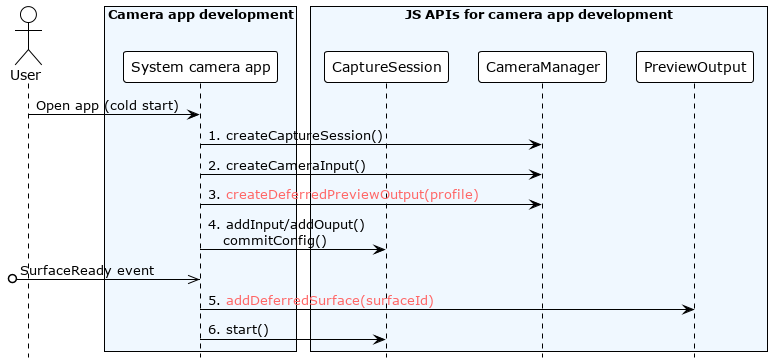
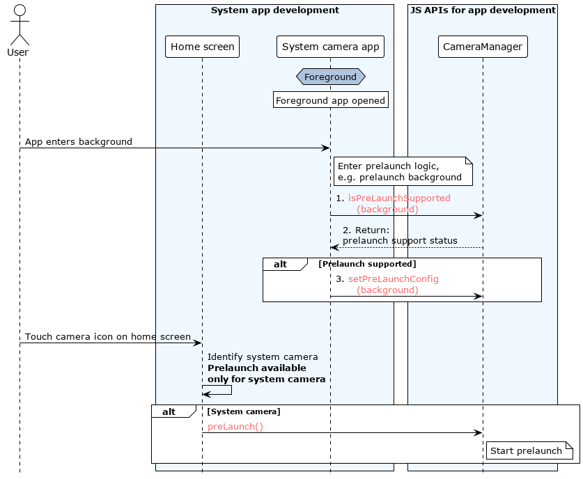

# Using Performance Improvement Features (for System Applications Only)

The camera startup performance is affected by time-consuming operations such as power-on of underlying components and initialization of the process pipeline. To improve the camera startup speed and thumbnail display speed, OpenHarmony introduces some features. The capabilities of these features are related to underlying components. You need to check whether these capabilities are supported before using them.

These features are involved in the processes of starting the camera device, configuring streams, and taking photos. This topic describes the three scenarios.

## Deferred Stream Configuration

A typical camera startup process includes starting the camera device, configuring a data stream, and starting the data stream. Before configuring the data stream, you need to obtain the surface ID of the **\<XComponent>**.

The deferred stream configuration feature decouples stream configuration and start from the surface. Before the **\<XComponent>** provides the surface for the camera application, the system configures and starts the stream. This way, the surface only needs to be available before the stream is started. This improves the startup speed and prevents the implementation of other startup optimization schemas from being affected.



Before optimization: Stream configuration depends on a **Surface** object, which is available after UI loading is complete. In other words, you can create a session, configure input and output streams, and start the session only after the UI is loaded. The camera HDI is responsible for stream configuration.

After optimization: Stream configuration does not depend on the **Surface** object. UI loading and stream configuration are executed concurrently. After the parameters are prepared, you can create a session.

### Available APIs

Read [Camera](../reference/apis/js-apis-camera.md) for the API reference.

| API| Description|
| ---- | ---- |
| createDeferredPreviewOutput(profile: Profile): Promise\<PreviewOutput> | Creates a deferred **PreviewOutput** instance and adds it to the data stream instead of a common **PreviewOutput** instance during stream configuration.|
| addDeferredSurface(surfaceId: string): Promise\<void> | Adds a surface for delayed preview. This API can run after **session.commitConfig()** or **session.start()** is called.|

### Development Example

The figure below shows the recommended API call process.



There are multiple [methods for obtaining the context](../application-models/application-context-stage.md).

```ts
import camera from '@ohos.multimedia.camera';
import featureAbility from '@ohos.ability.featureAbility';

async function preview(context: featureAbility.Context, cameraInfo: camera.CameraDevice, previewProfile: camera.Profile, photoProfile: camera.Profile, surfaceId: string): Promise<void> {
  const cameraManager: camera.CameraManager = camera.getCameraManager(context);
  const cameraInput: camera.CameraInput = cameraManager.createCameraInput(cameraInfo);
  const previewOutput: camera.PreviewOutput = await cameraManager.createDeferredPreviewOutput(previewProfile);
  const photoOutput: camera.PhotoOutput = cameraManager.createPhotoOutput(photoProfile, surfaceId);
  const session: camera.CaptureSession  = cameraManager.createCaptureSession();
  session.beginConfig();
  session.addInput(cameraInput);
  session.addOutput(previewOutput);
  session.addOutput(photoOutput);
  await session.commitConfig();
  await session.start();
  await previewOutput.addDeferredSurface(surfaceId);
}
```

## Quick Thumbnail

The photographing performance depends on the algorithm processing speed. A complex algorithm chain provides better image effect while requiring longer processing time.

To improve the photographing speed perceived by end users, the quick thumbnail feature is introduced. When the user takes a photo, a thumbnail is output and reported to the camera application for display before a real image is reported.

In this way, the photographing process is optimized, which fulfills the processing requirements of the post-processing algorithm without blocking the photographing speed of the foreground.

### Available APIs

Read [Camera](../reference/apis/js-apis-camera.md) for the API reference.

| API| Description|
| ---- | ---- |
| isQuickThumbnailSupported() : boolean | Checks whether the quick thumbnail feature is supported.|
| enableQuickThumbnail(enabled:bool): void | Enables or disables the quick thumbnail feature.|
| on(type: 'quickThumbnail', callback: AsyncCallback\<image.PixelMap>): void | Listens for camera thumbnails.|

> **NOTE**
>
> - **isQuickThumbnailSupported** and **enableQuickThumbnail** must be called after **CaptureSession.addOutput** and **CaptureSession.addInput** but before **CaptureSession.commitConfig()**.
> - **on()** takes effect after **enableQuickThumbnail(true)** is called.

### Development Example

The figure below shows the recommended API call process.


There are multiple [methods for obtaining the context](../application-models/application-context-stage.md).
```ts
import camera from '@ohos.multimedia.camera';
import { BusinessError } from '@ohos.base';
import image from '@ohos.multimedia.image';
import featureAbility from '@ohos.ability.featureAbility';

async function enableQuickThumbnail(context: featureAbility.Context, surfaceId: string, photoProfile: camera.Profile): Promise<void> {
  let cameraManager: camera.CameraManager = camera.getCameraManager(context);
  let cameras: Array<camera.CameraDevice> = cameraManager.getSupportedCameras();
  // Create a CaptureSession instance.
  let captureSession: camera.CaptureSession = cameraManager.createCaptureSession();
  // Start configuration for the session.
  captureSession.beginConfig();
  // Add a CameraInput instance to the session.
  let cameraInput: camera.CameraInput = cameraManager.createCameraInput(cameras[0]);
  cameraInput.open();
  captureSession.addInput(cameraInput);
  // Add a PhotoOutput instance to the session.
  let photoOutPut: camera.PhotoOutput = cameraManager.createPhotoOutput(photoProfile, surfaceId);
  captureSession.addOutput(photoOutPut);
  let isSupported: boolean = photoOutPut.isQuickThumbnailSupported();
  if (isSupported) {
    // Enable the quick thumbnail feature.
    photoOutPut.enableQuickThumbnail(true);
    photoOutPut.on('quickThumbnail', (err: BusinessError, pixelMap: image.PixelMap) => {
      if (err || pixelMap === undefined) {
        console.error('photoOutPut on thumbnail failed');
        return;
      }
      // Display or save the PixelMap instance.
      showOrSavePicture(pixelMap);
    })
  }
}

function showOrSavePicture(pixelMap: image.PixelMap): void {
  //do something
}
```

## Prelaunch

Generally, the startup of the camera application is triggered when the user touches the camera icon on the home screen. The home screen senses the touch event and instructs the application manager to start the camera application. This takes a relatively long time. After the camera application is started, the camera startup process starts. A typical camera startup process includes starting the camera device, configuring a data stream, and starting the data stream, which is also time-consuming.

The prelaunch feature triggers the action of starting the camera device before the camera application is started. In other words, when the user touches the camera icon on the home screen, the system starts the camera device. At this time, the camera application is not started yet. The figure below shows the camera application process before and after the prelaunch feature is introduced.


### Available APIs

Read [Camera](../reference/apis/js-apis-camera.md) for the API reference.

| API| Description|
| ---- | ---- |
| isPrelaunchSupported(camera: CameraDevice) : boolean |  Checks whether the camera supports prelaunch.|
| setPrelaunchConfig(prelaunchConfig: PrelaunchConfig) : void | Sets the prelaunch parameters.|
| prelaunch() : void | Prelaunches the camera. This API is called when a user clicks the system camera icon to start the camera application.|

### Development Example

The figure below shows the recommended API call process.



There are multiple [methods for obtaining the context](../application-models/application-context-stage.md).

- **Home screen**

  ```ts
  import camera from '@ohos.multimedia.camera';
  import { BusinessError } from '@ohos.base';
  import featureAbility from '@ohos.ability.featureAbility';

  function preLaunch(context: featureAbility.Context): void {
    let cameraManager: camera.CameraManager = camera.getCameraManager(context);
    try {
      cameraManager.prelaunch();
    } catch (error) {
      let err = error as BusinessError;
      console.error(`catch error: Code: ${err.code}, message: ${err.message}`);
    }
  }
  ```

- **Camera application**

  To use the prelaunch feature, the camera application must configure the **ohos.permission.CAMERA** permission.

  For details about how to request and verify the permissions, see [Permission Application Guide](../security/accesstoken-guidelines.md).

  ```ts
  import camera from '@ohos.multimedia.camera';
  import { BusinessError } from '@ohos.base';
  import featureAbility from '@ohos.ability.featureAbility';

  function setPreLaunchConfig(context: featureAbility.Context): void {
    let cameraManager: camera.CameraManager = camera.getCameraManager(context);
    let cameras: Array<camera.CameraDevice> = cameraManager.getSupportedCameras();
    if(cameraManager.isPrelaunchSupported(cameras[0])) {
      try {
        cameraManager.setPrelaunchConfig({cameraDevice: cameras[0]});
      } catch (error) {
        let err = error as BusinessError;
        console.error(`catch error: Code: ${err.code}, message: ${err.message}`);
      }
    }
  }
  ```
