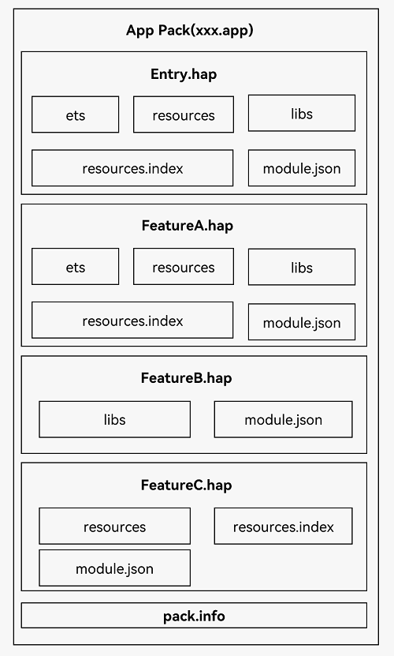

# Application Package Structure in Stage Model

To develop an application based on the [stage model](application-configuration-file-overview-stage.md), it is essential to understand the structure of the application package created after the application is built and packaged.

- In development, an application contains one or more modules. You can [create modules](https://developer.harmonyos.com/en/docs/documentation/doc-guides-V3/ohos-adding-deleting-module-0000001218760594-V3) in the application project in [DevEco Studio](https://developer.harmonyos.com/en/develop/deveco-studio/). As a basic functional unit of an OpenHarmony application/service, a module contains source code, resource files, third-party libraries, and application/service configuration files, and can be built and run independently. Modules can be classified as Ability or Library. A module of the Ability type is built into a Harmony Ability Package (HAP) file in .hap format, and a module of the Library type is built into a [Harmony Ability Resources (HAR) file](har-structure.md) in .tgz format.
  A module can contain one or more [UIAbility](../application-models/uiability-overview.md) components, as shown in the figure below.

    **Figure 1** Relationship between modules and UIAbility components 
  

  Unless otherwise specified, the modules described in this document refer to the modules of the Ability type.

- As aforementioned, you can build an application into one or more HAP files. The HAP file is the basic unit for installing an application. It provides code, resources, third-party libraries, and a configuration file. HAP files can be classified as Entry or Feature.
  - HAP of the entry type: main module of the application, whose **type** field is set to **"entry"** in the [module.json5](module-configuration-file.md) file. In an application, each type of device supports only one HAP of the entry type, which is typically used to implement the application's entry screen, entry icon, or headline feature.
  - HAP of the feature type: dynamic feature module of the application, whose **type** field is set to **"feature"** in the [module.json5](module-configuration-file.md) file. Each application can contain zero, one, or more HAP files of the feature type, which are used to implement the application features. You can configure this type of HAP file to be downloaded and installed independently as required or to be downloaded and installed together with the HAP file of the entry type. For details, see **deliveryWithInstall** in [module.json5 Configuration File](module-configuration-file.md).

- All the HAP files in an application are integrated into a bundle, and the bundle name is the unique identifier of the application. For details, see **bundleName** tag in [app.json5 Configuration File](app-configuration-file.md). Note that to release an application to the application market, all HAP files (that is, the bundle) contained in the application must be packed into an Application Package (App Pack) in .app format, which also contains the **pack.info** file that describes the attributes of the App Pack. The App Pack is distributed and installed on the cloud and on the device on a HAP-by-HAP basis.

- The HAP file includes folders such as **ets**, **libs**, and **resources** and files such as **resources.index**, **module.json**, and **pack.info**.
  - The **ets** folder stores bytecode files generated after application code build.
  - The **libs** folder stores library files, which are .so binary files that contain third-party code on which the OpenHarmony application depends.
  - The **resources** folder stores resource files (such as strings and images) of the application.
  - The **resources.index** file provides a resource index table, which is generated when the application project is built in DevEco Studio.
  - The **module.json** file is the configuration file indispensable in a HAP file. It consists of **module.json5** and **app.json5** in the project configuration. While DevEco Studio provides default configuration, you must modify the configuration as needed. For details about the configuration fields, see [Application Configuration Files in Stage Model](application-configuration-file-overview-stage.md).
  - The **pack.info** file describes the HAP attributes in the bundle, for example, **bundleName** and **versionCode** in **app** and **name**, **type**, and **abilities** in **module**. The file is automatically generated when DevEco Studio generates the bundle.

   **Figure 2** Application package structure in stage model 
     
