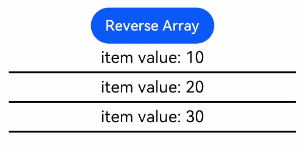

# Rendering Control

ArkTS provides conditional rendering and loop rendering. Conditional rendering can render state-specific UI content based on the application status. Loop rendering iteratively obtains data from the data source and creates the corresponding component during each iteration.

## Conditional Rendering

Use **if/else** for conditional rendering.


> **NOTE**
>
> - State variables can be used in the **if/else** statement.
>
> - The **if/else** statement can be used to implement rendering of child components.
>
> - The **if/else** statement must be used in container components.
>
> - Some container components limit the type or number of subcomponents. When **if/else** is placed in these components, the limitation applies to components created in **if/else** statements. For example, when **if/else** is used in the **\<Grid>** container component, whose child components can only be **\<GridItem>**, only the **\<GridItem>** component can be used in the **if/else** statement.


```ts
Column() {
  if (this.count < 0) {
    Text('count is negative').fontSize(14)
  } else if (this.count % 2 === 0) {
    Text('count is even').fontSize(14)
  } else {
    Text('count is odd').fontSize(14)
  }
}
```

## Loop Rendering

You can use **ForEach** to obtain data from arrays and create components for each data item.

```ts
ForEach(
  arr: any[], 
  itemGenerator: (item: any, index?: number) => void,
  keyGenerator?: (item: any, index?: number) => string 
)
```

Since API version 9, this API is supported in ArkTS widgets.

**Parameters**

| Name       | Type                             | Mandatory| Description                                                    |
| ------------- | ------------------------------------- | ---- | ------------------------------------------------------------ |
| arr           | any[]                                 | Yes  | An array, which can be empty, in which case no child component is created. The functions that return array-type values are also allowed, for example, **arr.slice (1, 3)**. The set functions cannot change any state variables including the array itself, such as **Array.splice**, **Array.sort**, and **Array.reverse**.|
| itemGenerator | (item: any, index?: number) => void   | Yes  | A lambda function used to generate one or more child components for each data item in an array. A single child component or a list of child components must be included in parentheses.|
| keyGenerator  | (item: any, index?: number) => string | No  | An anonymous function used to generate a unique and fixed key value for each data item in an array. This key value must remain unchanged for the data item even when the item is relocated in the array. When the item is replaced by a new item, the key value of the new item must be different from that of the existing item. This key-value generator is optional. However, for performance reasons, it is strongly recommended that the key-value generator be provided, so that the development framework can better identify array changes. For example, if no key-value generator is provided, a reverse of an array will result in rebuilding of all nodes in **ForEach**.|

> **NOTE**
>
> - **ForEach** must be used in container components.
>
> - The generated child components should be allowed in the parent container component of **ForEach**.
>
> - The **itemGenerator** function can contain an **if/else** statement, and an **if/else** statement can contain **ForEach**.
>
> - The call sequence of **itemGenerator** functions may be different from that of the data items in the array. During the development, do not assume whether or when the **itemGenerator** and **keyGenerator** functions are executed. The following is an example of incorrect usage:
>
>   ```ts
>   ForEach(anArray.map((item1, index1) => { return { i: index1 + 1, data: item1 }; }), 
>     item => Text(`${item.i}. item.data.label`),
>     item => item.data.id.toString())
>   ```

## Example

```ts
// xxx.ets
@Entry
@Component
struct MyComponent {
  @State arr: number[] = [10, 20, 30]

  build() {
    Column({ space: 5 }) {
      Button('Reverse Array')
        .onClick(() => {
          this.arr.reverse()
        })

      ForEach(this.arr, (item: number) => {
        Text(`item value: ${item}`).fontSize(18)
        Divider().strokeWidth(2)
      }, (item: number) => item.toString())
    }
  }
}
```



## Lazy Loading

You can use **LazyForEach** to iterate over provided data sources and create corresponding components during each iteration.

```ts
LazyForEach(
  dataSource: IDataSource,             
  itemGenerator: (item: any) => void,  
  keyGenerator?: (item: any) => string 
): void

interface IDataSource {
  totalCount(): number;                                           
  getData(index: number): any;                                   
  registerDataChangeListener(listener: DataChangeListener): void;   
  unregisterDataChangeListener(listener: DataChangeListener): void;
}

interface DataChangeListener {
  onDataReloaded(): void;                      
  onDataAdd(index: number): void;            
  onDataMove(from: number, to: number): void; 
  onDataDelete(index: number): void;         
  onDataChange(index: number): void;          
}
```

**Parameters**

| Name       | Type             | Mandatory| Description                                                    |
| ------------- | --------------------- | ---- | ------------------------------------------------------------ |
| dataSource    | IDataSource           | Yes  | Object used to implement the **IDataSource** API. You need to implement related APIs.         |
| itemGenerator | (item: any, index?: number) => void   | Yes  | A lambda function used to generate one or more child components for each data item in an array. A single child component or a list of child components must be included in parentheses.|
| keyGenerator  | (item: any, index?: number) => string | No  | An anonymous function used to generate a unique and fixed key value for each data item in an array. This key value must remain unchanged for the data item even when the item is relocated in the array. When the item is replaced by a new item, the key value of the new item must be different from that of the existing item. This key-value generator is optional. However, for performance reasons, it is strongly recommended that the key-value generator be provided, so that the development framework can better identify array changes. For example, if no key-value generator is provided, a reverse of an array will result in rebuilding of all nodes in **LazyForEach**.|

### Description of IDataSource

| Name                                                        | Description                  |
| ------------------------------------------------------------ | ---------------------- |
| totalCount(): number                                         | Obtains the total number of data records.        |
| getData(index: number): any                                  | Obtains the data corresponding to the specified index.  |
| registerDataChangeListener(listener:DataChangeListener): void | Registers a listener for data changes.|
| unregisterDataChangeListener(listener:DataChangeListener): void | Deregisters a listener for data changes.|

### Description of DataChangeListener

| Name                                                    | Description                                  |
| -------------------------------------------------------- | -------------------------------------- |
| onDataReloaded(): void                                   | Invoked when all data is reloaded.                    |
| onDataAdded(index: number): void<sup>deprecated</sup>           | Invoked when data is added to the position indicated by the specified index. This API is deprecated since API version 8. You are advised to use **onDataAdd**.      |
| onDataMoved(from: number, to: number): void<sup>deprecated</sup> | Invoked when data is moved from the **from** position to the **to** position. This API is deprecated since API version 8. You are advised to use **onDataMove**.|
| onDataDeleted(index: number): void<sup>deprecated</sup>         | Invoked when data is deleted from the position indicated by the specified index. This API is deprecated since API version 8. You are advised to use **onDataDelete**.       |
| onDataChanged(index: number): void<sup>deprecated</sup>          | Invoked when data in the position indicated by the specified index is changed. This API is deprecated since API version 8. You are advised to use **onDataChange**.      |
| onDataAdd(index: number): void<sup>8+</sup>                     | Invoked when data is added to the position indicated by the specified index.       |
| onDataMove(from: number, to: number): void<sup>8+</sup>           | Invoked when data is moved from the **from** position to the **to** position.|
| onDataDelete(index: number): void<sup>8+</sup>                     | Invoked when data is deleted from the position indicated by the specified index.       |
| onDataChange(index: number): void<sup>8+</sup>                     | Invoked when data in the position indicated by the specified index is changed.       |

## Example

```ts
// xxx.ets
class BasicDataSource implements IDataSource {
  private listeners: DataChangeListener[] = []

  public totalCount(): number {
    return 0
  }

  public getData(index: number): any {
    return undefined
  }

  registerDataChangeListener(listener: DataChangeListener): void {
    if (this.listeners.indexOf(listener) < 0) {
      console.info('add listener')
      this.listeners.push(listener)
    }
  }

  unregisterDataChangeListener(listener: DataChangeListener): void {
    const pos = this.listeners.indexOf(listener);
    if (pos >= 0) {
      console.info('remove listener')
      this.listeners.splice(pos, 1)
    }
  }

  notifyDataReload(): void {
    this.listeners.forEach(listener => {
      listener.onDataReloaded()
    })
  }

  notifyDataAdd(index: number): void {
    this.listeners.forEach(listener => {
      listener.onDataAdd(index)
    })
  }

  notifyDataChange(index: number): void {
    this.listeners.forEach(listener => {
      listener.onDataChange(index)
    })
  }

  notifyDataDelete(index: number): void {
    this.listeners.forEach(listener => {
      listener.onDataDelete(index)
    })
  }

  notifyDataMove(from: number, to: number): void {
    this.listeners.forEach(listener => {
      listener.onDataMove(from, to)
    })
  }
}

class MyDataSource extends BasicDataSource {
  // Initialize the data list.
  private dataArray: string[] = ['/path/image0.png', '/path/image1.png', '/path/image2.png', '/path/image3.png']

  public totalCount(): number {
    return this.dataArray.length
  }

  public getData(index: number): any {
    return this.dataArray[index]
  }

  public addData(index: number, data: string): void {
    this.dataArray.splice(index, 0, data)
    this.notifyDataAdd(index)
  }

  public pushData(data: string): void {
    this.dataArray.push(data)
    this.notifyDataAdd(this.dataArray.length - 1)
  }
}

@Entry
@Component
struct MyComponent {
  private data: MyDataSource = new MyDataSource()

  build() {
    List({ space: 3 }) {
      LazyForEach(this.data, (item: string) => {
        ListItem() {
          Row() {
            Image(item).width(50).height(50)
            Text(item).fontSize(20).margin({ left: 10 })
          }.margin({ left: 10, right: 10 })
        }
        .onClick(() => {
          // The count increases by one each time the list is clicked.
          this.data.pushData('/path/image' + this.data.totalCount() + '.png')
        })
      }, item => item)
    }
  }
}
```

> **NOTE**
>
> - **LazyForEach** must be used in the container component. Currently, only the **\<List>**, **\<Grid>**, and **\<Swiper>** components support lazy loading (that is, only the visible part and a small amount of data before and after the visible part are loaded for caching). For other components, all data is loaded at a time.
>
> - **LazyForEach** must create one and only one child component in each iteration.
>
> - The generated child components must be the ones allowed in the parent container component of **LazyForEach**.
>
> - **LazyForEach** can be included in an **if/else** statement.
>
> - For the purpose of high-performance rendering, when the **onDataChange** method of the **DataChangeListener** object is used to update the UI, the component update is triggered only when the state variable is used in the child component created by **itemGenerator**.
>
> - The call sequence of **itemGenerator** functions may be different from that of the data items in the data source. During the development, do not assume whether or when the **itemGenerator** and **keyGenerator** functions are executed. The following is an example of incorrect usage:
>
>   ```ts
>   LazyForEach(dataSource, 
>     item => Text(`${item.i}. item.data.label`),
>     item => item.data.id.toString())
>   ```


