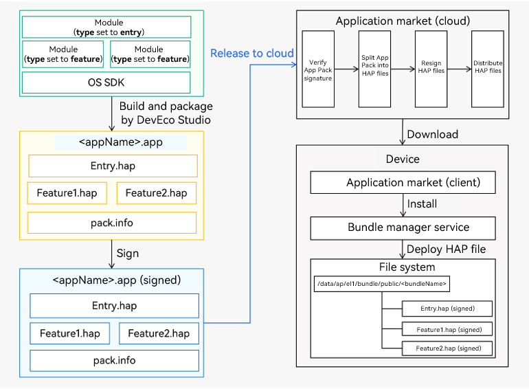

# Multi-HAP Development, Debugging, Release, and Deployment Process

Below is the process of developing, debugging, releasing, and deploying multiple HAP files.

**Figure 1** Process of developing, debugging, releasing, and deploying multiple HAP files


## Development
You can use [DevEco Studio](https://developer.harmonyos.com/en/develop/deveco-studio) to create multiple modules based on service requirements and develop services in independent modules.

## Debugging
You can use DevEco Studio to build code into one or more HAP files. Then, you can debug the HAP files.
* Using DevEco Studio for debugging

   Follow the instructions in [Debugging Configuration](https://developer.harmonyos.com/en/docs/documentation/doc-guides/ohos-debugging-and-running-0000001263040487#section10491183521520).

* Using [hdc_std](../../device-dev/subsystems/subsys-toolchain-hdc-guide.md) for debugging

    You can obtain the hdc_std tool from the **toolchains** directory of the SDK. When using this tool to install an HAP file, the HAP file path is the one on the operating platform. In this example, the Windows operating platform is used. The command reference is as follows:
    ```
    // Installation and update: Multiple file paths can be specified.
    hdc_std install C:\entry.hap C:\feature.hap
    // The execution result is as follows:
    install bundle successfully.
    // Uninstall
    hdc_std uninstall com.example.myapplication
    // The execution result is as follows:
    uninstall bundle successfully.
    ```

* Using [Bundle Manager (bm)](../../application-dev/tools/bm-tool.md) for debugging

    When using bm to install or update an HAP file, the HAP file path is the one on the real device. The command reference is as follows:
    ```
    // Installation and update: Multiple file paths can be specified.
    bm install -p /data/app/entry.hap /data/app/feature.hap
    // The execution result is as follows:
    install bundle successfully.
    // Uninstall
    bm uninstall -n com.example.myapplication
    // The execution result is as follows:
    uninstall bundle successfully.
    ```
## Release
When your application package meets the release requirements, you can package and build it into an App Pack and release it to the application market on the cloud. The application market verifies the signature of the App Pack. If the signature verification is successful, the application market obtains the HAP files from the App Pack, signs them, and distributes the signed HAP files.

## Deployment
The application market on the cloud distributes the applications to application market clients. These applications can contain one or more HAP files. After the user selects an application to download, the application market downloads all the HAP files contained in this application.

## Installation on a Device
After the download is complete, the application market client calls the installation API of the bundle manager service in the system to install the downloaded HAP files. The bundle manager service deploys HAP files by application in the specified directory to complete the application installation.
