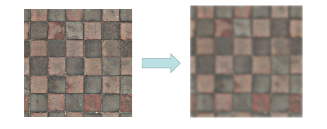
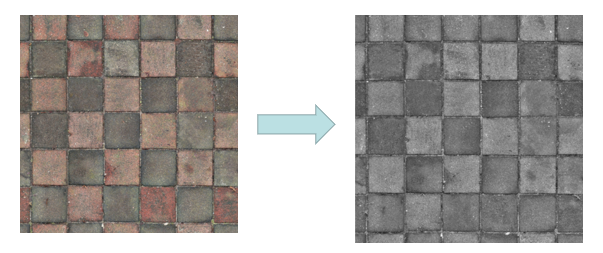

# @ohos.effectKit (Image Effects)

The **EffectKit** module provides basic image processing capabilities, including brightness adjustment, blurring, grayscale adjustment, and color picker.

This module provides the following classes:

- [Filter](#filter): a class that adds a specified effect to the image source.
- [Color](#color): a class used to store the color picked.
- [ColorPicker](#colorpicker): a smart color picker.

> **NOTE**
> 
> The initial APIs of this module are supported since API version 9. Newly added APIs will be marked with a superscript to indicate their earliest API version.

## Modules to Import

```js
import effectKit from '@ohos.effectKit';
```

## effectKit.createEffect
createEffect(source: image.PixelMap): Filter

Creates a **Filter** instance based on the pixel map.

**System capability**: SystemCapability.Multimedia.Image.Core

**Parameters**

| Name   | Type              | Mandatory| Description    |
| ------- | ----------------- | ---- | -------- |
| source  | [image.PixelMap](js-apis-image.md#pixelmap7) | Yes  | **PixelMap** instance created by the image module.  |

**Return value**

| Type                            | Description          |
| -------------------------------- | -------------- |
| [Filter](#filter) | Head node of the filter linked list without any effect. If the operation fails, **null** is returned.|

**Example**

```js
import image from "@ohos.multimedia.image";

const color = new ArrayBuffer(96);
let opts = { editable: true, pixelFormat: 3, size: { height: 4, width: 6 } }
image.createPixelMap(color, opts).then((pixelMap) => {
  let headFilter = effectKit.createEffect(pixelMap);
})
```

## effectKit.createColorPicker

createColorPicker(source: image.PixelMap): Promise\<ColorPicker>

Creates a **ColorPicker** instance based on the pixel map. This API uses a promise to return the result.

**System capability**: SystemCapability.Multimedia.Image.Core

**Parameters**

| Name    | Type        | Mandatory| Description                      |
| -------- | ----------- | ---- | -------------------------- |
| source   | [image.PixelMap](js-apis-image.md#pixelmap7) | Yes  |  **PixelMap** instance created by the image module.|

**Return value**

| Type                  | Description          |
| ---------------------- | -------------- |
| Promise\<[ColorPicker](#colorpicker)>  | Promise used to return the **ColorPicker** instance created.|

**Example**

```js
import image from "@ohos.multimedia.image";

const color = new ArrayBuffer(96);
let opts = { editable: true, pixelFormat: 3, size: { height: 4, width: 6 } }
image.createPixelMap(color, opts).then((pixelMap) => {
  effectKit.createColorPicker(pixelMap).then(colorPicker => {
    console.info("color picker=" + colorPicker);
  }).catch(ex => console.error(".error=" + ex.toString()))
})
```

## effectKit.createColorPicker

createColorPicker(source: image.PixelMap, callback: AsyncCallback\<ColorPicker>): void

Creates a **ColorPicker** instance based on the pixel map. This API uses an asynchronous callback to return the result.

**System capability**: SystemCapability.Multimedia.Image.Core

**Parameters**

| Name    | Type               | Mandatory| Description                      |
| -------- | ------------------ | ---- | -------------------------- |
| source   | [image.PixelMap](js-apis-image.md#pixelmap7) | Yes |**PixelMap** instance created by the image module. |
| callback | AsyncCallback\<[ColorPicker](#colorpicker)> | Yes | Callback used to return the **ColorPicker** instance created.|

**Example**

```js
import image from "@ohos.multimedia.image";

const color = new ArrayBuffer(96);
let opts = { editable: true, pixelFormat: 3, size: { height: 4, width: 6 } }
image.createPixelMap(color, opts).then((pixelMap) => {
  effectKit.createColorPicker(pixelMap, (error, colorPicker) => {
    if (error) {
      console.log('Failed to create color picker.');
    } else {
      console.log('Succeeded in creating color picker.');
    }
  })
})
```

## Color

A class that stores the color picked.

**System capability**: SystemCapability.Multimedia.Image.Core

| Name  | Type  | Readable| Writable| Description             |
| ------ | ----- | ---- | ---- | ---------------- |
| red   | number | Yes  | No  | Value of the red component.          |
| green | number | Yes  | No  | Value of the green component.          |
| blue  | number | Yes  | No  | Value of the blue component.          |
| alpha | number | Yes  | No  | Value of the alpha component.      |

## ColorPicker

A class used to obtain the color from an image. Before calling any method of **ColorPicker**, use [createColorPicker](#effectkitcreatecolorpicker) to create a **ColorPicker** instance.

### getMainColor

getMainColor(): Promise\<Color>

Obtains the main color from the image and writes the result to a [Color](#color) instance. This API uses a promise to return the result.

**System capability**: SystemCapability.Multimedia.Image.Core

**Return value**

| Type          | Description                                           |
| :------------- | :---------------------------------------------- |
| Promise\<[Color](#color)> | Promise used to return the color value of the main color. If the operation fails, an error message is returned.|

**Example**

```js
colorPicker.getMainColor().then(color => {
    console.log('Succeeded in getting main color.');
    console.info(`color[ARGB]=${color.alpha},${color.red},${color.green},${color.blue}`);
}).catch(error => {
    console.log('Failed to get main color.');
})
```

### getMainColorSync

getMainColorSync(): Color

Obtains the main color from the image and writes the result to a [Color](#color) instance. This API returns the result in synchronous mode.

**System capability**: SystemCapability.Multimedia.Image.Core

**Return value**

| Type    | Description                                 |
| :------- | :----------------------------------- |
| [Color](#color)    | Color value of the main color. If the operation fails, **null** is returned.|

**Example**

```js
let color = colorPicker.getMainColorSync();
console.log('get main color =' + color);
```


### getLargestProportionColor<sup>10+</sup>

getLargestProportionColor(): Color

Obtains the color with the largest proportion from the image and writes the result to a [Color](#color) instance. This API returns the result in synchronous mode.

**System capability**: SystemCapability.Multimedia.Image.Core

**Return value**

| Type          | Description                                           |
| :------------- | :---------------------------------------------- |
| [Color](#color)       | Color value of the color with the largest proportion. If the operation fails, **null** is returned.|

**Example**

```js
let color = colorPicker.getLargestProportionColor();
console.log('get largest proportion color =' + color);
```


### getHighestSaturationColor<sup>10+</sup>

getHighestSaturationColor(): Color

Obtains the color with the highest saturation from the image and writes the result to a [Color](#color) instance. This API returns the result in synchronous mode.

**System capability**: SystemCapability.Multimedia.Image.Core

**Return value**

| Type          | Description                                           |
| :------------- | :---------------------------------------------- |
| [Color](#color)       | Color value of the color with the highest saturation. If the operation fails, **null** is returned.|

**Example**

```js
let color = colorPicker.getHighestSaturationColor();
console.log('get highest saturation color =' + color);
```


### getAverageColor<sup>10+</sup>

getAverageColor(): Color

Obtains the average color from the image and writes the result to a [Color](#color) instance. This API returns the result in synchronous mode.

**System capability**: SystemCapability.Multimedia.Image.Core

**Return value**

| Type          | Description                                           |
| :------------- | :---------------------------------------------- |
| [Color](#color)       | Average color value. If the operation fails, **null** is returned.|

**Example**

```js
let color = colorPicker.getAverageColor();
console.log('get average color =' + color);
```


### isBlackOrWhiteOrGrayColor<sup>10+</sup>

isBlackOrWhiteOrGrayColor(color: number): boolean

Checks whether this image is black, white, and gray.

**System capability**: SystemCapability.Multimedia.Image.Core

**Return value**

| Type          | Description                                           |
| :------------- | :---------------------------------------------- |
| boolean              | Returns **true** if the image is black, white, and gray; returns **false** otherwise.|

**Example**

```js
let bJudge = colorPicker.isBlackOrWhiteOrGrayColor(0xFFFFFFFF);
console.log('is black or white or gray color[bool](white) =' + bJudge);
```

## Filter

A class used to add a specified effect to an image. Before calling any method of **Filter**, use [createEffect](#effectkitcreateeffect) to create a **Filter** instance.

### blur

blur(radius: number): Filter

Adds the blur effect to the filter linked list, and returns the head node of the linked list.

**System capability**: SystemCapability.Multimedia.Image.Core

**Parameters**

| Name| Type       | Mandatory| Description                                                        |
| ------ | ----------- | ---- | ------------------------------------------------------------ |
|  radius   | number | Yes  | Blur radius, in pixels. The blur effect is proportional to the configured value. A larger value indicates a more obvious effect.|

**Return value**

| Type          | Description                                           |
| :------------- | :---------------------------------------------- |
| [Filter](#filter) | Final image effect.|

**Example**

```js
import image from "@ohos.multimedia.image";

const color = new ArrayBuffer(96);
let opts = { editable: true, pixelFormat: 3, size: { height: 4, width: 6 } };
image.createPixelMap(color, opts).then((pixelMap) => {
  let radius = 5;
  let headFilter = effectKit.createEffect(pixelMap);
  if (headFilter != null) {
    headFilter.blur(radius);
  }
})
```


### brightness

brightness(bright: number): Filter

Adds the brightness effect to the filter linked list, and returns the head node of the linked list.

**System capability**: SystemCapability.Multimedia.Image.Core

**Parameters**

| Name| Type       | Mandatory| Description                                                        |
| ------ | ----------- | ---- | ------------------------------------------------------------ |
|  bright   | number | Yes  | Brightness value, ranging from 0 to 1. When the value is **0**, the image brightness remains unchanged.|

**Return value**

| Type          | Description                                           |
| :------------- | :---------------------------------------------- |
| [Filter](#filter) | Final image effect.|

**Example**

```js
import image from "@ohos.multimedia.image";

const color = new ArrayBuffer(96);
let opts = { editable: true, pixelFormat: 3, size: { height: 4, width: 6 } };
image.createPixelMap(color, opts).then((pixelMap) => {
  let bright = 0.5;
  let headFilter = effectKit.createEffect(pixelMap);
  if (headFilter != null) {
    headFilter.brightness(bright);
  }
})
```


### grayscale

grayscale(): Filter

Adds the grayscale effect to the filter linked list, and returns the head node of the linked list.

**System capability**: SystemCapability.Multimedia.Image.Core

**Return value**

| Type          | Description                                           |
| :------------- | :---------------------------------------------- |
| [Filter](#filter) | Final image effect.|

**Example**

```js
import image from "@ohos.multimedia.image";

const color = new ArrayBuffer(96);
let opts = { editable: true, pixelFormat: 3, size: { height: 4, width: 6 } };
image.createPixelMap(color, opts).then((pixelMap) => {
  let headFilter = effectKit.createEffect(pixelMap);
  if (headFilter != null) {
    headFilter.grayscale();
  }
})
```


### getPixelMap

getPixelMap(): [image.PixelMap](js-apis-image.md#pixelmap7)

Obtains **image.PixelMap** of the source image to which the filter linked list is added.

**System capability**: SystemCapability.Multimedia.Image.Core

**Return value**

| Type          | Description                                           |
| :------------- | :---------------------------------------------- |
| [image.PixelMap](js-apis-image.md#pixelmap7) | **image.PixelMap** of the source image.|

**Example**

```js
import image from "@ohos.multimedia.image";

const color = new ArrayBuffer(96);
let opts = { editable: true, pixelFormat: 3, size: { height: 4, width: 6 } };
image.createPixelMap(color, opts).then((pixelMap) => {
  let pixel = effectKit.createEffect(pixelMap).grayscale().getPixelMap();
})
```
