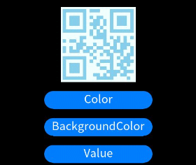

# qrcode


The **\<qrcode>** component is used to generate and display a QR code.

> **NOTE**
>
> This component is supported since API version 5. Updates will be marked with a superscript to indicate their earliest API version.


## Child Components

Not supported


## Attributes

| Name| Type| Default Value| Mandatory| Description|
| -------- | -------- | -------- | -------- | -------- |
| value | string | - | Yes| Content used to generate the QR code. The maximum length is 256.|
| id | string | - | No| Unique ID of the component.|
| style | string | - | No| Style declaration of the component.|
| class | string | - | No| Style class of the component, which is used to refer to a style table.|
| ref | string | - | No| Reference information of child elements, which is registered with the parent component on **$refs**.|


## Events

| Name| Parameter| Description|
| -------- | -------- | -------- |
| click | - | Triggered when the component is clicked. |
| longpress | - | Triggered when the component is long pressed. |
| swipe<sup>5+</sup> | [SwipeEvent](js-common-events.md) | Triggered when a user quickly swipes on the component. |


## Styles

| Name| Type| Default Value| Mandatory| Description|
| -------- | -------- | -------- | -------- | -------- |
| color | &lt;color&gt; | \#000000 | No| Color of the QR code.|
| background-color | &lt;color&gt; | \#ffffff | No| Background color of the QR code.|
| width | &lt;length&gt; \| &lt;percentage&gt;<sup>5+</sup> | - | No| Component width.<br>If this attribute is not set, the default value **0** is used. |
| height | &lt;length&gt; \| &lt;percentage&gt;<sup>5+</sup> | - | No| Component height.<br>If this attribute is not set, the default value **0** is used. |
| padding | &lt;length&gt; | 0 | No| Shorthand attribute to set the padding for all sides.<br>The attribute can have one to four values:<br>- If you set only one value, it specifies the padding for all the four sides.<br>- If you set two values, the first value specifies the top and bottom padding, and the second value specifies the left and right padding.<br>- If you set three values, the first value specifies the top padding, the second value specifies the left and right padding, and the third value specifies the bottom padding.<br>- If you set four values, they respectively specify the padding for top, right, bottom, and left sides (in clockwise order).|
| padding-[left\|top\|right\|bottom] | &lt;length&gt; | 0 | No| Left, top, right, and bottom padding.|
| margin | &lt;length&gt; \| &lt;percentage&gt;<sup>5+</sup> | 0 | No| Shorthand attribute to set the margin for all sides. The attribute can have one to four values:<br>- If you set only one value, it specifies the margin for all the four sides.<br>- If you set two values, the first value specifies the top and bottom margins, and the second value specifies the left and right margins.<br>- If you set three values, the first value specifies the top margin, the second value specifies the left and right margins, and the third value specifies the bottom margin.<br>- If you set four values, they respectively specify the margin for top, right, bottom, and left sides (in clockwise order).|
| margin-[left\|top\|right\|bottom] | &lt;length&gt; \| &lt;percentage&gt;<sup>5+</sup> | 0 | No| Left, top, right, and bottom margins.|
| border-width | &lt;length&gt; | 0 | No| Shorthand attribute to set the margin for all sides.|
| border-color | &lt;color&gt; | black | No| Shorthand attribute to set the color for all borders.|
| border-radius | &lt;length&gt; | - | No| Radius of round-corner borders.|
| display | string | flex | No| How and whether to display the box containing an element. Available values are as follows:<br>- **flex**: flexible layout<br>- **none**: not rendered|
| [left\|top] | &lt;length&gt; \| &lt;percentage&gt;<sup>6+</sup> | - | No| Edge of the element.<br>- **left**: left edge position of the element. This attribute defines the offset between the left edge of the margin area of a positioned element and left edge of its containing block.<br>- **top**: top edge position of the element. This attribute defines the offset between the top edge of a positioned element and that of a block included in the element. |

>  **NOTE**
> - If the values of **width** and **height** are different, the smaller value is used as the length of the QR code. The generated QR code is center displayed.
>
>- The minimum values of **width** and **height** are 200 px.


## Example


```html
<!-- xxx.hml -->
<div class="container">
  <qrcode value="{{qr_value}}" class="qrCode" style="color: {{qr_color}};background-color: {{qr_bcol}};"></qrcode>
  <input type="button" onclick="changeColor" class="button">Color</input>
  <input type="button" onclick="changeBackgroundColor" class="button">BackgroundColor</input>
  <input type="button" onclick="changeColor" class="button">Value</input>
</div>
```

```css
/* xxx.css */
.container {
  width: 100%;
  height: 100%;
  flex-direction: column;
  justify-content: center;
  align-items: center;
}
.qrCode {
  width: 200px;
  height: 200px;
}
.button {
  width: 30%;
  height: 10%;
  margin-top: 5%;
}
```

```javascript
// xxx.js
export default {
  data: {
    qr_col: '#87ceeb',
    qr_bcol: '#f0ffff',
    qr_value: 'value'
  },
  changeColor() {
    if (this.qr_col == '#87ceeb') {
      this.qr_col = '#fa8072';
    } else {
      this.qr_col = '#87ceeb';
    }
  },
  changeBackgroundColor() {
    if (this.qr_bcol == '#f0ffff') {
      this.qr_bcol = '#ffffe0';
    } else {
      this.qr_bcol = '#f0ffff';
    }
  },
  changeValue() {
    if (this.qr_value == 'value') {
      this.qr_value = 'change';
    } else {
      this.qr_value = 'value';
    }
  }
}
```


