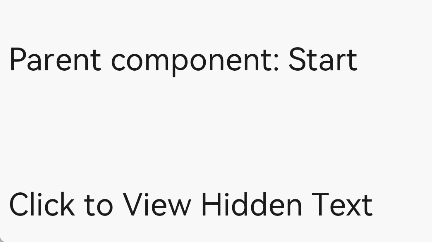

# Event Parameter

A child component can also pass parameters to an upper-layer component through the bound event. The following example describes how to pass parameters through the custom event:


```html
<!-- comp.hml -->
<div class="item">  
   <text class="text-style" onclick="childClicked">Click to View Hidden Text</text> 
   <text class="text-style" if="{{ showObj }}">hello world</text> 
</div>
```


```js
// comp.js
export default { 
  childClicked () {
    this.$emit('eventType1', {text: 'Received parameters from the child component.'});
    this.showObj = !this.showObj;
  },
}
```


In the following example, the child component passes the **text** parameter to the parent component, and the parent component obtains the parameter through **e.detail**:


```html
<!-- xxx.hml -->
<element name='comp' src='../../common/comp/comp.hml'></element>
<div class="container">  
   <text>Parent component: {{text}}</text> 
   <comp @event-type1="textClicked"></comp>  
</div>
```


```js
// xxx.js
export default { 
  data: {
    text: 'Start'
  },
  textClicked (e) {
    this.text = e.detail.text;
  },
}
```


