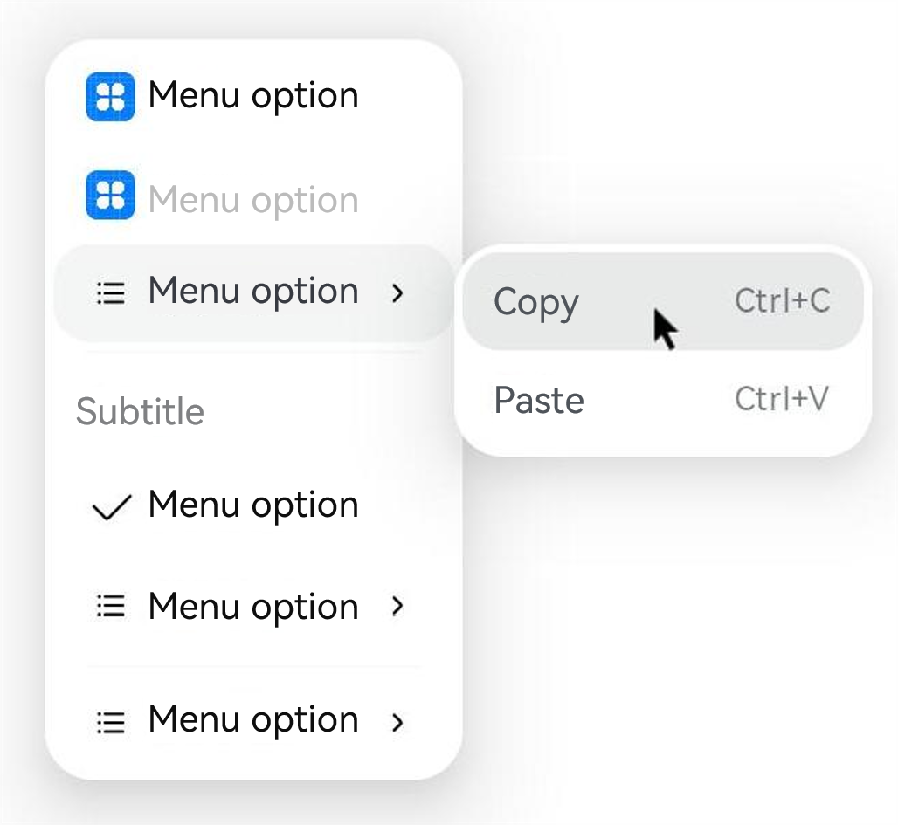

# Menu

The **\<Menu>** component is a vertical list of items presented to the user.

> **NOTE**
>
> - This component is supported since API version 9. Newly added APIs will be marked with a superscript to indicate their earliest API version.
>
> - The **\<Menu>** component must be used together with the [bindMenu](ts-universal-attributes-menu.md) or [bindContextMenu](ts-universal-attributes-menu.md) method. It does not work when used alone.

## Child Components

This component contains the [MenuItem](ts-basic-components-menuitem.md) and [MenuItemGroup](ts-basic-components-menuitemgroup.md) child components.

## APIs

Menu()

Creates a fixed container for a menu. This API does not have any parameters.

> **NOTE**
>
> Rules for calculating the width of menus and menu items:
>
> During the layout, the width of each menu item is expected to be the same. If a child component has its width set, the [size calculation rule](ts-universal-attributes-size.md#impact-of-constraintsize-on-widthheight) prevails.
>
> If the width is not set, the **\<Menu>** component sets the default width of two columns for the **\<MenuItem>** and **\<MenuItemGroup>** child components. If a menu item's content area is wider than two columns, the **\<Menu>** component automatically expands the menu item content area.
>
> When the width is set, the **\<Menu>** component sets the **\<MenuItem>** and **\<MenuItemGroup>** child components to the fixed width (set width minus the padding).

## Attributes

In addition to the [universal attributes](ts-universal-attributes-size.md), the following attributes are supported.

| Name    | Type                 | Description                                                            |
| -------- | ------------------------- | ---------------------------------------------------------------- |
| fontSize<sup>(deprecated)</sup> | [Length](ts-types.md#length) | Font size of the menu text. When **Length** is of the number type, the unit is fp.<br>This API is deprecated since API version 10. You are advised to use **font** instead.|
| font<sup>10+</sup> | [Font](ts-types.md#font) | Font style of the menu text.|
| fontColor<sup>10+</sup> | [ResourceColor](ts-types.md#resourcecolor) | Font color of the menu text.|
| radius<sup>10+</sup> | [Dimension](ts-types.md#dimension10) \| [BorderRadiuses](ts-types.md#borderradiuses9) | Radius of the menu border corners.<br> The default value follows the theme. If the value is less than half of the menu width, the default value is used.|
| width<sup>10+</sup> | [Length](ts-types.md#length) | Menu border width.<br> The minimum width is 64 vp.|

## Example

```ts
@Entry
@Component
struct Index {
  @State select: boolean = true
  private iconStr: ResourceStr = $r("app.media.view_list_filled")
  private iconStr2: ResourceStr = $r("app.media.view_list_filled")

  @Builder
  SubMenu() {
    Menu() {
      MenuItem({ content: "Copy", labelInfo: "Ctrl+C" })
      MenuItem({ content: "Paste", labelInfo: "Ctrl+V" })
    }
  }

  @Builder
  MyMenu(){
    Menu() {
      MenuItem({ startIcon: $r("app.media.icon"), content: "Menu option" })
      MenuItem({ startIcon: $r("app.media.icon"), content: "Menu option" })
        .enabled(false)
      MenuItem({
        startIcon: this.iconStr,
        content: "Menu option",
        endIcon: $r("app.media.arrow_right_filled"),
        builder: ():void=>this.SubMenu()
      })
      MenuItemGroup({ header: 'Subtitle' }) {
        MenuItem ({ content: "Menu option" })
          .selectIcon(true)
          .selected(this.select)
          .onChange((selected) => {
            console.info("menuItem select" + selected);
            this.iconStr2 = $r("app.media.icon");
          })
        MenuItem({
          startIcon: $r("app.media.view_list_filled"),
          content: "Menu option",
          endIcon: $r("app.media.arrow_right_filled"),
          builder: ():void=>this.SubMenu()
        })
      }
      MenuItem({
        startIcon: this.iconStr2,
        content: "Menu option",
        endIcon: $r("app.media.arrow_right_filled")
      })
    }
  }

  build() {
    Row() {
      Column() {
        Text('click to show menu')
          .fontSize(50)
          .fontWeight(FontWeight.Bold)
      }
      .bindMenu(this.MyMenu)
      .width('100%')
    }
    .height('100%')
  }
}
```


