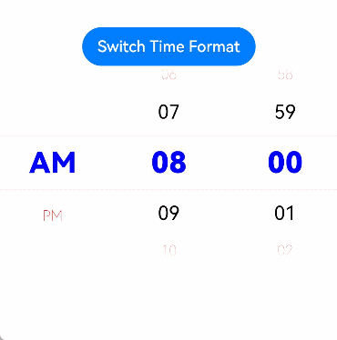

# TimePicker

The **\<TimePicker>** component allows users to select a time (with the hour and minute) from the given range.

>  **NOTE**
>
>  This component is supported since API version 8. Updates will be marked with a superscript to indicate their earliest API version.


## Child Components

Not supported


## APIs

TimePicker(options?: {selected?: Date})

Creates a time picker, which is in 24-hour format by default.

**Parameters**

| Name  | Type| Mandatory| Description                                                    |
| -------- | -------- | ---- | ------------------------------------------------------------ |
| selected | Date     | No  | Time of the selected item.<br>Default value: current system time<br>Since API version 10, this parameter supports [$$](../../quick-start/arkts-two-way-sync.md) for two-way binding of variables.|

## Attributes

In addition to the [universal attributes](ts-universal-attributes-size.md), the following attributes are supported.

| Name                            | Type                                                    | Description                                                        |
| -------------------------------- | ------------------------------------------------------------ | ------------------------------------------------------------ |
| useMilitaryTime                  | boolean                                                      | Whether the display time is in 24-hour format.<br>Default value: **false**                  |
| disappearTextStyle<sup>10+</sup> | [PickerTextStyle](ts-basic-components-datepicker.md#pickertextstyle10) | Font color, font size, and font width for the top and bottom items.<br>Default value:<br>{<br>color: '#ff182431',<br>font: {<br>size: '14fp', <br>weight: FontWeight.Regular<br>}<br>} |
| textStyle<sup>10+</sup>          | [PickerTextStyle](ts-basic-components-datepicker.md#pickertextstyle10) | Font color, font size, and font width of all items except the top, bottom, and selected items.<br>Default value:<br>{<br>color: '#ff182431',<br>font: {<br>size: '16fp', <br>weight: FontWeight.Regular<br>}<br>} |
| selectedTextStyle<sup>10+</sup>  | [PickerTextStyle](ts-basic-components-datepicker.md#pickertextstyle10) | Font color, font size, and font width of the selected item.<br>Default value:<br>{<br>color: '#ff007dff',<br>font: {<br>size: '20vp', <br>weight: FontWeight.Medium<br>}<br>} |

## Events

In addition to the [universal events](ts-universal-events-click.md), the following events are supported.

| Name                                      | Description       |
| ---------------------------------------- | ----------- |
| onChange(callback: (value: TimePickerResult ) =&gt; void) | Triggered when a time is selected.|

## TimePickerResult

| Name    | Type  | Description     |
| ------ | ------ | ------- |
| hour   | number | Hour portion of the selected time.|
| minute | number | Minute portion of the selected time.|


## Example

```ts
// xxx.ets
@Entry
@Component
struct TimePickerExample {
  @State isMilitaryTime: boolean = false
  private selectedTime: Date = new Date('2022-07-22T08:00:00')

  build() {
    Column() {
      Button ('Switch Time Format')
        .margin({ top: 30 })
        .onClick(() => {
          this.isMilitaryTime = !this.isMilitaryTime
        })
      TimePicker({
        selected: this.selectedTime,
      })
        .useMilitaryTime(this.isMilitaryTime)
        .onChange((value: TimePickerResult) => {
          this.selectedTime.setHours(value.hour, value.minute)
          console.info('select current date is: ' + JSON.stringify(value))
        })
        .disappearTextStyle({color: Color.Red, font: {size: 15, weight: FontWeight.Lighter}})
        .textStyle({color: Color.Black, font: {size: 20, weight: FontWeight.Normal}})
        .selectedTextStyle({color: Color.Blue, font: {size: 30, weight: FontWeight.Bolder}})
    }.width('100%')
  }
}
```


