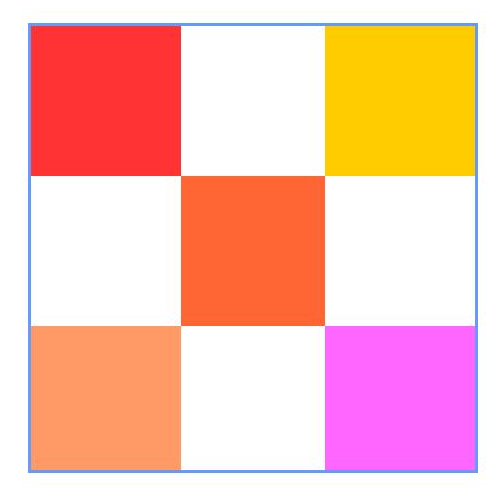

# RelativeContainer

The **\<RelativeContainer>** component is used for element alignment in complex scenarios.

>  **NOTE**
>
>  This component is supported since API version 9. Updates will be marked with a superscript to indicate their earliest API version.

## Rules 

 * Components in a container are aligned horizontally or vertically. 
   * Alignment modes in the horizontal direction can be left, middle, or right, achieved by the **HorizontalAlign.Start**, **HorizontalAlign.Center**, and **HorizontalAlign.End** attributes of the container, respectively.
   * Alignment modes in the vertical direction can be top, center, or bottom, achieved by the **VerticalAlign.Top**, **VerticalAlign.Center**, and **VerticalAlign.Bottom** attributes of the container, respectively.
 * A child component can set the container or another child component as the anchor. 
   * To show in the **\<RelativeContainer>**, child components must have an ID. The container ID is fixed at **__container__**. 
   * Three positions of the child component in a direction can use three positions of the container or another child components in the same direction as anchors. If anchors are set for more than two positions in a single direction, the third position is skipped. 
   * The child component size set on the frontend page is not affected by the **\<RelativeContainer>** rules.
   * If offset is required after the alignment, it can be set through **offset**. 
 * Exceptions
   * When a mutual or circular dependency occurs, none of the child components in the container are drawn. 
   * If anchors are set for more than two positions in a single direction but the anchor positions are reversed, the size of the child component is 0, which means that the child component is not drawn. 

## Child Components

Multiple child components are supported.


## APIs

RelativeContainer()

## Example

```ts
@Entry
@Component
struct Index {
  build() {
    Row() {
      Button("Extra button").width(100).height(50)

      RelativeContainer() {
        Button("Button 1")
          .width(120)
          .height(30)
          .alignRules({
            middle: { anchor: "__container__", align: HorizontalAlign.Center },
          })
          .id("bt1")
          .borderWidth(1)
          .borderColor(Color.Black)

        Text("This is text 2")
          .fontSize(20)
          .padding(10)
          .alignRules({
            bottom: { anchor: "__container__", align: VerticalAlign.Bottom },
            top: { anchor: "bt1", align: VerticalAlign.Bottom },
            right: { anchor: "bt1", align: HorizontalAlign.Center }
          })
          .id("tx2")
          .borderWidth(1)
          .borderColor(Color.Black)
          .height(30)

        Button("Button 3")
          .width(100)
          .height(100)
          .alignRules({
            left: { anchor: "bt1", align: HorizontalAlign.End },
            top: { anchor: "tx2", align: VerticalAlign.Center },
            bottom: { anchor: "__container__", align: VerticalAlign.Bottom }
          })
          .id("bt3")
          .borderWidth(1)
          .borderColor(Color.Black)

        Text("This is text 4")
          .fontSize(20)
          .padding(10)
          .alignRules({
            left: { anchor: "tx2", align: HorizontalAlign.End },
            right: { anchor: "__container__", align: HorizontalAlign.End },
            top: { anchor: "__container__", align: VerticalAlign.Top },
            bottom: { anchor: "bt3", align: VerticalAlign.Top }
          })
          .id("tx4")
          .borderWidth(1)
          .borderColor(Color.Black)
      }
      .width(200).height(200)
      .backgroundColor(Color.Orange)
    }
    .height('100%')
  }
}
```

