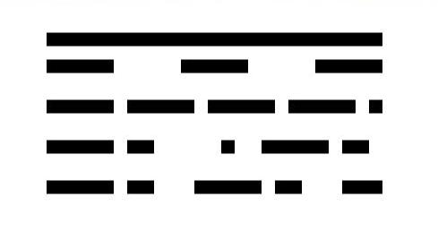

# Line

The **\<Line>** component is used to draw a straight line.

>  **NOTE**
>
> This component is supported since API version 7. Updates will be marked with a superscript to indicate their earliest API version.

## Child Components

Not supported


## APIs

Line(options?: {width?: string | number, height?: string | number})

**Parameters**

| Name| Type| Mandatory| Default Value| Description|
| -------- | -------- | -------- | -------- | -------- |
| width | string \| number | No| 0 | Width.|
| height | string \| number | No| 0 | Height.|


## Attributes

In addition to the [universal attributes](ts-universal-attributes-size.md), the following attributes are supported.

| Name| Type| Default Value| Description|
| -------- | -------- | -------- | -------- |
| startPoint | Array&lt;Length&gt; | [0, 0] | Coordinates (relative coordinates) of the start point of the line, in vp.|
| endPoint   | Array&lt;Length&gt; | [0, 0] | Coordinates (relative coordinates) of the end point of the line, in vp.|
| fill | [ResourceColor](ts-types.md#resourcecolor8) | Color.Black | Color of the fill area.<br>**NOTE**<br>This attribute does not take effect because the **\<Line>** component cannot be used to draw a closed shape.|
| fillOpacity | number \| string \| [Resource](ts-types.md#resource)| 1 | Opacity of the fill area.<br>**NOTE**<br>This attribute does not take effect because the **\<Line>** component cannot be used to draw a closed shape.|
| stroke | [ResourceColor](ts-types.md#resourcecolor8) | Color.Black | Stroke color.|
| strokeDashArray | Array&lt;Length&gt; | [] | Stroke dashes.|
| strokeDashOffset | number \| string | 0 | Offset of the start point for drawing the stroke.|
| strokeLineCap | [LineCapStyle](ts-appendix-enums.md#linecapstyle) | LineCapStyle.Butt | Cap style of the stroke.|
| strokeLineJoin | [LineJoinStyle](ts-appendix-enums.md#linejoinstyle) | LineJoinStyle.Miter | Join style of the stroke.|
| strokeMiterLimit | number \| string | 4 | Limit value when the sharp angle is drawn as a miter.<br>**NOTE**<br>This attribute does not take effect because the **\<Line>** component cannot be used to draw a shape with a sharp angle.|
| strokeOpacity | number \| string \| [Resource](ts-types.md#resource)| 1 | Stroke opacity.<br>**NOTE**<br>The value range is [0.0, 1.0]. If the set value is less than 0.0, **0.0** will be used. If the set value is greater than 1.0, **1.0** will be used.|
| strokeWidth | Length | 1 | Stroke width.|
| antiAlias | boolean | true | Whether anti-aliasing is enabled.|

## Example

### Example 1

```ts
// xxx.ets
@Entry
@Component
struct LineExample {
  build() {
    Column({ space: 10 }) {
      // The coordinates of the start and end points of the line are determined relative to the coordinates of the drawing area of the <Line> component.
      Line()
        .startPoint([0, 0])
        .endPoint([50, 100])
        .backgroundColor('#F5F5F5')
      Line()
        .width(200)
        .height(200)
        .startPoint([50, 50])
        .endPoint([150, 150])
        .strokeWidth(5)
        .stroke(Color.Orange)
        .strokeOpacity(0.5)
        .backgroundColor('#F5F5F5')
      // If the coordinates of a point are beyond the width and height range of the <Line> component, the line will exceed the drawing area.
      Line({ width: 50, height: 50 })
        .startPoint([0, 0])
        .endPoint([100, 100])
        .strokeWidth(3)
        .strokeDashArray([10, 3])
        .backgroundColor('#F5F5F5')
      // strokeDashOffset is used to define the offset when the associated strokeDashArray array is rendered.
      Line({ width: 50, height: 50 })
        .startPoint([0, 0])
        .endPoint([100, 100])
        .strokeWidth(3)
        .strokeDashArray([10, 3])
        .strokeDashOffset(5)
        .backgroundColor('#F5F5F5')
    }
  }
}
```


### Example 2

```ts
// xxx.ets
@Entry
@Component
struct LineExample1 {
  build() {
    Row({ space: 10 }) {
      // Set LineCapStyle to Butt.
      Line()
        .width(100)
        .height(200)
        .startPoint([50, 50])
        .endPoint([50, 200])
        .strokeWidth(20)
        .strokeLineCap(LineCapStyle.Butt)
        .backgroundColor('#F5F5F5').margin(10)
      // Set LineCapStyle to Round.
      Line()
        .width(100)
        .height(200)
        .startPoint([50, 50])
        .endPoint([50, 200])
        .strokeWidth(20)
        .strokeLineCap(LineCapStyle.Round)
        .backgroundColor('#F5F5F5')
      // Set LineCapStyle to Square.
      Line()
        .width(100)
        .height(200)
        .startPoint([50, 50])
        .endPoint([50, 200])
        .strokeWidth(20)
        .strokeLineCap(LineCapStyle.Square)
        .backgroundColor('#F5F5F5')
    }
  }
}
```


### Example 3

```ts
// xxx.ets
@Entry
@Component
struct LineExample {
  build() {
    Column() {
      Line()
        .startPoint([50, 30])
        .endPoint([300, 30])
        .strokeWidth(10)
      // Set the interval for strokeDashArray to 50.
      Line()
        .startPoint([50, 20])
        .endPoint([300, 20])
        .strokeWidth(10)
        .strokeDashArray([50])
      // Set the interval for strokeDashArray to 50, 10.
      Line()
        .startPoint([50, 20])
        .endPoint([300, 20])
        .strokeWidth(10)
        .strokeDashArray([50, 10])
      // Set the interval for strokeDashArray to 50, 10, 20.
      Line()
        .startPoint([50, 20])
        .endPoint([300, 20])
        .strokeWidth(10)
        .strokeDashArray([50, 10, 20])
      // Set the interval for strokeDashArray to 50, 10, 20, 30.
      Line()
        .startPoint([50, 20])
        .endPoint([300, 20])
        .strokeWidth(10)
        .strokeDashArray([50, 10, 20, 30])

    }
  }
}
```


