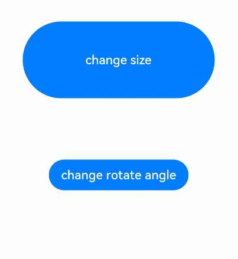

# Explicit Animation

You can create explicit animation with your custom settings.

>  **NOTE**
>
>  The APIs of this module are supported since API version 7. Updates will be marked with a superscript to indicate their earliest API version.

animateTo(value: AnimateParam, event: () => void): void

| Name            | Type       |       Mandatory    |        Description       |
| ---------------- | ------------ | -------------------- | -------------------- |
| value | [AnimateParam](#animateparam)| Yes| Animation settings.|
| event | () => void | Yes| Closure function that displays the dynamic effect. The system automatically inserts the transition animation if the status changes in the closure function.|

## AnimateParam

| Name| Type| Description|
| -------- | -------- | -------- |
| duration | number | Animation duration, in ms.<br>Default value: **1000** |
| tempo | number | Animation playback speed. A larger value indicates faster animation playback, and a smaller value indicates slower animation playback. The value **0** means that there is no animation.<br>Default value: **1.0**|
| curve | [Curve](ts-appendix-enums.md#curve) \| [ICurve](../apis/js-apis-curve.md#icurve) \| string | Animation curve.<br>Default value: **Curve.Linear** |
| delay | number | Delay of animation playback, in ms. By default, the playback is not delayed.<br>Default value: **0**|
| iterations | number | Number of times that the animation is played. By default, the animation is played once. The value **-1** indicates that the animation is played for an unlimited number of times.<br>Default value: **1**|
| playMode | [PlayMode](ts-appendix-enums.md#playmode) | Animation playback mode. By default, the animation is played from the beginning after the playback is complete.<br>Default value: **PlayMode.Normal** |
| onFinish   | () =&gt; void   | Callback invoked when the animation playback is complete. |


## Example

```ts
// xxx.ets
@Entry
@Component
struct AnimateToExample {
  @State widthSize: number = 250
  @State heightSize: number = 100
  @State rotateAngle: number = 0
  private flag: boolean = true

  build() {
    Column() {
      Button('change size')
        .width(this.widthSize)
        .height(this.heightSize)
        .margin(30)
        .onClick(() => {
          if (this.flag) {
            animateTo({
              duration: 2000,
              curve: Curve.EaseOut,
              iterations: 3,
              playMode: PlayMode.Normal,
              onFinish: () => {
                console.info('play end')
              }
            }, () => {
              this.widthSize = 150
              this.heightSize = 60
            })
          } else {
            animateTo({}, () => {
              this.widthSize = 250
              this.heightSize = 100
            })
          }
          this.flag = !this.flag
        })
      Button('change rotate angle')
        .margin(50)
        .rotate({ x: 0, y: 0, z: 1, angle: this.rotateAngle })
        .onClick(() => {
          animateTo({
            duration: 1200,
            curve: Curve.Friction,
            delay: 500,
            iterations: -1, // The value -1 indicates that the animation is played for an unlimited number of times.
            playMode: PlayMode.Alternate,
            onFinish: () => {
              console.info('play end')
            }
          }, () => {
            this.rotateAngle = 90
          })
        })
    }.width('100%').margin({ top: 5 })
  }
}
```


