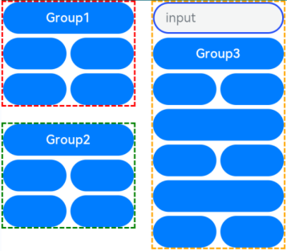
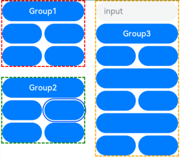
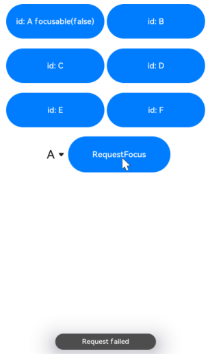

# Focus Control

Focus control attributes set whether a component is focusable and how it participates in focus navigation.

>  **NOTE**
>
>  The APIs of this module are supported since API version 8. Updates will be marked with a superscript to indicate their earliest API version.


## Attributes

| Name              | Type| Description                                  |
| -------------------- | -------- | ---------------------------------------- |
| focusable            | boolean  | Whether the current component is focusable.<br>**NOTE**<br>Components that have default interaction logic, such as **\<Button>** and **\<TextInput>**, are focusable by default. Other components, such as **\<Text>** and **\<Image>**, are not focusable by default. Only focusable components can trigger a [focus event](ts-universal-focus-event.md).|
| tabIndex<sup>9+<sup> | number   | How the current component participates in sequential keyboard navigation.<br>- **tabIndex** >= 0: The component is focusable in sequential keyboard navigation, with its order defined by the value. A component with a larger value gains focus later than one with a smaller value. If multiple components share the same **tabIndex** value, they gain focus in the order they appear in the component tree.<br>- **tabIndex** < 0 (usually **tabIndex** = -1): The component is focusable, but cannot be reached through sequential keyboard navigation.<br>Default value: **0**|
| defaultFocus<sup>9+<sup> | boolean  | Whether to set the component as the default focus of the page. This attribute takes effect only when the page is new and accessed for the first time.<br>Default value: **false**|
| groupDefaultFocus<sup>9+<sup> | boolean  | Whether to set the component as the default focus of the parent container. This attribute takes effect only when the container is new and obtains focus for the first time.<br>Default value: **false**<br>**NOTE**<br>This attribute must be used together with **tabIndex**. When **tabIndex** is set for a container and **groupDefaultFocus** is set for a component in the container, the focus is automatically shifted to that component when the container obtains focus for the first time.<br>|
| focusOnTouch<sup>9+<sup> | boolean | Whether the component is focusable on touch.<br>Default value: **false**<br>**NOTE**<br>The component can obtain focus only when it is touchable or clickable.|

## focusControl<sup>9+</sup>

### requestFocus<sup>9+</sup>

requestFocus(value: string): boolean

Requests the focus to move to the specified component. This API can be used in global method statements. 

**Parameters**

| Name| Type| Mandatory| Description|
| ----- | ------ | ---- | ---- |
| value | string | Yes  | String bound to the target component using the **key(value: string)**.|

**Return value**

| Type| Description|
| ------- | ---- |
| boolean | Returns whether the focus is successfully moved to the target component. Returns **true** if the specified component exists and the focus is successfully moved to the target component; returns **false** otherwise.|

>  **NOTE**
>
>  The following components support focus control: **\<TextInput>**, **\<TextArea>**, **\<Search>**, **\<Button>**, **\<Text>**, **\<Image>**, **\<List>**, and **\<Grid>**. Currently, the running effect of the focus event can be displayed only on a real device.

## Example

### Example 1

This example shows how to use **defaultFocus**, **groupDefaultFocus**, and **focusOnTouch**.

**defaultFocus** sets the bound component as the initial focus of the page after the page is created. **groupDefaultFocus** sets the bound component as the initial focus of the **tabIndex** container after the container is created. **focusOnTouch** sets the bound component to obtain focus upon being clicked.

```ts
// focusTest.ets
@Entry
@Component
struct FocusableExample {
  @State inputValue: string = ''

  build() {
    Scroll() {
      Row({ space: 20 }) {
        Column({ space: 20 }) {
          Column({ space: 5 }) {
            Button('Group1')
              .width(165)
              .height(40)
              .fontColor(Color.White)
              .focusOnTouch(true)           // The button is focusable on touch.
            Row({ space: 5 }) {
              Button()
                .width(80)
                .height(40)
                .fontColor(Color.White)
              Button()
                .width(80)
                .height(40)
                .fontColor(Color.White)
                .focusOnTouch(true)           // The button is focusable on touch.
            }
            Row({ space: 5 }) {
              Button()
                .width(80)
                .height(40)
                .fontColor(Color.White)
              Button()
                .width(80)
                .height(40)
                .fontColor(Color.White)
            }
          }.borderWidth(2).borderColor(Color.Red).borderStyle(BorderStyle.Dashed)
          .tabIndex(1)                      // The column is the initial component to have focus in sequential keyboard navigation.
          Column({ space: 5 }) {
            Button('Group2')
              .width(165)
              .height(40)
              .fontColor(Color.White)
            Row({ space: 5 }) {
              Button()
                .width(80)
                .height(40)
                .fontColor(Color.White)
              Button()
                .width(80)
                .height(40)
                .fontColor(Color.White)
                .groupDefaultFocus(true)      // The button obtains focus when its upper-level column is in focus.
            }
            Row({ space: 5 }) {
              Button()
                .width(80)
                .height(40)
                .fontColor(Color.White)
              Button()
                .width(80)
                .height(40)
                .fontColor(Color.White)
            }
          }.borderWidth(2).borderColor(Color.Green).borderStyle(BorderStyle.Dashed)
          .tabIndex(2)                      // The column is the second component to have focus in sequential keyboard navigation.
        }
        Column({ space: 5 }) {
          TextInput({placeholder: 'input', text: this.inputValue})
            .onChange((value: string) => {
              this.inputValue = value
            })
            .width(156)
            .defaultFocus(true)             // The <TextInput> component is the initial default focus of the page.
          Button('Group3')
            .width(165)
            .height(40)
            .fontColor(Color.White)
          Row({ space: 5 }) {
            Button()
              .width(80)
              .height(40)
              .fontColor(Color.White)
            Button()
              .width(80)
              .height(40)
              .fontColor(Color.White)
          }
          Button()
            .width(165)
            .height(40)
            .fontColor(Color.White)
          Row({ space: 5 }) {
            Button()
              .width(80)
              .height(40)
              .fontColor(Color.White)
            Button()
              .width(80)
              .height(40)
              .fontColor(Color.White)
          }
          Button()
            .width(165)
            .height(40)
            .fontColor(Color.White)
          Row({ space: 5 }) {
            Button()
              .width(80)
              .height(40)
              .fontColor(Color.White)
            Button()
              .width(80)
              .height(40)
              .fontColor(Color.White)
          }
        }.borderWidth(2).borderColor(Color.Orange).borderStyle(BorderStyle.Dashed)
        .tabIndex(3)                      // The column is the third component to have focus in sequential keyboard navigation.
      }.alignItems(VerticalAlign.Top)
    }
  }
}
```
Diagrams:

When you press the Tab button for the first time, the focus switches to the component bound to **defaultFocus**.



When you press the Tab button for the second time, the focus switches to the container that matches **tabIndex(1)** and automatically moves to the component bound to **groupDefaultFocus**.


When you press the Tab button for the third time, the focus switches to the container that matches **tabIndex(2)** and automatically moves to the component bound to **groupDefaultFocus**.



When you press the Tab button for the fourth time, the focus switches to the container that matches **tabIndex(3)** and automatically moves to the component bound to **groupDefaultFocus**.


Click the component bound to **focusOnTouch**. The component then obtains focus.


### Example 2

This example shows how to use **focusControl.requestFocus** to move th focus to the specified component.

```ts
// requestFocus.ets
import promptAction from '@ohos.promptAction';

@Entry
@Component
struct RequestFocusExample {
  @State idList: string[] = ['A', 'B', 'C', 'D', 'E', 'F', 'LastPageId']
  @State selectId: string = 'LastPageId'

  build() {
    Column({ space:20 }){
      Row({space: 5}) {
        Button("id: " + this.idList[0] + " focusable(false)")
          .width(200).height(70).fontColor(Color.White)
          .key(this.idList[0])
          .focusable(false)
        Button("id: " + this.idList[1])
          .width(200).height(70).fontColor(Color.White)
          .key(this.idList[1])
      }
      Row({space: 5}) {
        Button("id: " + this.idList[2])
          .width(200).height(70).fontColor(Color.White)
          .key(this.idList[2])
        Button("id: " + this.idList[3])
          .width(200).height(70).fontColor(Color.White)
          .key(this.idList[3])
      }
      Row({space: 5}) {
        Button("id: " + this.idList[4])
          .width(200).height(70).fontColor(Color.White)
          .key(this.idList[4])
        Button("id: " + this.idList[5])
          .width(200).height(70).fontColor(Color.White)
          .key(this.idList[5])
      }
      Row({space: 5}) {
        Select([{value: this.idList[0]},
                {value: this.idList[1]},
                {value: this.idList[2]},
                {value: this.idList[3]},
                {value: this.idList[4]},
                {value: this.idList[5]},
                {value: this.idList[6]}])
          .value(this.selectId)
          .onSelect((index: number) => {
            this.selectId = this.idList[index]
          })
        Button("RequestFocus")
          .width(200).height(70).fontColor(Color.White)
          .onClick(() => {
            var res = focusControl.requestFocus(this.selectId)      // Move the focus to the component specified by this.selectId.
            if (res) {
              promptAction.showToast({message: 'Request success'})
            } else {
              promptAction.showToast({message: 'Request failed'})
            }
          })
      }
    }.width('100%').margin({ top:20 })
  }
}
```

Diagrams:

Press the Tab button to activate the focus state.

Below shows how the UI behaves when you request focus for a component that does not exist.


Below shows how the UI behaves when you request focus for a component that is not focusable.



Below shows how the UI behaves when you request focus for a focusable component.


