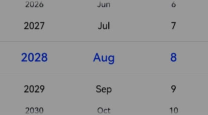

# Light Up Effect

You can apply a light up effect to a component.

>  **NOTE**
>
>  This attribute is supported since API Version 10. Updates will be marked with a superscript to indicate their earliest API version. This is a system API.

## Attributes

| Name| Type| Description|
| -------- | -------- | -------- |
| lightUpEffect | [number] | Light up degree of the component.<br>The value ranges from 0 to 1.<br>If the value is 0, the component is dark. If the value is 1, the component is fully illuminated. Between 0 and 1, a greater value indicates higher luminance. A value less than 0 evaluates to the value **0**. A value greater than 1 evaluates to the value **1**.|

## Example

### Example 1
```ts
// xxx.ets
@Entry
@Component
struct LightUpExample {
  build() {
    Stack() {
      Text('This is the text content with letterSpacing 0.')
        .letterSpacing(0)
        .fontSize(12)
        .border({ width: 1 })
        .padding(10)
        .width('50%')
        .lightUpEffect(0.6)
    }.alignContent(Alignment.Center).width("100%").height("100%")
  }
}

```
Below is how the component looks with **lightUpEffect** set to **0.6**:


Below is how the component looks with **lightUpEffect** set to **0.2**:


Below is how the component looks without the light up effect applied:


### Example 2

```ts
// xxx.ets
@Entry
@Component
struct LightUpExample {
  @State isLunar: boolean = false
  private selectedDate: Date = new Date('2028-08-08')
  build() {
    Stack() {
      DatePicker({
        start: new Date('1970-1-1'),
        end: new Date('2100-1-1'),
        selected: this.selectedDate
      })
        .lunar(this.isLunar)
        .onChange((value: DatePickerResult) => {
          this.selectedDate.setFullYear(value.year, value.month, value.day)
          console.info('select current date is: ' + JSON.stringify(value))
        })
        .lightUpEffect(0.6)

    }.alignContent(Alignment.Center).width("100%").height("100%")
  }
}
```



Below is how the component looks without the light up effect applied:


