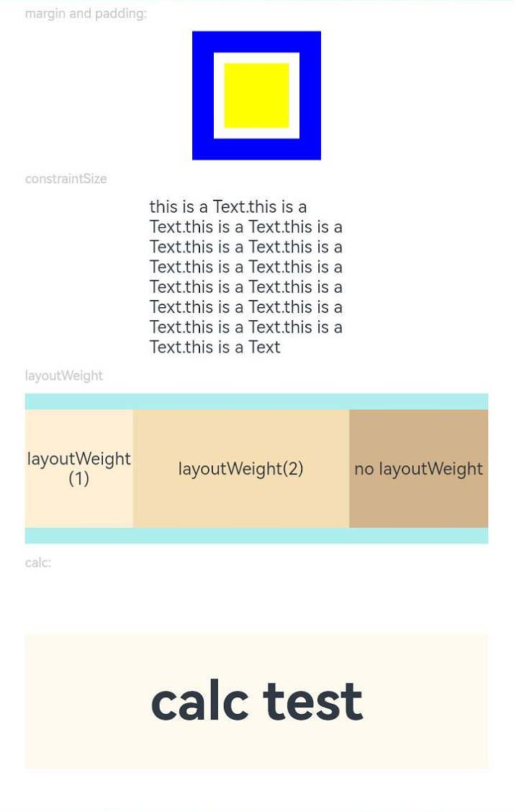

# Size

The size attributes set the width, height, and margin of a component.

>  **NOTE**
>
>  The APIs of this module are supported since API version 7. Updates will be marked with a superscript to indicate their earliest API version.


## Attributes


| Name            | Type                                    | Description                                      |
| -------------- | ---------------------------------------- | ---------------------------------------- |
| width          | [Length](ts-types.md#length)             | Width of the component. By default, the width required to fully hold the component content is used. If the width of the component is greater than that of the parent container, the range of the parent container is drawn.<br>Since API version 9, this API is supported in ArkTS widgets.<br>Since API version 10, this API supports the calc calculation feature.|
| height         | [Length](ts-types.md#length)             | Height of the component. By default, the height required to fully hold the component content is used. If the height of the component is greater than that of the parent container, the range of the parent container is drawn.<br>Since API version 9, this API is supported in ArkTS widgets.<br>Since API version 10, this API supports the calc calculation feature.|
| size           | {<br>width?: [Length](ts-types.md#length),<br>height?: [Length](ts-types.md#length)<br>} | Size of the component.<br>Since API version 9, this API is supported in ArkTS widgets.<br>Since API version 10, this API supports the calc calculation feature.|
| padding        | [Padding](ts-types.md#padding) \| [Length](ts-types.md#length) | Padding of the component.<br>When the parameter is of the **Length** type, the four paddings take effect.<br>Default value: **0**<br>When **padding** is set to a percentage, the width of the parent container is used as the basic value.<br>Since API version 9, this API is supported in ArkTS widgets.<br>Since API version 10, this API supports the calc calculation feature.|
| margin         | [Margin](ts-types.md#margin) \| [Length](ts-types.md#length) | Margin of the component.<br>When the parameter is of the **Length** type, the four margins take effect.<br>Default value: **0**<br>When **margin** is set to a percentage, the width of the parent container is used as the basic value. When child components are laid out along the cross axis of the **\<Row>**, **\<Column>**, or **\<Flex>** container, the cross axis size of the child components and the margins add up to the total size of the container.<br>For example, if the width of the **\<Column>** container is 100, the width of the child component is 50, the left margin is 10, and the right margin is 20, then the actual horizontal offset of the child component is 20.<br>Since API version 9, this API is supported in ArkTS widgets.<br>Since API version 10, this API supports the calc calculation feature.|
| constraintSize | {<br>minWidth?: [Length](ts-types.md#length),<br>maxWidth?: [Length](ts-types.md#length),<br>minHeight?: [Length](ts-types.md#length),<br>maxHeight?: [Length](ts-types.md#length)<br>} | Constraint size of the component, which is used to limit the size range during component layout. **constraintSize** takes precedence over **width** and **height**. Learn [how the value of this attribute affects the width and height](#impact-of-constraintsize-on-widthheight).<br>Default value:<br>{<br>minWidth: 0,<br>maxWidth: Infinity,<br>minHeight: 0,<br>maxHeight: Infinity<br>}<br>Since API version 9, this API is supported in ArkTS widgets.<br>Since API version 10, this API supports the calc calculation feature.|

## Impact of constraintSize on width/height

| Default Value                                  | Result                |
| ---------------------------------------- | ------------------ |
| / | max(minWidth/minHeight, min(maxWidth/maxHeight, width/height))       |
| maxWidth/maxHeight | max(minWidth/minHeight, width/height) |
| minWidth/minHeight | min(maxWidth/maxHeight, width/height)       |
|width/height|In the case of maxWidth/maxHeight > minWidth/minHeight, the layout logic of the component is used,<br>and the result is between maxWidth/maxHeight and minWidth/minHeight.<br> In other cases, the result is max(minWidth/minHeight, maxWidth, maxHeight).|
|maxWidth/maxHeight && width/height| minWidth/minHeight |
|minWidth/minHeight && width/height| The layout logic of the component is used. The final result does not exceed maxWidth/maxHeight.|
|maxWidth/maxHeight && minWidth/minHeight| Width/Height, which may be stretched or compressed based on other layout attributes.|
maxWidth/maxHeight && minWidth/minHeight && width/height|The layout restrictions passed by the parent container are used for layout.|

## Example

```ts
// xxx.ets
@Entry
@Component
struct SizeExample {
  build() {
    Column({ space: 10 }) {
      Text('margin and padding:').fontSize(12).fontColor(0xCCCCCC).width('90%')
      Row() {
        // Width: 80; height: 80; margin: 20 (blue area); padding: 10 (white area)
        Row() {
          Row().size({ width: '100%', height: '100%' }).backgroundColor(Color.Yellow)
        }
        .width(80)
        .height(80)
        .padding(10)
        .margin(20)
        .backgroundColor(Color.White)
      }.backgroundColor(Color.Blue)

      Text('constraintSize').fontSize(12).fontColor(0xCCCCCC).width('90%')
      Text('this is a Text.this is a Text.this is a Text.this is a Text.this is a Text.this is a Text.this is a Text.this is a Text.this is a Text.this is a Text.this is a Text.this is a Text.this is a Text.this is a Text.this is a Text')
        .width('90%')
        .constraintSize({ maxWidth: 200 })

      Text('layoutWeight').fontSize(12).fontColor(0xCCCCCC).width('90%')
      // When the container size is determined, the component occupies the space along the main axis based on the layout weight, and the component size setting is ignored.
      Row() {
        // Weight 1: The component occupies 1/3 of the remaining space along the main axis.
        Text('layoutWeight(1)')
          .size({ width: '30%', height: 110 }).backgroundColor(0xFFEFD5).textAlign(TextAlign.Center)
          .layoutWeight(1)
        // Weight 2: The component occupies 2/3 of the remaining space along the main axis.
        Text('layoutWeight(2)')
          .size({ width: '30%', height: 110 }).backgroundColor(0xF5DEB3).textAlign(TextAlign.Center)
          .layoutWeight(2)
        // If layoutWeight is not set, the component is rendered based on its own size setting.
        Text('no layoutWeight')
          .size({ width: '30%', height: 110 }).backgroundColor(0xD2B48C).textAlign(TextAlign.Center)
      }.size({ width: '90%', height: 140 }).backgroundColor(0xAFEEEE)
      // calc calculation feature
      Text('calc:').fontSize(12).fontColor(0xCCCCCC).width('90%')
      Text('calc test').fontSize(50).fontWeight(FontWeight.Bold).backgroundColor(0xFFFAF0).textAlign(TextAlign.Center)
        .margin('calc(25vp*2)')
        .size({width:'calc(90%)', height:'calc(50vp + 10%)'})
    }.width('100%').margin({ top: 5 })
  }
}
```


