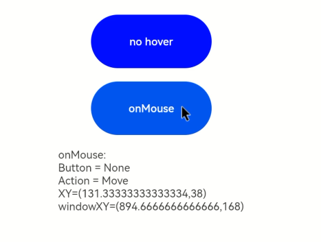

# Mouse Event

If a mouse action triggers multiple events, the order of these events is fixed. By default, mouse events are transmitted transparently.

>  **NOTE**
>
>  - The APIs of this module are supported since API version 8. Updates will be marked with a superscript to indicate their earliest API version.
>  - For the time being, a mouse event can be triggered only by an external mouse.


## Events

| Name                                      | Bubbling Supported| Description                                      |
| ---------------------------------------- | ---- | ---------------------------------------- |
| onHover(event: (isHover?: boolean, event<sup>10+</sup>?: HoverEvent) =&gt; void) | Yes   | Triggered when the mouse pointer enters or leaves the component.<br>**isHover**: whether the mouse pointer hovers over the component. The value **true** means that the mouse pointer enters the component, and the value **false** means that the mouse pointer leaves the component.<br>**event**: bubbling blocking of the event.|
| onMouse(event: (event?: MouseEvent) =&gt; void) | Yes   | Triggered when the component is clicked by a mouse button or the mouse pointer moves on the component. The **event** parameter indicates the timestamp, mouse button, action, coordinates of the clicked point on the entire screen, and coordinates of the clicked point relative to the component when the event is triggered.|


## MouseEvent

| Name                    | Type                                    | Description                          |
| ---------------------- | ---------------------------------------- | ---------------------------- |
| x                      | number                                   | X coordinate of the mouse pointer relative to the upper left corner of the component being clicked.        |
| y                      | number                                   | Y coordinate of the mouse pointer relative to the upper left corner of the component being clicked.        |
| button                 | [MouseButton](ts-appendix-enums.md#mousebutton) | Mouse button.                       |
| action                 | [MouseAction](ts-appendix-enums.md#mouseaction) | Mouse action.                       |
| stopPropagation        | () => void                               | Stops the event from bubbling upwards or downwards.                     |
| timestamp<sup>8+</sup> | number                                   | Timestamp of the event. It is interval between the time when the event is triggered and the time when the system starts, in nanoseconds.|
| target<sup>8+</sup>    | [EventTarget](ts-universal-events-click.md#eventtarget8) | Display area of the component that triggers the event.              |
| source<sup>8+</sup>    | [SourceType](ts-gesture-settings.md#sourcetype)| Event input device.                     |
| windowX<sup>10+</sup> | number                          | X coordinate of the mouse pointer relative to the upper left corner of the application window.|
| windowY<sup>10+</sup> | number                          | Y coordinate of the mouse pointer relative to the upper left corner of the application window.|
| displayX<sup>10+</sup> | number                         | X coordinate of the mouse pointer relative to the upper left corner of the application screen.|
| displayY<sup>10+</sup> | number                         | Y coordinate of the mouse pointer relative to the upper left corner of the application screen.|
| screenX<sup>(deprecated)</sup> | number                 | X coordinate of the mouse pointer relative to the upper left corner of the application window.<br>This API is deprecated since API version 10. You are advised to use **windowX** instead.|
| screenY<sup>(deprecated)</sup> | number                 | Y coordinate of the mouse pointer relative to the upper left corner of the application window.<br>This API is deprecated since API version 10. You are advised to use **windowY** instead.|

## HoverEvent<sup>10+</sup>

| Name             | Type      | Description     |
| --------------- | ---------- | ------- |
| stopPropagation | () => void | Stops the event from bubbling upwards or downwards.|

## Example

```ts
// xxx.ets
@Entry
@Component
struct MouseEventExample {
  @State hoverText: string = 'no hover';
  @State mouseText: string = '';
  @State action: string = '';
  @State mouseBtn: string = '';
  @State color: Color = Color.Blue;

  build() {
    Column({ space: 20 }) {
      Button(this.hoverText)
        .width(180).height(80)
        .backgroundColor(this.color)
        .onHover((isHover?: boolean, event?: HoverEvent):void => {
          // Use the onHover event to dynamically change the text content and background color of a button when the mouse pointer is hovered on it.
          if (isHover) {
            this.hoverText = 'hover';
            this.color = Color.Pink;
          } else {
            this.hoverText = 'no hover';
            this.color = Color.Blue;
          }
        })
      Button('onMouse')
        .width(180).height(80)
        .onMouse((event?: MouseEvent):void => {
          if(event){
            switch (event.button) {
              case MouseButton.None:
                this.mouseBtn = 'None';
                break;
              case MouseButton.Left:
                this.mouseBtn = 'Left';
                break;
              case MouseButton.Right:
                this.mouseBtn = 'Right';
                break;
              case MouseButton.Back:
                this.mouseBtn = 'Back';
                break;
              case MouseButton.Forward:
                this.mouseBtn = 'Forward';
                break;
              case MouseButton.Middle:
                this.mouseBtn = 'Middle';
                break;
            }
            switch (event.action) {
              case MouseAction.Hover:
                this.action = 'Hover';
                break;
              case MouseAction.Press:
                this.action = 'Press';
                break;
              case MouseAction.Move:
                this.action = 'Move';
                break;
              case MouseAction.Release:
                this.action = 'Release';
                break;
            }
            this.mouseText = 'onMouse:\nButton = ' + this.mouseBtn +
            '\nAction = ' + this.action + '\nXY=(' + event.x + ',' + event.y + ')' +
            '\nwindowXY=(' + event.windowX + ',' + event.windowY + ')';
          }
        })
      Text(this.mouseText)
    }.padding({ top: 30 }).width('100%')
  }
}
```

 

The figure below shows how the button looks like when hovered on.

  

The figure below shows how the button looks like when clicked.


