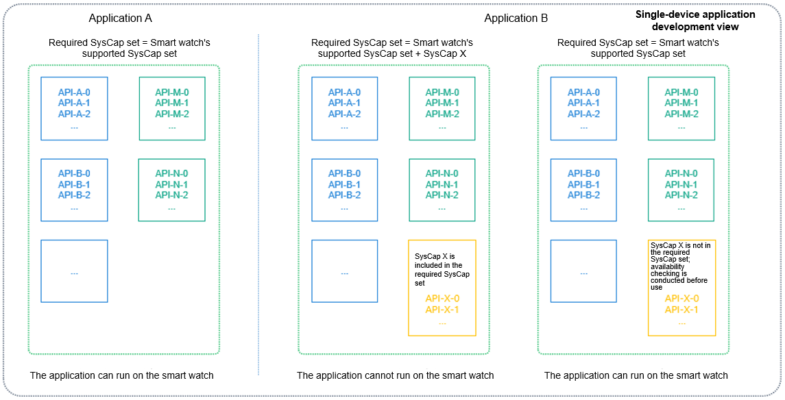
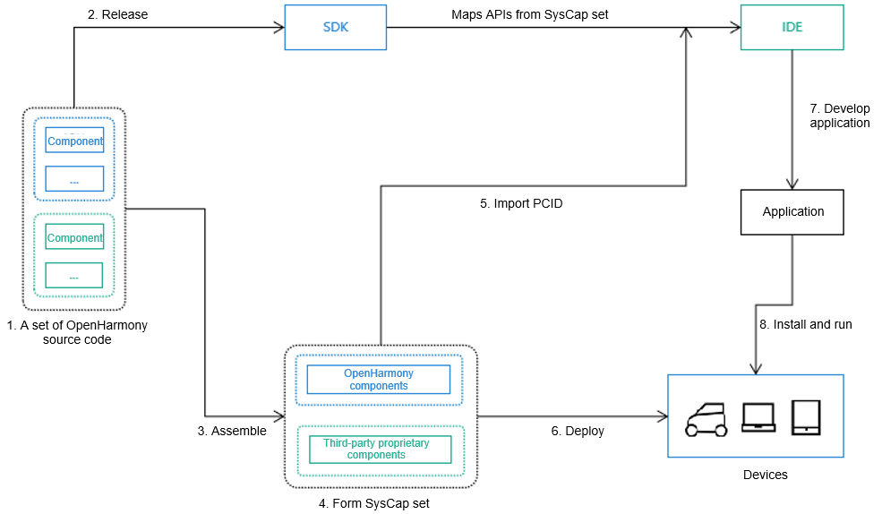

# SystemCapability

## Overview

### System Capabilities and APIs

SystemCapability (SysCap) refers to a standalone feature in the operating system, for example, Bluetooth, Wi-Fi, NFC, or camera. Each SysCap corresponds to a set of APIs, whose availability depends on the support of the target device. Such a set of APIs can be provided in DevEco Studio for association.


For details about the SysCap sets in OpenHarmony, see [SysCap List](syscap-list.md).

### Supported SysCap Set, Associated SysCap Set, and Required SysCap Set

The supported SysCap set, associated SysCap set, and required SysCap set are collections of SysCaps.
The supported SysCap set covers the device capabilities, and the required SysCap set covers the application capabilities. If the SysCap set required by application A is a subset of the SysCap set supported by device N, application A can be distributed to device N for installation and running. Otherwise, application A cannot be distributed.
The associated SysCap set covers the system capabilities of associated APIs that DevEco Studio offers during application development.


### Devices and Supported SysCap Sets

Each device provides a SysCap set that matches its hardware capability.
The SDK classifies devices into general devices and custom devices. The general devices' supported SysCap set is defined by OpenHarmony, and the custom devices' is defined by device vendors.


### Mapping Between Devices and SDK Capabilities

The SDK provides a full set of APIs for DevEco Studio. DevEco Studio identifies the supported SysCap set based on the devices selected for the project, filters the APIs contained in the SysCap set, and provides the supported APIs for association (to autocomplete input).


## How to Develop

### Obtaining the PCID

The Product Compatibility ID (PCID) contains the SysCap information supported by the current device. For the moment, you can obtain the PCID of a device from the device vendor. In the future, you'll be able to obtain the PCIDs of all devices from the authentication center, which is in development.

### Importing the PCID

DevEco Studio allows Product Compatibility ID (PCID) imports for projects. After the imported PCID file is decoded, the SysCap is output and written into the **syscap.json** file.

Right-click the project directory and choose **Import Product Compatibility ID** from the shortcut menu to upload the PCID file and import it to the **syscap.json** file.


### Configuring the Associated SysCap Set and Required SysCap Set

DevEco Studio automatically configures the associated SysCap set and required SysCap set based on the settings supported by the created project. You can modify these SysCap sets when necessary.
You can add APIs to the associated SysCap set in DevEco Studio by adding system capabilities. However, note that these APIs may not be supported on the device. Therefore, check whether these APIs are supported before using them.
Exercise caution when modifying the required SysCap set. Incorrect modifications may result in the application being unable to be distributed to the target device.

```json
// syscap.json
{
	"devices": {
		"general": [            // General devices. Each general device supports a SysCap set. Multiple general devices can be configured.
			"default",
			"car"
		],
		"custom": [             // Custom devices.
			{
				"Custom device": [
					"SystemCapability.Communication.SoftBus.Core"
				]
			}
		]
	},
	"development": {             // The SysCap set in addedSysCaps and the SysCap set supported by each device configured in devices form the associated SysCap set.
		"addedSysCaps": [
			"SystemCapability.Location.Location.Lite"
		]
	},
	"production": {              // Used to generate the RPCID. Exercise caution when adding this parameter. Under incorrect settings, applications may fail to be distributed to target devices.
		"addedSysCaps": [],      // Intersection of SysCap sets supported by devices configured in devices. It is the required SysCap set with addedSysCaps set and removedSysCaps set.
		"removedSysCaps": []     // When the required SysCap set is a capability subset of a device, the application can be distributed to the device.
	}
}
```

### Single-Device Application Development

By default, the associated SysCap set and required SysCap set of the application are the same as the supported SysCap set of the device. Exercise caution when modifying the required SysCap set.



### Cross-Device Application Development

By default, the associated SysCap set of an application is the union of multiple devices' supported SysCap sets, while the required SysCap set is the intersection of the devices' supported SysCap sets.


### Checking Whether an API Is Available

You can use either the ArtTS or native API to determine whether an API is available.

- ArkTS API

  - Method 1: Use the **canIUse()** API to check whether a SysCap is supported.

    ```ts
    if (canIUse("SystemCapability.ArkUI.ArkUI.Full")) {
	   console.log("This device supports SystemCapability.ArkUI.ArkUI.Full.");
    } else {
       console.log("This device does not support SystemCapability.ArkUI.ArkUI.Full.");
    }
    ```

  - Method 2: Import a module using the **import** API. If the current device does not support the module, the import result is **undefined**. Before using an API, you must make sure the API is available.

	```ts
	import geolocation from '@ohos.geolocation';

	if (geolocation) {
	geolocation.getCurrentLocation((location) => {
		console.log(location.latitude, location.longitude);
	});
	} else {
	console.log('This device does not support location information.');
	}
	```
- Native API

	```c
	#include <stdio.h>
	#include <stdlib.h>
	#include "syscap_ndk.h"

	char syscap[] = "SystemCapability.ArkUI.ArkUI.Full";
	bool result = canIUse(syscap);
	if (result) {
		printf("SysCap: %s is supported!\n", syscap);
	} else {
		printf("SysCap: %s is not supported!\n", syscap);
	}
	```

You can also find out the SysCap to which an API belongs by referring to the API reference document.

### Checking the Differences Between Devices with a Specific SysCap

The performance of a SysCap may vary by device type. For example, a tablet is superior to a smart wearable device in terms of the camera capability.

```ts
import userAuth from '@ohos.userIAM.userAuth';

const authenticator = userAuth.getAuthenticator();
const result = authenticator.checkAbility('FACE_ONLY', 'S1');

if (result == authenticator.CheckAvailabilityResult.AUTH_NOT_SUPPORT) {
	console.log('This device does not support facial recognition.');
}
// If an unsupported API is forcibly called, an error message is returned, but no syntax error occurs.
authenticator.execute('FACE_ONLY', 'S1', (err, result) => {
	if (err) {
		console.log(err.message);
		return;
	}
})
```

### How Do SysCap Differences Arise Between Devices

The device SysCaps in product solutions vary according to the component combination defined by the product solution vendor. The following figure shows the overall process.



1. A set of OpenHarmony source code consists of optional and mandatory components. Different components represent different SysCaps.

2. In a normalized released SDK, APIs are mapped to SysCap sets.

3. Product solution vendors can assemble components based on hardware capabilities and product requirements.

4. The components configured for a product can be OpenHarmony components or proprietary components developed by a third party. Since there is mapping between components and SysCap, the SysCap set of the product can be obtained after all components are assembled.

5. The SysCap set is encoded to generate the PCID. You can import the PCID to DevEco Studio and decode it into SysCaps. During development, compatibility processing is performed to mitigate the SysCap differences of devices.

6. System parameters deployed on devices contain the SysCap set. The system provides native interfaces and application interfaces for components and applications to check whether a specific SysCap is available.

7. During application development, the SysCap set required by the application is encoded into the Required Product Compatibility ID (RPCID) and written into the application installation package. During application installation, the package manager decodes the RPCID to obtain the SysCap set required by the application and compares it with the SysCap set supported by the device. If the SysCap set required by the application is met, the application can be installed on the device.

8. When an application is running on a device, the **canIUse** API can be used to query whether the device is compatible with a specific SysCap.
