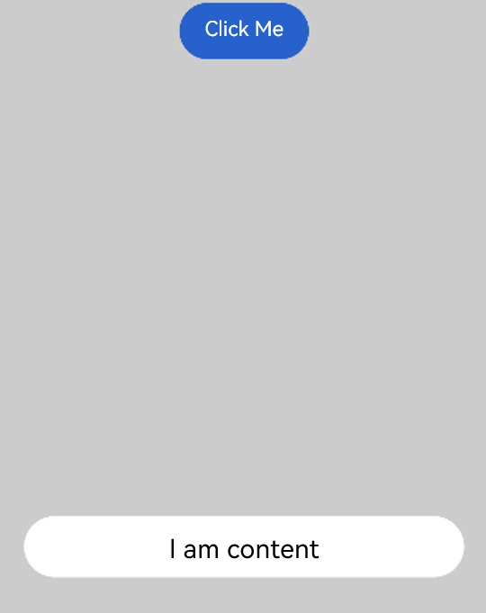
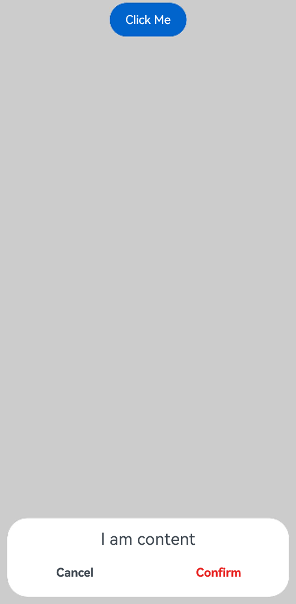

# Custom Dialog Box (CustomDialog)


A custom dialog box is a dialog box you customize by using APIs of the **CustomDialogController** class. It can be used for user interactions, showing an ad, prize, alert, software update message, and more. For details, see [Custom Dialog Box](../reference/arkui-ts/ts-methods-custom-dialog-box.md).


## Creating a Custom Dialog Box

1. Use the \@CustomDialog decorator to create a custom dialog box.

2. Set the content for the \@CustomDialog decorated dialog box.

   ```ts
   @CustomDialog
   struct CustomDialogExample {
     controller: CustomDialogController = new CustomDialogController({
       builder: CustomDialogExample({}),
     })
   
     build() {
       Column() {
         Text ('I am content')
           .fontSize(20)
           .margin({ top: 10, bottom: 10 })
       }
     }
   }
   ```
   
3. Create a builder that is bound to the decorator.

   ```ts
    @Entry
    @Component
    struct CustomDialogUser {
      dialogController: CustomDialogController = new CustomDialogController({
        builder: CustomDialogExample(),
      })
    }
   ```
   
4. Click the component bound to the **onClick** event to display the dialog box.

   ```ts
   @Entry
   @Component
   struct CustomDialogUser {dialogController: CustomDialogController = new CustomDialogController({
       builder: CustomDialogExample(),
     })
   
     build() {
       Column() {
         Button('click me')
           .onClick(() => {
             this.dialogController.open()
           })
       }.width('100%').margin({ top: 5 })
     }
   }
   ```
   
   


## Interaction with Custom Dialog Box

Custom dialog boxes can be used for data interactions to complete a series of response operations.


1. Add buttons in the \@CustomDialog decorator structure and add data functions.

  ```ts
  @CustomDialog
  struct CustomDialogExample {
    cancel: () => void = () => {
      console.info('Callback when the first button is clicked')
    }
    confirm: () => void = () => {
      console.info('Callback when the second button is clicked')
    }
    controller: CustomDialogController = new CustomDialogController({
      builder: CustomDialogExample({
        cancel: this.cancel,
        confirm: this.confirm,
      }),
    })
  
    build() {
      Column() {
        Text('I am content') .fontSize(20).margin({ top: 10, bottom: 10 })
        Flex({ justifyContent: FlexAlign.SpaceAround }) {
          Button('cancel')
            .onClick(() => {
              this.controller.close()
              this.cancel()
            }).backgroundColor(0xffffff).fontColor(Color.Black)
          Button('confirm')
            .onClick(() => {
              this.controller.close()
              this.confirm()
            }).backgroundColor(0xffffff).fontColor(Color.Red)
        }.margin({ bottom: 10 })
      }
    }
  }
  ```

2. Receive the page in the builder and create corresponding function operations.

  ```ts
  @Entry
  @Component
  struct CustomDialogUser {
    @State bud: Record<string, Function | void> = { 'cancel': this.onCancel(), 'confirm': this.onAccept() }
    dialogController: CustomDialogController = new CustomDialogController({
      builder: CustomDialogExample(this.bud),
    })
  
    onCancel() {
      console.info('Callback when the first button is clicked')
    }
  
    onAccept() {
      console.info('Callback when the second button is clicked')
    }
  
    build() {
      Column() {
        Button('Click Me')
          .onClick(() => {
            this.dialogController.open()
          })
      }.width('100%').margin({ top: 5 })
    }
  }
  ```
   
   

## Sample Code

```ts
// xxx.ets
@CustomDialog
struct CustomDialogExample {
  controller: CustomDialogController = new CustomDialogController({
    builder: undefined
  })

  build() {
    Column() {
      Text ('I am content')
        .fontSize(20)
        .margin({ top: 10, bottom: 10 })
    }
  }
}

@Entry
@Component
struct CustomDialogUser {
  @State bud: Record<string, Function | void> = { 'cancel': this.onCancel(), 'confirm': this.onAccept() }
  dialogController: CustomDialogController = new CustomDialogController({
    builder: CustomDialogExample(this.bud),
  })

  onCancel() {
    console.info('Callback when the first button is clicked')
  }

  onAccept() {
    console.info('Callback when the second button is clicked')
  }

  build() {
    Column() {
      Button('Click Me')
        .onClick(() => {
          this.dialogController.open()
        })
    }.width('100%').margin({ top: 5 })
  }
}
```
