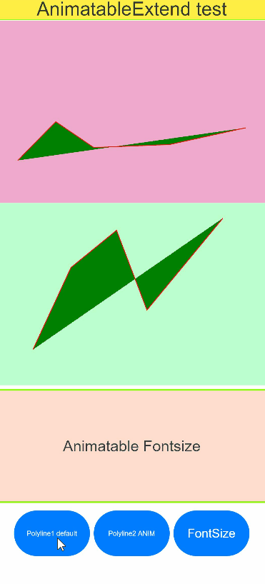

# Custom Attribute Animation


The attribute animation is an illusion of movement created on the UI when the value of an animatable attribute changes over time. It is implemented by setting continuous value changes of an attribute to the attribute API that can cause the UI re-render.


ArkUI provides the [@AnimatableExtend](../quick-start/arkts-animatable-extend.md) decorator for customizing animatable attribute APIs, which accepts only parameters of the number type or a custom type that implements [AnimtableArithmetic<T>](../quick-start/arkts-animatable-extend.md) to deliver continuous value changes. During execution of **animateTo** or **animation** with a custom animatable attribute API and the animatable data type, the frame-by-frame callback is used to change the value of a non-animatable attribute so that an animation effect can be applied to the attribute.


## Animating Font Size Changes with Number Data Type and \@AnimatableExtend Decorator


```ts
// Step 1: Use the @AnimatableExtend decorator to customize an animatable attribute API.
@AnimatableExtend(Text) function animatableFontSize(size: number) {
  .fontSize(size) // Invoke the system attribute API.
}

@Entry
@Component
struct AnimatablePropertyExample {
  @State fontSize: number = 20;

  build() {
    Column() {
      Text("AnimatableProperty")
        .animatableFontSize(this.fontSize) // Step 2: Set the custom animatable attribute API on the component.
        .animation({ duration: 1000, curve: "ease" }) // Step 3: Bind an animation to the custom animatable attribute API.
      Button("Play")
        .onClick(() => {
          this.fontSize = this.fontSize == 20 ? 36 : 20; // Step 4: Change the value of the custom animatable attribute to generate an animation.
        })
    }.width("100%")
    .padding(10)
  }
}
```


## Animating Polyline Changes with Custom Data Type and \@AnimatableExtend Decorator


```ts
declare type Point = [x: number, y: number];

// Define the parameter type of the animatable attribute API and implement the addition, subtraction, multiplication, and equivalence judgment functions in the AnimtableArithmetic<T> API.
class PointClass extends Array<number> {
  constructor(value: Point) {
    super(value[0], value[1])
  }

  add(rhs: PointClass): PointClass {
    let result = new Array<number>() as Point;
    for (let i = 0; i < 2; i++) {
      result.push(rhs[i] + this[i])
    }
    return new PointClass(result);
  }

  subtract(rhs: PointClass): PointClass {
    let result = new Array<number>() as Point;
    for (let i = 0; i < 2; i++) {
      result.push(this[i] - rhs[i]);
    }
    return new PointClass(result);
  }

  multiply(scale: number): PointClass {
    let result = new Array<number>() as Point;
    for (let i = 0; i < 2; i++) {
      result.push(this[i] * scale)
    }
    return new PointClass(result);
  }
}

// Define the parameter type of the animatable attribute API and implement the addition, subtraction, multiplication, and equivalence judgment functions in the AnimtableArithmetic<T> API.
// Template T supports nested implementation of the AnimtableArithmetic<T> type.
class PointVector extends Array<PointClass> implements AnimatableArithmetic<Array<Point>> {
  constructor(initialValue: Array<Point>) {
    super();
    if (initialValue.length) {
      initialValue.forEach(p => this.push(new PointClass(p)))
    }
  }

  // implement the IAnimatableArithmetic interface
  plus(rhs: PointVector): PointVector {
    let result = new PointVector([]);
    const len = Math.min(this.length, rhs.length)
    for (let i = 0; i < len; i++) {
      result.push(this[i].add(rhs[i]))
    }
    return result;
  }

  subtract(rhs: PointVector): PointVector {
    let result = new PointVector([]);
    const len = Math.min(this.length, rhs.length)
    for (let i = 0; i < len; i++) {
      result.push(this[i].subtract(rhs[i]))
    }
    return result;
  }

  multiply(scale: number): PointVector {
    let result = new PointVector([]);
    for (let i = 0; i < this.length; i++) {
      result.push(this[i].multiply(scale))
    }
    return result;
  }

  equals(rhs: PointVector): boolean {
    if (this.length !== rhs.length) {
      return false;
    }
    for (let index = 0, size = this.length; index < size; ++index) {
      if (this[index][0] !== rhs[index][0] || this[index][1] !== rhs[index][1]) {
        return false;
      }
    }
    return true;
  }
}

function randomInt(min, max) {
  return Math.floor(Math.random() * (max - min) + min);
}

// Define a custom animatable attribute API.
@AnimatableExtend(Polyline) function animatablePoints(points: PointVector) {
  .points(points)
}

// Define a custom animatable attribute API.
@AnimatableExtend(Text) function animatableFontSize(size: number) {
  .fontSize(size)
}

@Entry
@Component
struct AnimatedShape {
  @State pointVec1: PointVector = new PointVector([
    [50, randomInt(0, 200)],
    [100, randomInt(0, 200)],
    [150, randomInt(0, 200)],
    [250, randomInt(0, 200)],
    [350, randomInt(0, 200)]
  ]);
  @State pointVec2: PointVector = new PointVector([
    [70, randomInt(0, 200)],
    [120, randomInt(0, 200)],
    [180, randomInt(0, 200)],
    [220, randomInt(0, 200)],
    [320, randomInt(0, 200)]
  ]);
  @State color: Color = Color.Green;
  @State fontSize: number = 20.0;
  @State polyline1Vec: PointVector = this.pointVec1;
  @State polyline2Vec: PointVector = this.pointVec2;

  build() {
    Column() {
      Text("AnimatableExtend test")
        .width(400)
        .height(30)
        .margin(1)
        .fontSize(25)
        .textAlign(TextAlign.Center)
        .backgroundColor("#ffee44")
        .border({ width: '1vp', color: "#88ff00", radius: 20, style: BorderStyle.Solid })

      Polyline()
        .width(400)
        .height(240)
        .backgroundColor("#eeaacc")
        .fill(this.color)
        .stroke(Color.Red)
        .animatablePoints(this.polyline1Vec)
        .animation({ duration: 2000, delay: 0, curve: Curve.Ease })

      Polyline()
        .width(400)
        .height(240)
        .backgroundColor("#bbffcc")
        .fill(this.color)
        .stroke(Color.Red)
        .animatablePoints(this.polyline2Vec)
        .animation({ duration: 2000, delay: 0, curve: Curve.Ease })

      Text("Animatable Fontsize")

        .animatableFontSize(this.fontSize)
        .animation({ duration: 2000, delay: 0, curve: Curve.Ease })
        .width(400)
        .height(150)
        .margin(5)
        .textAlign(TextAlign.Center)
        .backgroundColor("#ffddcc")
        .border({ width: '2vp', color: "#88ff00", radius: 20, style: BorderStyle.Solid })
        .onClick(() => {
          console.log("Text onClick()")
        })

      Row() {
        Button("Polyline1 default")
          .width(100).height(60)
          .margin({ left: 5, right: 5 })
          .onClick(() => {

            if (this.polyline1Vec.equals(this.pointVec1)) {
              this.polyline1Vec = this.pointVec2;
            } else {
              this.polyline1Vec = this.pointVec1;
            }
          })

        Button("Polyline2 ANIM")
          .width(100).height(60)
          .onClick(() => {
            if (this.polyline2Vec.equals(this.pointVec1)) {
              this.polyline2Vec = this.pointVec2;
            } else {
              this.polyline2Vec = this.pointVec1;
            }
          })

        Button("FontSize")
          .width(100).height(60)
          .margin({ left: 5, right: 5 })
          .onClick(() => {
            this.fontSize = (this.fontSize == 20.0) ? 40.0 : 20.0;
          })
      }
      .alignItems(VerticalAlign.Center)
      .margin(5)

    }
    .width('100%')
    .alignItems(HorizontalAlign.Center)
  }
}
```



