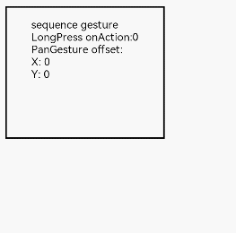
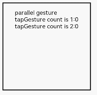

# Combined Gestures


A combined gesture is a combination of multiple single gestures. Its recognition mode is subject to **GestureMode** passed in **GestureGroup**. Three recognition modes are supported: [sequential recognition](#sequential-recognition), [parallel recognition](#parallel-recognition), and [exclusive recognition](#exclusive-recognition).


```ts
GestureGroup(mode:GestureMode, gesture:GestureType[])
```


- **mode**: recognition mode of combined gestures. The value belongs to the **GestureMode** enumeration class.

- **gesture**: array of multiple gestures.  .


## Sequential Recognition

For sequential recognition, the value of **GestureMode** is **Sequence**. In this gesture recognition mode, gestures are recognized in the order in which they were registered until they are all recognized successfully. If any of the registered gestures fails to be recognized, all gestures fail to be recognized. Only the last gesture recognized responds to the **onActionEnd** event.

In the following example, the combined gestures for continuous recognition are the long press gesture and pan gesture.

The **translate** attribute is bound to a **\<Column>** component. You can set the attribute to translate the component. Then, bind **LongPressGesture** and **PanGesture** to the component in the **Sequence** gesture mode. When a long press gesture is recognized, the displayed number is updated. When the user drags the component after the long press gesture, the component is dragged based on the callback function of the pan gesture.


```ts
// xxx.ets
@Entry
@Component
struct Index {
  @State offsetX: number = 0;
  @State offsetY: number = 0;
  @State count: number = 0;
  @State positionX: number = 0;
  @State positionY: number = 0;
  @State borderStyles: BorderStyle = BorderStyle.Solid

  build() {
    Column() {
      Text('sequence gesture\n' + 'LongPress onAction:' + this.count + '\nPanGesture offset:\nX: ' + this.offsetX + '\n' + 'Y: ' + this.offsetY)
        .fontSize(28)
    }
    // Bind the translate attribute to translate the component.
    .translate({ x: this.offsetX, y: this.offsetY, z: 0 })
    .height(250)
    .width(300)
    // The following combined gestures are recognized in sequence. When the long press gesture event is not triggered correctly, the pan gesture event is not triggered.
    .gesture(
      // Set the gesture mode to Sequence.
      GestureGroup(GestureMode.Sequence,
        // The first gesture recognized in the combined gestures is the long press gesture, which can be responded to for multiple times.
        LongPressGesture({ repeat: true })
          // When the long press gesture is successfully recognized, the value of count displayed on the <Text> component is increased.
          .onAction((event: GestureEvent|undefined) => {
            if(event){
              if (event.repeat) {
                this.count++;
              }
            }
            console.info('LongPress onAction');
          })
          .onActionEnd(() => {
            console.info('LongPress end');
          }),
        // The pan gesture is triggered when the component is dragged after the long press gesture is recognized.
        PanGesture()
          .onActionStart(() => {
            this.borderStyles = BorderStyle.Dashed;
            console.info('pan start');
          })
            // When the gesture is triggered, the pan distance is obtained based on the callback, and the displacement distance of the component is modified. In this way, the component is translated.
          .onActionUpdate((event: GestureEvent|undefined) => {
            if(event){
              this.offsetX = this.positionX + event.offsetX;
              this.offsetY = this.positionY + event.offsetY;
            }
            console.info('pan update');
          })
          .onActionEnd(() => {
            this.positionX = this.offsetX;
            this.positionY = this.offsetY;
            this.borderStyles = BorderStyle.Solid;
          })
      )
    )
  }
}
```





>**NOTE**
>
>The drag event is a typical use case of sequential recognition on the long press gesture and pan gesture. It is triggered only when the user performs a pan gesture within the preset time frame after a long press gesture is recognized. If the long press gesture is not recognized or the pan gesture is not performed within the preset time frame, the drag event will not be triggered.


## Parallel Recognition

For parallel recognition, the value of **GestureMode** is **Parallel**. In this gesture recognition mode, gestures registered in the combined gestures will be recognized at the same time until they are all recognized successfully. The gestures are recognized in parallel without affecting each other.

For example, if the tap gesture and the double-tap gesture are bound to the \**<Column>** component in parallel recognition mode, they can be recognized at the same time, and the recognition of these two gestures does not interfere with each other. 


```ts
// xxx.ets
@Entry
@Component
struct Index {
  @State count1: number = 0;
  @State count2: number = 0;

  build() {
    Column() {
      Text('parallel gesture\n' + 'tapGesture count is 1:' + this.count1 + '\ntapGesture count is 2:' + this.count2 + '\n')
        .fontSize(28)
    }
    .height(200)
    .width(250)
    // The following combined gestures are recognized in parallel mode. After a tap gesture is recognized successfully, if another tap gesture is recognized within the specified time frame, a double-tap gesture will also be recognized.
    .gesture(
      GestureGroup(GestureMode.Parallel,
        TapGesture({ count: 1 })
          .onAction(() => {
            this.count1++;
          }),
        TapGesture({ count: 2 })
          .onAction(() => {
            this.count2++;
          })
      )
    )
  }
}
```


>**NOTE**
>
>After a tap gesture and a double-tap gesture are combined for parallel recognition, when taps are performed in an area, the tap gesture and the double-tap gesture are recognized at the same time.
>
>When there is only a single tap, the tap gesture is recognized, but the double-tap gesture fails to be recognized.
>
>When there are two taps and the interval between the two taps is within a specified period (300 ms by default), two tap events and one double-tap event are triggered.
>
>When there are two taps, but the interval between the two taps exceeds the specified time, two tap events are triggered but the double-tap event is not triggered.


## Exclusive Recognition

For exclusive recognition, the value of **GestureMode** is **Exclusive**. In this gesture recognition mode, all registered gestures are recognized at once. One any of the gestures is recognized successfully, the gesture recognition ends, and all other gestures fail to be recognized.

For example, if the tap gesture and the double-tap gesture are bound to the **\<Column>** component in exclusive recognition mode, only a tap gesture event can be triggered. This is because a tap gesture requires a single tap to be triggered, and a double-tap gesture event requires two taps; each tap event is consumed by the tap gesture and cannot be accumulated into a double-tap gesture.


```ts
// xxx.ets
@Entry
@Component
struct Index {
  @State count1: number = 0;
  @State count2: number = 0;

  build() {
    Column() {
      Text('parallel gesture\n' + 'tapGesture count is 1:' + this.count1 + '\ntapGesture count is 2:' + this.count2 + '\n')
        .fontSize(28)
    }
    .height(200)
    .width(250)
    // The following combined gestures are mutually exclusive. After the tap gesture is recognized successfully, the double-tap gesture fails to be recognized.
    .gesture(
      GestureGroup(GestureMode.Exclusive,
        TapGesture({ count: 1 })
          .onAction(() => {
            this.count1++;
          }),
        TapGesture({ count: 2 })
          .onAction(() => {
            this.count2++;
          })
      )
    )
  }
}
```





>**NOTE**
>
>After a tap gesture and a double-tap gesture are combined for exclusive recognition, when taps are performed in an area, the tap gesture and the double-tap gesture are recognized at the same time.
>
>When there is only a single tap, the tap gesture is recognized, but the double-tap gesture fails to be recognized.
>
>When there are two taps, the gesture recognition is declared as successful when the first tap gesture is recognized. In this case, the double-tap gesture fails to be recognized. Even if the second tap is performed within the specified time, the double-tap gesture event is not responded to. Instead, another tap gesture event is triggered.
