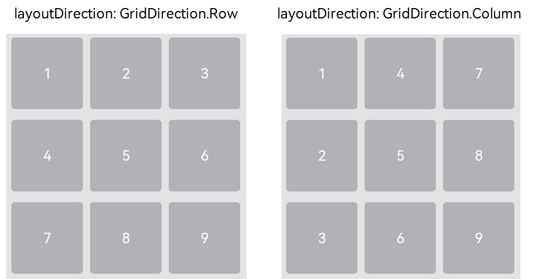
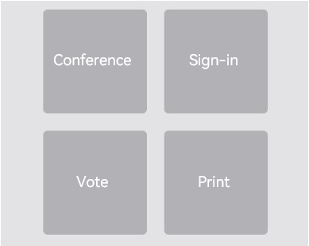
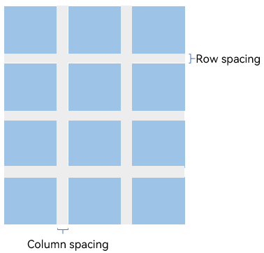
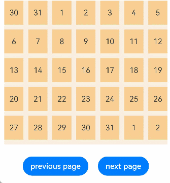

# Creating a Grid (Grid/GridItem)


## Overview

The grid layout consists of cells formed by rows and columns. You can specify the cells where items are located to form various layouts. The grid layout excels at dividing a page into regions and defining the proportion of child components. It is a key adaptive layout and applies to scenarios such as photo gallery, calendar, and calculator.

ArkUI provides the \<[Grid](../reference/arkui-ts/ts-container-grid.md)> container component and \<[GridItem](../reference/arkui-ts/ts-container-griditem.md)> child component for building grid layouts. The former is used to set parameters related to the grid layout, while the latter is used to define features related to child components. The **\<Grid>** component allows creation of child components with conditional rendering, rendering of repeated content, and [lazy data loading](../quick-start/arkts-rendering-control-lazyforeach.md).


## Layout and Constraints

Each item in the **\<Grid>** container corresponds to a **\<GridItem>** component, as shown below.

**Figure 1** Relationship between \<Grid> and \<GridItem> components


>**NOTE**
>
>The **\<Grid>** component accepts only **\<GridItem>** as its child components.

The grid layout is a two-dimensional layout. The **\<Grid>** component allows you to define the number of rows and columns, proportion of each row and column, number of rows or columns that child components span, and the horizontal and vertical alignment. When the **\<Grid>** container size changes, the child components and spacing are adjusted proportionally. By leveraging these layout capabilities, you can build grid layouts of different styles, as shown below.

**Figure 2** Grid layout


The size of the **\<Grid>** component follows its width and height settings (if configured) or adapts to the size of its parent component.

Depending on the number of rows and columns and the proportion, the **\<Grid>** component behaves as follows:

- If both the number and proportion are set for rows or columns, the **\<Grid>** component displays only elements in the fixed number of rows or columns. Other elements are not displayed, and the component cannot be scrolled.

- If only the number or proportion is set for rows or columns, elements are arranged in the specified direction, and excess elements can be displayed in scrolling mode.

- If neither the number nor the proportion is set for rows or columns, elements are arranged in the layout direction. The number of rows and columns is determined by the layout direction and the width and height of a single grid. Elements that exceed the range of rows and columns are not displayed, and the **\<Grid>** component cannot be scrolled.

>**NOTE**
>
>Whenever possible, set the number or proportion for rows or columns for layout.


## Setting the Arrangement Mode


### Setting the Number and Proportion of Rows and Columns

You can set the number and proportion of rows and columns to determine the overall arrangement mode of the grid layout. To do so, use the **rowsTemplate** and **columnsTemplate** attributes of the **\<Grid>** component.

The values of **rowsTemplate** and **columnsTemplate** are a string consisting of 'number+fr' segments, separated by spaces. Wherein **frs** indicates the number of rows or columns in the grid layout, and the number before **fr** is used to calculate the proportion of the row or column in the grid width, thereby determining the width of the row or column.

**Figure 3** Example of the proportion of rows and columns


The preceding figure shows a grid layout with three rows and three columns. The grid layout is divided into three parts in the vertical direction with each row taking up 1/3, and four parts in the horizontal direction with the first column taking up 1/4, the second column 2/4, and the third column 1/4.

This layout can be implemented by setting **rowsTemplate** to **'1fr 1fr 1fr'** and **columnsTemplate** to **'1fr 2fr 1fr'**.


```ts
Grid() {
  ...
}
.rowsTemplate('1fr 1fr 1fr')
.columnsTemplate('1fr 2fr 1fr')
```

>**NOTE**
>
>When **rowsTemplate** or **columnsTemplate** is set for the **\<Grid>** component, its **layoutDirection**, **maxCount**, **minCount**, and **cellLength** attributes do not take effect. For details about the attributes, see [Grid Attributes](../reference/arkui-ts/ts-container-grid.md#attributes).


### Setting the Number of Rows and Columns Occupied by a Child Component

In real-world applications, an uneven grid layout, where grid cells span a varying number of cells and rows, is as common as its even counterpart. To implement an uneven grid layout, as shown below, you can set **rowStart**, **rowEnd**, **columnStart**, and **columnEnd** of **\<GridItem>**.

**Figure 4** Uneven grid layout


A common application with an uneven grid layout is the calculator. As shown in the following figure, the **0** key spans the first and second columns, and the **=** key spans the fifth and sixth rows. For a grid layout created using the **\<Grid>** component, the row and column numbers start from 1 and increase continuously.

**Figure 5** Calculator 


For a single grid cell, the **rowStart** and** rowEnd** attributes indicate the start and end row numbers of the current element, and the **columnStart** and **columnEnd** attributes indicate the start and end column numbers of the current element.

Therefore, for the **0** key to span the first and second columns, just set **columnStart** and **columnEnd** of the corresponding **\<GridItem>** component to **1** and **2**.


```ts
GridItem() {
  Text(key)
    ...
}
.columnStart(1)
.columnEnd(2)
```

For the **=** key to span the fifth and sixth rows, set **rowStart** and **rowEnd** of the corresponding **\<GridItem>** component to **5** and **6**


```ts
GridItem() {
  Text(key)
    ...
}
.rowStart(5)
.rowEnd(6)
```


### Setting the Main Axis Direction

When neither the number nor proportion is set for rows and columns in a grid layout, you can use the **layoutDirection** attribute to set the main axis direction and thereby specify the arrangement mode of child components. In addition, you can use the **minCount** and **maxCount** attributes to restrict the number of grid cells along the main axis.

**Figure 6** Main axis direction



When **layoutDirection** is set to **Row**, child components are arranged from left to right. When a row is full, a new row will be added. When **layoutDirection** is set to **Column**, child components are arranged from top to bottom. When a column is full, a new column will be added. In this example, the **maxCount** attribute is set to **3**, indicating that the maximum number of grid cells displayed along the main axis is 3.


```ts
Grid() {
  ...
}
.maxCount(3)
.layoutDirection(GridDirection.Row)
```

>**NOTE**
>
>- The **layoutDirection** attribute takes effect only when **rowsTemplate** and **columnsTemplate** are not set. In this case, child components are arranged in the direction set by **layoutDirection**.
>- When only **rowsTemplate** is set, the main axis of the grid runs in the horizontal direction, and the cross axis runs in the vertical direction.
>- When only **columnsTemplate** is set, the main axis of the grid runs in the vertical direction, and the cross axis runs in the horizontal direction.


## Displaying Data in a Grid Layout

The grid layout organizes its internal elements in two-dimensional layout mode, as shown in the following figure.

**Figure 7** General office services 



The **\<Grid>** component can display a group of **\<GridItem>** child components in two-dimensional layout mode.


```ts
Grid() {
  GridItem() {
    Text('Conference')
      ...
  }

  GridItem() {
    Text('Sign-in')
      ...
  }

  GridItem() {
    Text ('Vote')
      ...
  }

  GridItem() {
    Text ('Print')
      ...
  }
}
.rowsTemplate('1fr 1fr')
.columnsTemplate('1fr 1fr')
```

For multiple **\<GridItem>** components with similar content structures, you are advised to nest them in **ForEach** statements to reduce repeated code.


```ts
@Component
struct OfficeService {
  @State services: Array<string> = ['Conference', 'Vote','Sign-in', 'Print']

  build() {
    Column() {
      Grid() {
        ForEach(this.services, (service:string) => {
          GridItem() {
            Text(service)
          }
        }, (service:string):string => service)
      }
      .rowsTemplate(('1fr 1fr') as string)
      .columnsTemplate(('1fr 1fr') as string)
    }
  }
}
```


## Setting the Gap Between Rows and Columns

The horizontal spacing between two grid cells is called row spacing, and the vertical spacing is called column spacing, as shown in the following figure.

**Figure 8** Row spacing and column spacing 



You can use **rowsGap** and **columnsGap** to set the row spacing and column spacing of the grid layout. In the calculator shown in Figure 5, the row spacing is 15 vp, and the column spacing is 10vp.


```ts
Grid() {
  ...
}
.columnsGap(10)
.rowsGap(15)
```


## Building a Scrollable Grid Layout

The scrollable grid layout is often used on the file list, product list, video list, and similar pages, as shown in the following figure. When only the number or proportion is set for rows and columns, that is, only the **rowsTemplate** or **columnsTemplate** attribute is set, the elements in the grid are arranged in the configured direction. When the content goes beyond the display area, the grid can be scrolled.

**Figure 9** Horizontal scrollable grid layout


If **columnsTemplate** is set, the grid scrolls vertically. If **rowsTemplate** is set, the grid scrolls horizontally.

In the horizontal scrollable grid layout shown in the preceding figure, **rowsTemplate** is set but **columnsTemplate** is not. When the content exceeds the width of the grid, the grid can scroll horizontally to display the content outside of the display area.


```ts
@Component
struct Shopping {
  @State services: Array<string> = ['Live', 'Premium']

  build() {
    Column({ space: 5 }) {
      Grid() {
        ForEach(this.services, (service: string, index) => {
          GridItem() {
          }
          .width('25%')
        }, (service:string):string => service)
      }
      .rowsTemplate('1fr 1fr') // Set only the rowsTemplate attribute. When the content exceeds the display area of the grid, the grid can be scrolled horizontally.
      .rowsGap(15)
    }
  }
}
```


## Controlling the Scrolling Position

Similar to the Back to top button in a list layout, the feature of controlling the scrolling position is commonly used in the grid layout, for example, page turning in the calendar application, as shown below.

**Figure 10** Page turning in the calendar application 



When the **\<Grid>** component is initialized, it can be bound to a [Scroller](../reference/arkui-ts/ts-container-scroll.md#scroller) object for scrolling control. In this example, the [scrollPage](../reference/arkui-ts/ts-container-scroll.md#scrollpage) API of the **Scroller** object is used to turn pages.


```ts
export let scroller: Scroller = new Scroller()
```

On the calendar page, when a user clicks the **Next** button, the application responds to the click event by setting the **next** parameter in the **scrollPage** API to **true** to scroll to the next page.


```ts
class Tmp{
  scroller: Scroller = new Scroller()
  set(boo:boolean){
    this.scroller.scrollPage({next:boo})
  }
}
Column({ space: 5 }) {
  Grid(this.scroller) {
    ...
  }
  .columnsTemplate('1fr 1fr 1fr 1fr 1fr 1fr 1fr')
  ...
 
 Row({space: 20}) {
   Button ('Previous')
     .onClick(() => {
       let ClickN = new Tmp()
       ClickN.set(false)
     })

   Button ('Next')
     .onClick(() => {
       let ClickN = new Tmp()
       ClickN.set(true)
     })
 }
}
...
```


## Performance Optimization

Just as [LazyForEach](../quick-start/arkts-rendering-control-lazyforeach.md) is recommended for [handling a long list](arkts-layout-development-create-list.md#handling-a-long-list), it is also recommended for a scrolling grid layout when a large number of grid items is involved.

For details about the implementation, see the example in [LazyForEach: Lazy Data Loading](../quick-start/arkts-rendering-control-lazyforeach.md).

When the grid is rendered in lazy loading mode, to improve the grid scrolling experience and minimize white blocks during grid scrolling, you can use the **cachedCount** parameter of the **\<Grid>** component. This parameter sets the number of grid items preloaded outside of the screen and is valid only in **LazyForEach**.

  Specifically, the number of the grid items to cache before and after the currently displayed one equals the value of **cachedCount** multiplied by the number of columns. Grid items that exceed the display and cache range are released.

```ts
Grid() {
  LazyForEach(this.dataSource, () => {
    GridItem() {
    }
  })
}
.cachedCount(3)
```

>**NOTE**
>
>A greater **cachedCount** value may result in higher CPU and memory overhead of the UI. Adjust the value by taking into account both the comprehensive performance and user experience.

