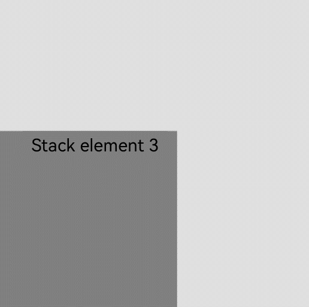
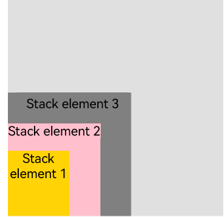
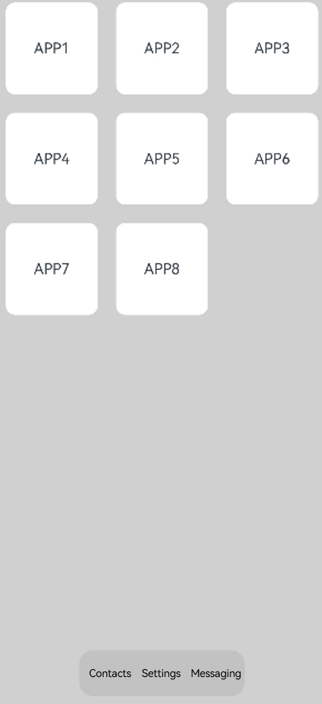

# Stack Layout (Stack)


## Overview

The stack layout reserves an area on the screen to display elements in a component and allows the elements to be stacked. You can implement a stack layout through the [\<Stack>](../reference/arkui-ts/ts-container-stack.md) component, which provides a stack container where positioned or non-positioned child components are pushed successively and the latter one sits on top of the previous one.

The stack layout excels at page stacking and positioning, and is widely used in ads and widget arrangement.

In the **\<Stack>** component shown in Figure 1, the sequence of child elements (child components) is Item1 -> Item2 -> Item3.


  **Figure 1** Stack layout 


## How to Develop

The **\<Stack>** component can contain a wide variety of child components, which are stacked in the center by default. While respecting the constraints of **\<Stack>**, child components are laid out in their respective style.


```ts
let MTop:Record<string,number> = { 'top': 50 }
Column(){
  Stack({ }) {
    Column(){}.width('90%').height('100%').backgroundColor('#ff58b87c')
    Text('text').width('60%').height('60%').backgroundColor('#ffc3f6aa')
    Button('button').width('30%').height('30%').backgroundColor('#ff8ff3eb').fontColor('#000')
  }.width('100%').height(150).margin(MTop)
}
```


## Alignment

Alignment of child components in the **\<Stack>** component is set through the [alignContent](../reference/arkui-ts/ts-appendix-enums.md#alignment) parameter. As shown in Figure 2, nine alignment modes are supported.

  **Figure 2** Alignment modes in the \<Stack> component 


## Z-order Control

The stacking order of child components in the **\<Stack>** component is set through the **[zIndex](../reference/arkui-ts/ts-universal-attributes-z-order.md)** attribute. A larger **zIndex** value indicates a higher display level.

  In the stack layout, if the size of a component is greater than that of the one before it, the one before it is hidden.

```ts
let MTopM1:Record<string,number> = { 'top': 100 }
Stack({ alignContent: Alignment.BottomStart }) {
  Column() {
    Text ('Stacked component 1').textAlign (TextAlign.End).fontSize (20)
  }.width(100).height(100).backgroundColor(0xffd306)

  Column() {
    Text ('Stacked component 2').fontSize (20)
  }.width(150).height(150).backgroundColor(Color.Pink)

  Column() {
    Text ('Stacked component 3').fontSize (20)
  }.width(200).height(200).backgroundColor(Color.Grey)
}.margin(MTopM1).width(350).height(350).backgroundColor(0xe0e0e0)
```



In the following figure, the size of the stacked component 3 is greater than that of all the components before it. Therefore, the first two components are completely hidden. To show these components, modify their **zIndex** attribute settings.


```ts
let MTopM:Record<string,number> = { 'top': 100 }
Stack({ alignContent: Alignment.BottomStart }) {
  Column() {
    Text ('Stacked component 1').fontSize (20)
  }.width(100).height(100).backgroundColor(0xffd306).zIndex(2)

  Column() {
    Text ('Stacked component 2').fontSize (20)
  }.width(150).height(150).backgroundColor(Color.Pink).zIndex(1)

  Column() {
    Text ('Stacked component 3').fontSize (20)
  }.width(200).height(200).backgroundColor(Color.Grey)
}.margin(MTopM).width(350).height(350).backgroundColor(0xe0e0e0)
```




## Example Scenario

In this example, the stack layout is used to quickly set up a page display model.


```ts
@Entry
@Component
struct StackSample {
  private arr: string[] = ['APP1', 'APP2', 'APP3', 'APP4', 'APP5', 'APP6', 'APP7', 'APP8'];

  build() {
    Stack({ alignContent: Alignment.Bottom }) {
      Flex({ wrap: FlexWrap.Wrap }) {
        ForEach(this.arr, (item:string) => {
          Text(item)
            .width(100)
            .height(100)
            .fontSize(16)
            .margin(10)
            .textAlign(TextAlign.Center)
            .borderRadius(10)
            .backgroundColor(0xFFFFFF)
        }, (item:string):string => item)
      }.width('100%').height('100%')

      Flex({ justifyContent: FlexAlign.SpaceAround, alignItems: ItemAlign.Center }) {
        Text ('Contacts').fontSize (16)
        Text ('Settings').fontSize (16)
        Text ('Messaging').fontSize (16)
      }
      .width('50%')
      .height(50)
      .backgroundColor('#16302e2e')
      .margin({ bottom: 15 })
      .borderRadius(15)
    }.width('100%').height('100%').backgroundColor('#CFD0CF')
  }
}
```



