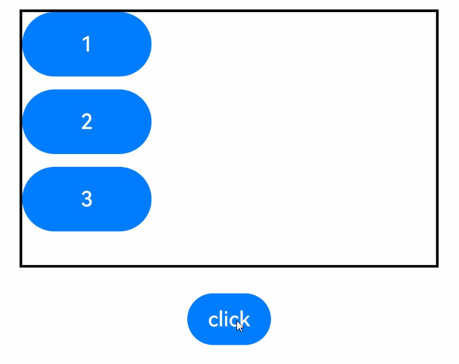
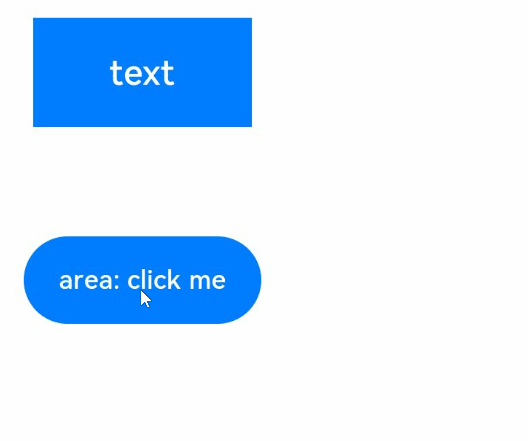

# Layout Update Animation


[Attribute animation](../reference/arkui-ts/ts-animatorproperty.md) (animation) and [explicit animation](../reference/arkui-ts/ts-explicit-animation.md) (animateTo) are the most basic and common animation features provided by ArkUI. When the layout attributes (such as the [size](../reference/arkui-ts/ts-universal-attributes-size.md) and [position](../reference/arkui-ts/ts-universal-attributes-location.md)) attributes change, you can use the attribute animation or explicit animation to transit to the new layout parameter status based on the animation parameters.


| Animation Type| Description                                      | Application Scenario    |
| ---- | ---------------------------------------- | -------- |
| Attribute animation| The animation setting is simple. The animation is automatically triggered when the attribute changes.                     | Simple animation scenario|
| Explicit animation| Changes in a closure trigger animations, including component addition and deletion caused by data changes and component attribute changes. Complex animations can be performed.| Complex animation scenarios|


## Using Explicit Animation to Generate Layout Update Animation

The API for explicit animation is as follows:


```ts
animateTo(value: AnimateParam, event: () => void): void
```

The first parameter specifies the animation parameter, and the second parameter is the closure function of the animation.

The following is an example of using explicit animation to produce a layout update animation. In the example, after the alignItems attribute of the Column component is changed, the layout of its child components changes. As long as the attribute is modified in the closure function of **animateTo**, all changes caused by the attribute are performed to the end value according to the animation parameter of animateTo.


```ts
@Entry
@Component
struct LayoutChange {
  // Used to control the alignItems attribute of a column.
  @State itemAlign: HorizontalAlign = HorizontalAlign.Start;
  allAlign: HorizontalAlign[] = [HorizontalAlign.Start, HorizontalAlign.Center, HorizontalAlign.End];
  alignIndex: number = 0;

  build() {
    Column() {
      Column({ space: 10 }) {
        Button("1").width(100).height(50)
        Button("2").width(100).height(50)
        Button("3").width(100).height(50)
      }
      .margin(20)
      .alignItems(this.itemAlign)
      .borderWidth(2)
      .width("90%")
      .height(200)

      Button("click").onClick(() => {
        // The animation duration is 1000 ms, and the curve is EaseInOut.
        animateTo({ duration: 1000, curve: Curve.EaseInOut }, () => {
          this.alignIndex = (this.alignIndex + 1) % this.allAlign.length;
          // Modify the this.itemAlign parameter in the closure function to change the layout of children in the Column container. Use an animation to transition to the new position.
          this.itemAlign = this.allAlign[this.alignIndex];
        });
      })
    }
    .width("100%")
    .height("100%")
  }
}
```





In addition to directly changing the layout mode, you can also directly change the width, height, and position of a component.


```ts
@Entry
@Component
struct LayoutChange2 {
  @State myWidth: number = 100;
  @State myHeight: number = 50;
  // Flag. true and false correspond to a group of myWidth and myHeight values respectively.
  @State flag: boolean = false;

  build() {
    Column({ space: 10 }) {
      Button("text")
        .type(ButtonType.Normal)
        .width(this.myWidth)
        .height(this.myHeight)
        .margin(20)
      Button("area: click me")
        .fontSize(12)
        .margin(20)
        .onClick(() => {
          animateTo({ duration: 1000, curve: Curve.Ease }, () => {
            // In the animation closure, the state variable that controls the width and height of the first button is changed based on the flag bit so that the width and height of the first button are animated.
            if (this.flag) {
              this.myWidth = 100;
              this.myHeight = 50;
            } else {
              this.myWidth = 200;
              this.myHeight = 100;
            }
            this.flag = !this.flag;
          });
        })
    }
    .width("100%")
    .height("100%")
  }
}
```


In the click event of the second button, the **animateTo** API is used to modify the **this.myWidth** and **this.myHeight** state variables in the closure. The two state variables are the width and height attribute values of the first button. Therefore, the width and height animation is performed for the first button. The display effect is shown below.





At the same time, the second button also produces a position animation. After the width and height of the first button are changed, the layout of other components in the column is also changed. The layout of the second button is also changed because the width and height of the first button are changed in the closure.


If you do not want the second button to have an animation effect, you can use either of the following methods: 1. Add a container outside the first button so that the sizes before and after the animation are within the range of the container. In this way, the position of the second button is not affected by the position of the first button. The modified key code is as follows:


```ts
Column({ space: 10 }) {
  Column() {
    // The button is placed in a container that is large enough so that it does not affect the position of the outer component.
    Button("text")
      .type(ButtonType.Normal)
      .width(this.myWidth)
      .height(this.myHeight)
  }
  .margin(20)
  .width(200)
  .height(100)

  Button("area: click me")
    .fontSize(12)
    .onClick(() => {
      animateTo({ duration: 1000, curve: Curve.Ease }, () => {
        // In the animation closure, the state variable that controls the width and height of the first button is changed based on the flag bit so that the width and height of the first button are animated.
        if (this.flag) {
          this.myWidth = 100;
          this.myHeight = 50;
        } else {
          this.myWidth = 200;
          this.myHeight = 100;
        }
        this.flag = !this.flag;
      });
    })
}
.width("100%")
.height("100%")
```


2. Add layout constraints to the second button, for example, position constraints, so that the position of the second button is not affected by the width and height of the first button. Sample code:


```ts
Column({ space: 10 }) {
  Button("text")
    .type(ButtonType.Normal)
    .width(this.myWidth)
    .height(this.myHeight)
    .margin(20)

  Button("area: click me")
    .fontSize(12)
    // Set the position attribute to a fixed value so that the layout position is not affected by the width and height of the first button.
    .position({ x: "30%", y: 200 })
    .onClick(() => {
      animateTo({ duration: 1000, curve: Curve.Ease }, () => {
        // In the animation closure, the state variable that controls the width and height of the first button is changed based on the flag bit so that the width and height of the first button are animated.
        if (this.flag) {
          this.myWidth = 100;
          this.myHeight = 50;
        } else {
          this.myWidth = 200;
          this.myHeight = 100;
        }
        this.flag = !this.flag;
      });
    })
}
.width("100%")
.height("100%")
```


## Using Attribute Animation to Generate Layout Update Animation

The explicit animation places the modification of the attribute of the animation to be executed in the closure function to trigger the animation. The attribute animation does not need to use the closure. You only need to add the animation attribute to the end of the attribute of the component to be executed.

The API of the attribute animation is as follows:


```ts
animation(value: AnimateParam)
```

The input parameter is an animation parameter. If you want the component to generate an animation with the change of an attribute value, you need to add this attribute before the animation attribute. Some attribute changes do not want to generate attribute animations through animations. Therefore, attribute animations can be placed after animations. The example of explicit animation above is easily changed to be implemented with property animation. Sample code:


```ts
@Entry
@Component
struct LayoutChange2 {
  @State myWidth: number = 100;
  @State myHeight: number = 50;
  @State flag: boolean = false;
  @State myColor: Color = Color.Blue;

  build() {
    Column({ space: 10 }) {
      Button("text")
        .type(ButtonType.Normal)
        .width(this.myWidth)
        .height(this.myHeight)
        // Animation takes effect only for the type, width, and height attributes. The duration is 1000 ms, and the curve is Ease.
        .animation({ duration: 1000, curve: Curve.Ease })
        .backgroundColor(this.myColor)
        .margin(20)
        // Animation does not take effect for the backgroundColor and margin attributes.

      Button("area: click me")
        .fontSize(12)
        .onClick(() => {
          // Change the attribute value. Animation transition is performed for attributes configured with attribute animation.
          if (this.flag) {
            this.myWidth = 100;
            this.myHeight = 50;
            this.myColor = Color.Blue;
          } else {
            this.myWidth = 200;
            this.myHeight = 100;
            this.myColor = Color.Pink;
          }
          this.flag = !this.flag;
        })
    }
  }
}
```


In the preceding example, the animation attribute of the first button takes effect only for the type, width, and height attributes written before the animation, but does not take effect for the backgroundColor and margin attributes written after the animation. In the running result, the width and height attributes execute the animation based on the animation parameters. However, the backgroundColor directly jumps and no animation is generated. The display effect is shown below.


>**NOTE**
>
>  1. When the attribute animation is used, the animation is executed according to the specified attribute animation parameters. Each component can configure attribute animations with different parameters for its own attributes.
>
>  2. Explicit animations are executed on all GUI differences caused before and after animation closures, and the same animation parameters are used. Therefore, explicit animations are applicable to scenarios where animations are executed in a unified manner. In addition, explicit animations can also be used for animations caused by non-attribute variables, such as if/else conditions and deletion of array elements used by Forach.
>
>  3. If an attribute animation is configured for an attribute and the attribute value is changed in the explicit animation closure, the attribute animation takes effect first and the animation parameters of the attribute animation are used.
