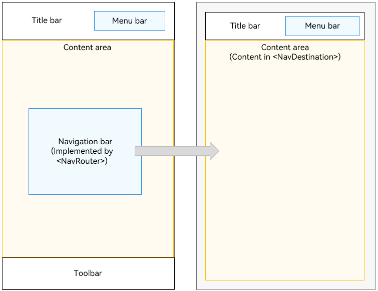
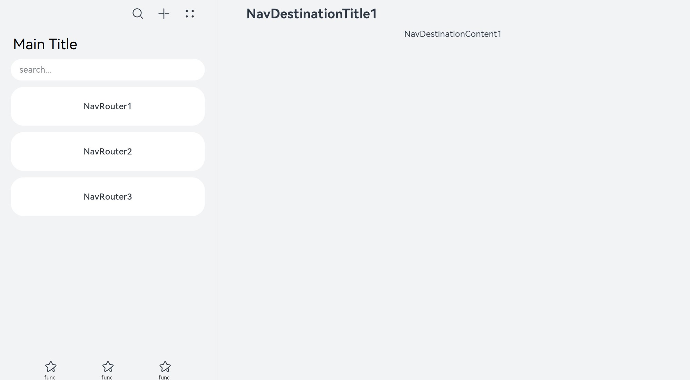

# Navigation


Generally, the [\<Navigation>](../reference/arkui-ts/ts-basic-components-navigation.md) component functions as the root container of a page and supports three display modes: single-page, column, and adaptive. In addition, **\<Navigation>** provides attributes to set the title bar, toolbar, and navigation bar of a page.


The pages of the Navigation component include the home page and content page. The home page consists of the title bar, content area, and toolbar. You can use the [\<NavRouter>](../reference/arkui-ts/ts-basic-components-navrouter.md) child component in the content area to implement the navigation bar function. The content page displays the content of the [\<NavDestination>](../reference/arkui-ts/ts-basic-components-navdestination.md) child component.


**\<NavRouter>** is a special child component used together with **\<Navigation>**. It provides default processing logic for responding to clicks, eliminating the need for manual logic definition. **\<NavRouter>** has only two root nodes. The second root node is **\<NavDestination>**. **\<NavDestination>** is a special child component used together with **\<NavRouter>** to display the content page of the **\<Navigation>** component. When the user clicks the **\<NavRouter>** component, the corresponding **\<NavDestination>** content area is displayed.


## Setting the Page Display Mode

The **\<Navigation>** component uses the **mode** attribute to set the page display mode.

- Adaptive Mode

  By default, the **\<Navigation>** component is in adaptive mode. In this case, the **mode** attribute is **NavigationMode.Auto**. In adaptive mode, when the device width is greater than 520 vp, the **\<Navigation>** component uses the column mode. Otherwise, the **\<Navigation>** component uses the single-page mode.


  ```
  Navigation() {
    ...
  }
  .mode(NavigationMode.Auto)
  ```

- Single-page mode

    **Figure 1** Single-page mode 

  

  Set **mode** to **NavigationMode.Stack** so that the **\<Navigation>** component is displayed on a single page.


  ```ts
  Navigation() {
    ...
  }
  .mode(NavigationMode.Stack)
  ```

  

- Column mode

  **Figure 2** Column mode

  

  Set **mode** to **NavigationMode.Split** so that the **\<Navigation>** component is displayed in columns.


  ```ts
  let TooTmp:Record<string,string|Function> = {'value': "func", 'icon': "./image/ic_public_highlights.svg", 'action': ()=> {}}
  @Entry
  @Component
  struct NavigationExample {
    private arr: number[] = [1, 2, 3];
  
    build() {
      Column() {
        Navigation() {
          TextInput({ placeholder: 'search...' })
            .width("90%")
            .height(40)
            .backgroundColor('#FFFFFF')
  
          List({ space: 12 }) {
            ForEach(this.arr, (item:string) => {
              ListItem() {
                NavRouter() {
                  Text("NavRouter" + item)
                    .width("100%")
                    .height(72)
                    .backgroundColor('#FFFFFF')
                    .borderRadius(24)
                    .fontSize(16)
                    .fontWeight(500)
                    .textAlign(TextAlign.Center)
                  NavDestination() {
                    Text("NavDestinationContent" + item)
                  }
                  .title("NavDestinationTitle" + item)
                }
              }
            }, ((item:string):string => item))
          }
          .width("90%")
          .margin({ top: 12 })
        }
        .title ("Main Title")
        .mode(NavigationMode.Split)
        .menus([
          {value: "", icon: "./image/ic_public_search.svg", action: ()=> {}},
          {value: "", icon: "./image/ic_public_add.svg", action: ()=> {}},
          {value: "", icon: "./image/ic_public_add.svg", action: ()=> {}},
          {value: "", icon: "./image/ic_public_add.svg", action: ()=> {}},
          {value: "", icon: "./image/ic_public_add.svg", action: ()=> {}}
        ])
        .toolBar({items: [
          TooTmp,
          TooTmp,
          TooTmp
        ]})
      }
      .height('100%')
      .width('100%')
      .backgroundColor('#F1F3F5')
    }
  }
  ```

  


## Setting the Title Bar Mode

The title bar is on the top of the page and is used to display the page name and operation entry. The **\<Navigation>** component uses the **titleMode** attribute to set the title bar mode.

- Mini mode
  Applicable when the title of a level-1 page does not need to be highlighted.

  **Figure 3** Title bar in Mini mode 

  


  ```ts
  Navigation() {
    ...
  }
  .titleMode(NavigationTitleMode.Mini)
  ```


- Full mode
  Applicable when the title of a level-1 page needs to be highlighted.

    **Figure 4** Title bar in Full mode 

  


  ```ts
  Navigation() {
    ...
  }
  .titleMode(NavigationTitleMode.Full)
  ```


## Setting the Menu Bar

The menu bar is in the upper right corner of the **\<Navigation>** component. You can set the menu bar through the **menus** attribute, which supports two parameter types: Array&lt;[NavigationMenuItem](../reference/arkui-ts/ts-basic-components-navigation.md#navigationmenuitem)&gt; and CustomBuilder. When the Array\<NavigationMenuItem> type is used, a maximum of three icons can be displayed in portrait mode and a maximum of five icons can be displayed in landscape mode. Extra icons will be placed in the automatically generated More icons.

**Figure 5** Menu bar with three icons 


```ts
let TooTmp:Record<string,string|Function> = {'value': "", 'icon': "./image/ic_public_highlights.svg", 'action': ()=> {}}
Navigation() {
  ...
}
.menus([TooTmp,
  TooTmp,
  TooTmp])
```

**Figure 6** Menu bar with four icons 


```ts
let TooTmp:Record<string,string|Function> = {'value': "", 'icon': "./image/ic_public_highlights.svg", 'action': ()=> {}}
Navigation() {
  ...
}
.menus([TooTmp,
  TooTmp,
  TooTmp,
  TooTmp])
```


## Setting the Toolbar

The toolbar is located at the bottom of the **\<Navigation>** component. You can set the toolbar through the **toolBar** attribute.


  **Figure 7** Toolbar 


```ts
let TooTmp:Record<string,string|Function> = {'value': "func", 'icon': "./image/ic_public_highlights.svg", 'action': ()=> {}}
let TooBar:Record<string,object[]> = {'items':[TooTmp,TooTmp,TooTmp]}
Navigation() {
  ...
}
.toolBar(TooBar)
```
