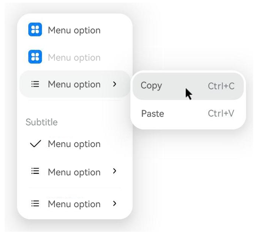

# Menu


Menu is a menu interface, which is generally used for right-click pop-up windows and click pop-up windows. For details, see [Menu Control] (../reference/arkui-ts/ts-universal-attributes-menu.md).


## Creating a Menu in the Default Style

The bindMenu interface needs to be called to implement menus. The bindMenu responds to the tap event of the bound widget. After the widget is bound, the widget is displayed after you tap the corresponding widget using gestures.


```ts
Button('click for Menu')
  .bindMenu([
  {
    value: 'Menu1',
    action: () => {
      console.info('handle Menu1 select')
    }
  }       
])
```


## Creating a Menu with a Customized Style

If the default style does not meet development requirements, you can use \@CustomBuilder to customize menu content. Menus can be customized through the bindContextMenu interface.


### \@Builder Develop the content in the menu.


```ts
@State select: boolean = true
private iconStr: ResourceStr = $r("app.media.view_list_filled")
private iconStr2: ResourceStr = $r("app.media.view_list_filled")
@Builder
SubMenu() {
  Menu() {
    MenuItem({ content: "Copy", labelInfo: "Ctrl+C" })
    MenuItem({ content: "Paste", labelInfo: "Ctrl+V" })
  }
}

@Builder
MyMenu(){
  Menu() {
    MenuItem({ startIcon: $r("app.media.icon"), content: " menu option "})
    MenuItem({ startIcon: $r("app.media.icon"), content: " menu option "}).enabled(false)
    MenuItem({
      startIcon: this.iconStr,
      content: "Menu option",
      endIcon: $r("app.media.arrow_right_filled"),
      //When the builder parameter is set, it indicates that a submenu is bound to menuItem. When you hover the cursor over the menu item, the submenu is displayed.
      builder: this.SubMenu.bind(this),
    })
    MenuItemGroup ({ header: 'Subtitle' }) {
      MenuItem ({ content: "MenuOptions" })
        .selectIcon(true)
        .selected(this.select)
        .onChange((selected) => {
	   console.info("menuItem select" + selected);
	   this.iconStr2 = $r("app.media.icon");
        })
      MenuItem({
        startIcon: $r("app.media.view_list_filled"),
        content: "Menu option",
        endIcon: $r("app.media.arrow_right_filled"),
        builder: this.SubMenu.bind(this)\
      })
    }
    MenuItem({
      startIcon: this.iconStr2,
      content: "Menu option",
      endIcon: $r("app.media.arrow_right_filled")
    })
  }
}
  
```


### Binding the bindMenu Attribute to a Component


```ts
Button('click for Menu')
  .bindMenu(this.MyMenu)
```





## Create a menu that supports right-click or touch and hold.

The bindContextMenu interface is used to customize menus and trigger menu pop-up by right-clicking or pressing and holding. The menu items that are displayed using bindContextMenu are in an independent child window and can be displayed outside the application window.


- [@Builder development menu content] (#builder development menu content) is the same as the preceding content.

- Confirm the menu pop-up mode and use the bindContextMenu property to bind the component. In the example, the shortcut menu is displayed.

  ```ts
  Button('click for Menu')
    .bindContextMenu(this.MyMenu, ResponseType.RightClick)
  ```
