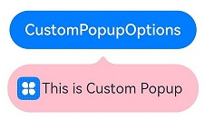

# Bubble


You can bind the **Popup** attribute to a component, specifying its content, interaction logic, and display status. It is mainly used for screen recording and message pop-up notification.


Bubbles are classified into two types: built-in bubbles with [PopupOptions](../reference/arkui-ts/ts-universal-attributes-popup.md#popupoptions) and custom bubbles with [CustomPopupOptions](../reference/arkui-ts/ts-universal-attributes-popup.md#custompopupoptions8). For PopupOptions, you can set primaryButton and secondaryButton to set bubbles with buttons. CustomPopupOptions sets the customized bubble by configuring the [builder](../quick-start/arkts-builder.md) parameter.


## Text prompt bubble

Text pop-up messages are usually used to display only text messages without any interaction. The Popup attribute needs to be bound to a component. When the show parameter in the bindPopup attribute is set to true, a pop-up message is displayed.

Bind the Popup attribute to the Button component. Each time the Button button is clicked, handlePopup switches the Boolean value. When handlePopup is set to true, bindPopup pops up.


```ts
@Entry
@Component
struct PopupExample {
  @State handlePopup: boolean = false
 
  build() {
    Column() {
      Button('PopupOptions')
        .onClick(() => {
          this.handlePopup = !this.handlePopup
        })
        .bindPopup(this.handlePopup, {
          message: 'This is a popup with PopupOptions',
        })
    }.width('100%').padding({ top: 5 })
  }
}
```


## Bubble with a button

A maximum of two buttons can be set for a bubble through the primaryButton and secondaryButton attributes for simple interaction. Developers can set the action parameter to specify the operation to be triggered.


```ts
@Entry
@Component
struct PopupExample22 {
  @State handlePopup: boolean = false
  build() {
    Column() {
      Button('PopupOptions').margin({top:200})
        .onClick(() => {
          this.handlePopup = !this.handlePopup
        })
        .bindPopup(this.handlePopup, {
          message: 'This is a popup with PopupOptions',
          primaryButton:{
            value:'Confirm',
            action: () => {
              this.handlePopup = !this.handlePopup
              console.info('confirm Button click')
            }
          },
          secondaryButton: {
            value: 'Cancel',
            action: () => {
              this.handlePopup = !this.handlePopup
            }
          },
        })
    }.width('100%').padding({ top: 5 })
  }
}
```


## Custom Bubbles

Developers can use the builder CustomPopupOptions to create customized bubbles. \@Builder can store customized content. In addition, parameters such as popupColor can be used to control the bubble style.


```ts
@Entry
@Component
struct Index {
  @State customPopup: boolean = false
  // The popup constructor defines the dialog box content.
  @Builder popupBuilder() {
    Row({ space: 2 }) {
      Image($r("app.media.icon")).width(24).height(24).margin({ left: 5 })
      Text('This is Custom Popup').fontSize(15)
    }.width(200).height(50).padding(5)
  }
  build() {
    Column() {
      Button('CustomPopupOptions')
        .position({x:100,y:200})
        .onClick(() => {
          this.customPopup = !this.customPopup
        })
        .bindPopup(this.customPopup, {
          builder: this.popupBuilder, // Content of the bubble
          placement:Placement.Bottom, // Pop-up position of the bubble
          popupColor:Color.Pink // Background color of the bubble
        })
    }
    .height('100%')
  }
}
```


You can set the placement parameter to place the pop-up bubble in the required position. The pop-up window constructor triggers a pop-up message to guide the user to complete the operation, providing better UI experience for the user.





```ts
@Entry
@Component
struct Index {
  @State customPopup: boolean = false
  // The popup constructor defines the dialog box content.
  @Builder popupBuilder() {
    Row({ space: 2 }) {
      Image('/images/shengWhite.png').width(30).objectFit(ImageFit.Contain)
      Column(){
        Text('Control Life') .fontSize(14).fontWeight(900).fontColor(Color.White).width('100%')
        Text('When you want to sing, tens of millions of songs can be selected and the voice can be adjusted.').fontSize(12).fontColor('#ffeeeeee').width('100%')
      }
    }.width(230).height(80).padding(5)
  }
  build() {
    Row() {
      Text ('I would like to sing a song')
      Image('/images/sheng.png').width(35).objectFit(ImageFit.Contain)
        .onClick(() => {
          this.customPopup = !this.customPopup
        })
        .bindPopup(this.customPopup, {
          builder: this.popupBuilder,
        })
    }
    .margin(20)
    .height('100%')
  }
}
```
