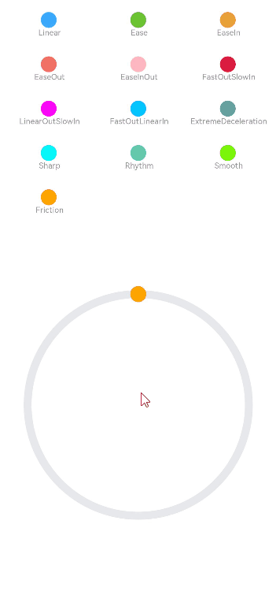

# Traditional Curve

The animation curve, defined by a timing function, is a speed curve that controls the time consumed by an animation on attribute changes. The slope of the animation curve at a certain moment indicates the animation velocity and corresponds to the attribute change speed. A well-designed animation curve should be continuously smooth, in line with the user's intent, and consistent with the real world. When designing animation curves for your animations and transitions, take into account use cases and user intents. Animation curves can be classified into physics-based curves (ArkUI provides multiple physics-based spring curves) and traditional curves based on whether they model the real world. Compared with the traditional curve, the movement trajectory generated by the physics-based curve would feel more natural to users and help create a more engaging experience. In light of this, you are advised to use the physics-based curve when possible.


Traditional curves are mathematically described curves. A typical representative is the cubic Bezier curve. You define the curve shape with a set of control points, to bring out the expected animation effect, such as ease in and ease out. As aforementioned, a traditional curve is not based on the real-world behavior. This means that it does not change its shape to respond to user behavior, and lacks the natural and engaging feel given by a physics-based curve. When creating animations, prioritize physics-based curves and use traditional curves only in rare cases.


ArkUI provides APIs for traditional curves such as Bezier and step curves. For details, see [Interpolation Calculation](../reference/apis/js-apis-curve.md).


The following is an example of a traditional curve.


```ts
class MyCurve {
  public title: string;
  public curve: Curve;
  public color: Color | string;

  constructor(title: string, curve: Curve, color: Color | string = '') {
    this.title = title;
    this.curve = curve;
    this.color = color;
  }
}

const myCurves: MyCurve[] = [
  new MyCurve(' Linear', Curve.Linear, 0x409EFF),
  new MyCurve(' Ease', Curve.Ease, 0x67C23A),
  new MyCurve(' EaseIn', Curve.EaseIn, 0xE6A23C),
  new MyCurve(' EaseOut', Curve.EaseOut, 0xF56C6C),
  new MyCurve(' EaseInOut', Curve.EaseInOut, 0xFFB6C1),
  new MyCurve(' FastOutSlowIn', Curve.FastOutSlowIn, 0xDC143C),
  new MyCurve(' LinearOutSlowIn', Curve.LinearOutSlowIn, 0xFF00FF),
  new MyCurve(' FastOutLinearIn', Curve.FastOutLinearIn, 0x00BFFF),
  new MyCurve(' ExtremeDeceleration', Curve.ExtremeDeceleration, 0x5F9EA0),
  new MyCurve(' Sharp', Curve.Sharp, 0x00FFFF),
  new MyCurve(' Rhythm', Curve.Rhythm, 0x66CDAA),
  new MyCurve(' Smooth', Curve.Smooth, 0x7CFC00),
  new MyCurve(' Friction', Curve.Friction, 0xFFA500)
]

@Entry
@Component
export struct CurveDemo {
  @State dRotate: number = 0; // Rotation angle.

  build() {
    Column() {
      // Curve example
      Grid() {
        ForEach(myCurves, (item: MyCurve) => {
          GridItem() {
            Column() {
              Row()
                .width(20)
                .height(20)
                .borderRadius(10)
                .backgroundColor(item.color)
              Text(item.title)
                .fontSize(10)
                .fontColor(0x909399)
            }
            .width('100%')
          }
        })
      }
      .columnsTemplate('1fr 1fr 1fr')
      .rowsTemplate('1fr 1fr 1fr 1fr 1fr')
      .padding(10)
      .width('100%')
      .height(300)

      Stack() {
        // Swing pipe
        Row()
          .width(290)
          .height(290)
          .border({
            width: 10,
            color: 0xE6E8EB,
            radius: 145
          })

        ForEach(myCurves, (item: MyCurve) => {
          // Balls
          Column() {
            Row()
              .width(20)
              .height(20)
              .borderRadius(10)
              .backgroundColor(item.color)
          }
          .width(20)
          .height(300)
          .rotate({ angle: this.dRotate })
          .animation({ duration: 2000, iterations: -1, curve: item.curve, delay: 100 })
        })
      }
      .width('100%')
      .height(437)
      .onClick(() => {
        this.dRotate ? null : this.dRotate = 360;
      })
    }
    .width('100%')
  }
}
```



