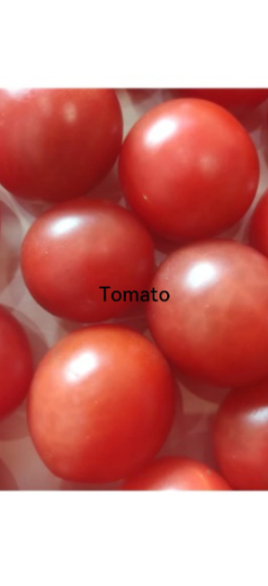
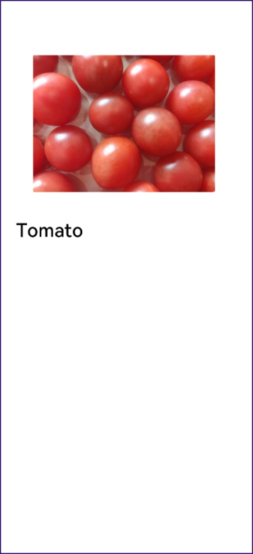

# Creating a Simple Page

In this section, we will develop an infographic food details page, by building custom components through the container components **\<Stack>** and **\<Flex>** as well as basic components **\<Image>** and **\<Text>**.

Before creating a page, create an ArkTS project. For details, see [Creating an ArkTS Project in FA model](../quick-start/start-with-ets-stage.md#creating-an-arkts-project) or [Creating an ArkTS Project in Stage model](../quick-start/start-with-ets-fa.md#creating-an-arkts-project).


## Building the Stack Layout

1. Create a food name.
   
   In the **index.ets** file, create a **\<Stack>** component, and place the **\<Text>** component in the braces of the **\<Stack>** component. When the **\<Stack>** component contains multiple child components, the latter child component overwrites the former one.
   
   ```ts
   @Entry
   @Component
   struct MyComponent {
     build() {
       Stack() {
           Text('Tomato')
               .fontSize(26)
               .fontWeight(500)
       }
     }
   }
   ```

   
   
2. Display food pictures.
   Create an **\<Image>** component and specify a URL for it. To display the **\<Text>** component above the **\<Image>** component, declare the **\<Image>** component first. Image resources are stored in the **rawfile** folder in **resources**. When referencing the resources in the **rawfile** folder, use the `$rawfile('filename')` format, where **filename** indicates the relative path of the file in the **rawfile** folder. `$rawfile` only allows the **\<Image>** component to reference image resources.

   ```ts
   @Entry
   @Component
   struct MyComponent {
     build() {
       Stack() {
           Image($rawfile('Tomato.png'))
           Text('Tomato')
               .fontSize(26)
               .fontWeight(500)
       }
     }
   }
   ```


   

3. Access images through resources.
   In addition to specifying the image path, you can also use the media resource symbol **$r** to reference resources based on the resource qualifier rules in the **resources** folder. Right-click the **resources** folder, choose **New** > **Resource Directory** from the shortcut menu, and set **Resource Type** to **Media** (image resource).

   Place **Tomato.png** in the **media** folder. You can then reference the application resources in the `$r('app.type.name')` format, which is `$r('app.media.Tomato')` in this example.

   ```ts
   @Entry
   @Component
   struct MyComponent {
     build() {
       Stack() {
         Image($r('app.media.Tomato'))
           .objectFit(ImageFit.Contain)
           .height(357)
         Text('Tomato')
           .fontSize(26)
           .fontWeight(500)
       }
     }
   }
   ```

4. Set the width and height of the image, and set the **objectFit** attribute of the image to **ImageFit.Contain**, which means to keep the aspect ratio of the image to ensure that the image is completely displayed within the boundary.
   If the image fills the entire screen, the possible causes are as follows:
   1. The width and height of the image are not set.

   2. The default attribute of **objectFit** of the image is **ImageFit.Cover**, that is, the image is zoomed in or zoomed out to fill the entire display boundary with the aspect ratio locked.

   ```ts
   @Entry
   @Component
   struct MyComponent {
     build() {
       Stack() {
         Image($r('app.media.Tomato'))
           .objectFit(ImageFit.Contain)
           .height(357)
         Text('Tomato')
           .fontSize(26)
           .fontWeight(500)
       }
     }
   }
   ```

     

5. Set the food image and name layout. Set the alignment mode of the stack to bottom alignment. By default, the stack is center aligned. Set **alignContent** to **Alignment.BottomStart**. Similar to **FontWeight**, **Alignment** is a built-in enumeration type provided by the framework.

   ```ts
   @Entry
   @Component
   struct MyComponent {
     build() {
       Stack({ alignContent: Alignment.BottomStart }) {
         Image($r('app.media.Tomato'))
           .objectFit(ImageFit.Contain)
           .height(357)
         Text('Tomato')
           .fontSize(26)
           .fontWeight(500)
       }
     }
   }
   ```

     

6. Adjust the left and bottom margin of the **\<Text>** component. **margin** is a shorthand attribute. You can specify the margins of the four edges in a unified manner or separately.  

   1. To set the margins of the four edges in a unified manner, use the **Margin(Length)** format. For example, **margin(20)** indicates that the margins of the top, right, bottom, and left edges are all 20.
   2. To set the margins of the four edges separately, use the **{top?: Length, right?: Length, bottom?: Length, left?:Length}** format. For example, **margin({ left: 26, bottom: 17.4 })** indicates that the left margin is 26 and the bottom margin is 17.4.

   ```ts
   @Entry
   @Component
   struct MyComponent {
     build() {
       Stack({ alignContent: Alignment.BottomStart }) {
           Image($r('app.media.Tomato'))
               .objectFit(ImageFit.Contain)
               .height(357)
           Text('Tomato')
               .fontSize(26)
               .fontWeight(500)
               .margin({left: 26, bottom: 17.4})
       }   
     }
   }
   ```

     

7. Adjust the structure between components and semanticize component names. Create the **FoodDetail** page entry component, create a **\<Column>** component in **FoodDetail**, and set the alignment to **alignItems(HorizontalAlign.Center)**. Change the name of the **MyComponent** component to **FoodImageDisplay**, which is a child component of the **FoodDetail** component.

   The **\<Column>** component is a container whose child components are vertically arranged. It is in linear layout in essence. Therefore, only the alignment in the cross axis direction can be set.

   ```ts
   @Component
   struct FoodImageDisplay {
     build() {
       Stack({ alignContent: Alignment.BottomStart }) {
         Image($r('app.media.Tomato'))
           .objectFit(ImageFit.Contain)
         Text('Tomato')
           .fontSize(26)
           .fontWeight(500)
           .margin({ left: 26, bottom: 17.4 })
       }
       .height(357)   
     }
   }
   
   @Entry
   @Component
   struct FoodDetail {
     build() {
       Column() {
         FoodImageDisplay()
       }
       .alignItems(HorizontalAlign.Center)
     }
   }
   ```

## Building the Flex Layout

Use the **Flex** layout to build a food composition table. In this way, cell sizes are flexibly set based on the proportion, eliminating the need for width and height calculation.

1. Create a **ContentTable** component as a child component of the **FoodDetail** component.

   ```ts
   @Component
   struct FoodImageDisplay {
     build() {
       Stack({ alignContent: Alignment.BottomStart }) {
         Image($r('app.media.Tomato'))
           .objectFit(ImageFit.Contain)
           .height(357)
         Text('Tomato')
           .fontSize(26)
           .fontWeight(500)
           .margin({ left: 26, bottom: 17.4 })
       }
     }
   }
   
   @Component
   struct ContentTable {
     build() {
     }
   }
   
   @Entry
   @Component
   struct FoodDetail {
     build() {
       Column() {
         FoodImageDisplay()
         ContentTable()
       }
       .alignItems(HorizontalAlign.Center)
     }
   }
   ```

2. Create a **\<Flex>** component to display two food composition categories in the tomato: **Calories** and **Nutrition**.
   **Calories** contains information about calories. **Nutrition** contains information about protein, fat, carbohydrates, and vitamin C.

   Create the **Calories** class. Create a **\<Flex>** component and set its height to **280**, and the top, right, and left margins to **30**. The **Flex** component contains three **\<Text>** child components, which represent the category name (**Calories**), content name (**Calories**), and contain value (**17 kcal**), respectively. By default, child components in the **Flex** component are arranged horizontally.

   In the following example, code of **FoodImageDisplay** is omitted, and only code of **ContentTable** is provided.

   ```ts
   @Component
   struct ContentTable {
     build() {
       Flex() {
         Text('Calories')
           .fontSize(17.4)
           .fontWeight(FontWeight.Bold)
         Text('Calories')
           .fontSize(17.4)
         Text('17kcal')
           .fontSize(17.4)
       }
       .height(280)
       .padding({ top: 30, right: 30, left: 30 })
     }
   }
   
   @Entry
   @Component
   struct FoodDetail {
     build() {
       Column() {
         FoodImageDisplay()
         ContentTable()
       }
       .alignItems(HorizontalAlign.Center)
     }
   }
   ```
   
   
      
   
3. Adjust the layout and set the proportion (**layoutWeight**) of each part. Set **layoutWeight** of the category name to **1**, and **layoutWeight** of the content name and content value to **2**. The content name and content value are in a same **Flex**, and the content name occupies all remaining space **flexGrow(1)**.

   ```ts
   @Component
   struct FoodImageDisplay {
     build() {
       Stack({ alignContent: Alignment.BottomStart }) {
         Image($r('app.media.Tomato'))
           .objectFit(ImageFit.Contain)
           .height(357)
         Text('Tomato')
           .fontSize(26)
           .fontWeight(500)
           .margin({ left: 26, bottom: 17.4 })
       }  
     }
   }
   
   @Component
   struct ContentTable {
     build() {
       Flex() {
         Text('Calories')
           .fontSize(17.4)
           .fontWeight(FontWeight.Bold)
           .layoutWeight(1)
         Flex() {
           Text('Calories')
             .fontSize(17.4)
             .flexGrow(1)
           Text('17kcal')
             .fontSize(17.4)
         }
         .layoutWeight(2)
       }
       .height(280)
       .padding({ top: 30, right: 30, left: 30 })
     }
   }
   
   @Entry
   @Component
   struct FoodDetail {
     build() {
       Column() {
         FoodImageDisplay()
         ContentTable()
       }
       .alignItems(HorizontalAlign.Center)
     }
   }
   ```
   
     
   
4. Create the **Nutrient** class in a similar process. **Nutrition** consists of four parts: **Protein**, **Fat**, **Carbohydrates**, and **VitaminC**. The names of the last three parts are omitted in the table and represented by spaces.
   Set **FlexDirection.Column**, **FlexAlign.SpaceBetween**, and **ItemAlign.Start**.

   ```ts
   @Component
   struct ContentTable {
     build() {
       Flex({ direction: FlexDirection.Column, justifyContent: FlexAlign.SpaceBetween, alignItems: ItemAlign.Start }) {
         Flex() {
           Text('Calories')
             .fontSize(17.4)
             .fontWeight(FontWeight.Bold)
             .layoutWeight(1)
           Flex() {
             Text('Calories')
               .fontSize(17.4)
               .flexGrow(1)
             Text('17kcal')
               .fontSize(17.4)
           }
           .layoutWeight(2)
         }
         Flex() {
           Text('Nutrition')
             .fontSize(17.4)
             .fontWeight(FontWeight.Bold)
             .layoutWeight(1)
           Flex() {
             Text('Protein')
               .fontSize(17.4)
               .flexGrow(1)
             Text('0.9g')
               .fontSize(17.4)
           }
           .layoutWeight(2)
         }
         Flex() {
           Text(' ')
             .fontSize(17.4)
             .fontWeight(FontWeight.Bold)
             .layoutWeight(1)
           Flex() {
             Text('Fat')
               .fontSize(17.4)
               .flexGrow(1)
             Text('0.2g')
               .fontSize(17.4)
           }
           .layoutWeight(2)
         }
         Flex() {
           Text(' ')
             .fontSize(17.4)
             .fontWeight(FontWeight.Bold)
             .layoutWeight(1)
           Flex() {
             Text('Carbohydrates')
               .fontSize(17.4)
               .flexGrow(1)
             Text('3.9g')
               .fontSize(17.4)
           }
           .layoutWeight(2)
         }
         Flex() {
           Text(' ')
             .fontSize(17.4)
             .fontWeight(FontWeight.Bold)
             .layoutWeight(1)
           Flex() {
             Text('vitaminC')
               .fontSize(17.4)
               .flexGrow(1)
             Text('17.8mg')
               .fontSize(17.4)
           }
           .layoutWeight(2)
         }
       }
       .height(280)
       .padding({ top: 30, right: 30, left: 30 })
     }
   }
   
   @Entry
   @Component
   struct FoodDetail {
       build() {
           Column() {
               FoodImageDisplay()
               ContentTable()
           }
           .alignItems(HorizontalAlign.Center)
       }
   }
   ```

   
   
5. Use the custom constructor **\@Builder** to simplify the code. It can be found that the food groups in each food composition table are actually of the same UI structure.
   
   
   
Currently, all food groups are declared, resulting in code duplication and redundancy. You can use **\@Builder** to build a custom method and abstract the same UI structure declaration. The **\@Builder** decorated method and the **build** method for the **@Component** decorated component are used to declare some UI rendering structures and comply with the same ArkTS syntax. You can define one or more methods decorated by **\@Builder**, but a component decorated by **@Component** can have only one **build** method.
   
Declare the **IngredientItem** method decorated by **\@Builder** in **ContentTable** to declare the UI descriptions for the category name, content name, and content value.
   
   ```ts
    @Component
   struct ContentTable {
     @Builder IngredientItem(title:string, name: string, value: string) {
       Flex() {
         Text(title)
           .fontSize(17.4)
           .fontWeight(FontWeight.Bold)
           .layoutWeight(1)
         Flex({ alignItems: ItemAlign.Center }) {
           Text(name)
             .fontSize(17.4)
             .flexGrow(1)
           Text(value)
             .fontSize(17.4)
         }
         .layoutWeight(2)
       }
     }
   }
   ```
   
When the **IngredientItem** API is called in the **build** method of **ContentTable**, **this** needs to be used to invoke the method in the scope of the component to distinguish the global method call.
   
   ```ts
   @Component
   struct ContentTable {
     ......
     build() {
       Flex({ direction: FlexDirection.Column, justifyContent: FlexAlign.SpaceBetween, alignItems: ItemAlign.Start }) {
         this.IngredientItem('Calories', 'Calories', '17kcal')
         this.IngredientItem('Nutrition', 'Protein', '0.9g')
         this.IngredientItem('', 'Fat', '0.2g')
         this.IngredientItem('', 'Carbohydrates', '3.9g')
         this.IngredientItem('', 'VitaminC', '17.8mg')
       }
       .height(280)
       .padding({ top: 30, right: 30, left: 30 })
     }
   }
   ```
   
The overall code of the **ContentTable** component is as follows:
   
   ```ts
   @Component
   struct ContentTable {
     @Builder IngredientItem(title:string, name: string, value: string) {
       Flex() {
         Text(title)
           .fontSize(17.4)
           .fontWeight(FontWeight.Bold)
           .layoutWeight(1)
         Flex() {
           Text(name)
             .fontSize(17.4)
             .flexGrow(1)
           Text(value)
             .fontSize(17.4)
         }
         .layoutWeight(2)
       }
     }
   
     build() {
       Flex({ direction: FlexDirection.Column, justifyContent: FlexAlign.SpaceBetween, alignItems: ItemAlign.Start }) {
         this.IngredientItem('Calories', 'Calories', '17kcal')
         this.IngredientItem('Nutrition', 'Protein', '0.9g')
         this.IngredientItem('', 'Fat', '0.2g')
         this.IngredientItem('', 'Carbohydrates', '3.9g')
         this.IngredientItem('', 'VitaminC', '17.8mg')
       }
       .height(280)
       .padding({ top: 30, right: 30, left: 30 })
     }
   }
   
   @Entry
   @Component
   struct FoodDetail {
       build() {
           Column() {
               FoodImageDisplay()
               ContentTable()
           }
           .alignItems(HorizontalAlign.Center)
       }
   }
   ```
   
  

You've learned how to build a simple food details page. Read on to learn how to define the page layout and connection.
