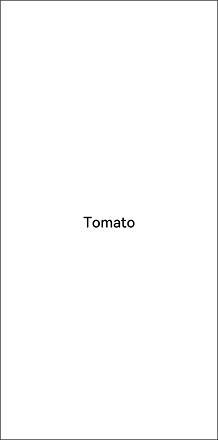

# Declarative UI Development Guidelines

## Overview

| Task         | Description                                      | Related Resources                                    |
| ----------- | ---------------------------------------- | ---------------------------------------- |
| Set up the development environment.     | Understand the project structure of the declarative UI.<br>Learn the resource categories and how to access resources.             | [OpenHarmony Project Overview](https://developer.harmonyos.com/en/docs/documentation/doc-guides/ohos-project-overview-0000001218440650)<br>[Resource Categories and Access](../quick-start/resource-categories-and-access.md)|
| Learn ArkTS.  | As its name implies, ArkTS is a superset of TypeScript. It is the preferred, primary programming language for application development in OpenHarmony.| [Learning ArkTS](../quick-start/arkts-get-started.md)|
| Develop a page.       | Select an appropriate layout based on the use case.<br>Add built-in components and set the component style based on the page content to present.<br>Update and diversify the page content.| [Creating a Page](#creating-a-page)<br>          [Common Layout Development](ui-ts-layout-linear.md)<br>          [Common Components](ui-ts-components-intro.md)<br>[Setting the Component Style](#setting-the-component-styles)<br>[Updating Page Content](#updating-page-content)|
| (Optional) Diversify the page content.  | Leverage the drawing and animation features to effectively increase user engagement.                                  | [Drawing Components](../reference/arkui-ts/ts-drawing-components-circle.md)<br>[Canvas Components](../reference/arkui-ts/ts-components-canvas-canvas.md)<br>[Animation](../reference/arkui-ts/ts-animatorproperty.md)|
| (Optional) Implement page redirection.| Use page routing to implement redirection between pages.                      | [Page Routing](../reference/apis/js-apis-router.md)|
| (Optional) Improve performance.   | Learn how you can improve your implementation, thereby avoiding possible performance drop.                    | [Recommendations for Improving Performance](ui-ts-performance-improvement-recommendation.md)|

## Creating a Page

Select a layout to create a page and add basic built-in components to the page. In this example, the [flex layout](ui-ts-layout-flex.md) is used, and the **\<Text>** component is centered horizontally and vertically on the page.

   ```ts
    // xxx.ets
    @Entry
    @Component
    struct MyComponent {
      build() {
        Flex({ direction: FlexDirection.Column, alignItems: ItemAlign.Center, justifyContent: FlexAlign.Center }) {
          Text('Hello')
        }        
        .width('100%')
        .height('100%')
      }
    }
   ```

## Setting the Component Style

If a built-in component does not have attribute methods set, it takes the default style. To change the style of a component and thereby how it looks on the UI, modify the settings of styles, including component-specific styles and [universal styles](../reference/arkui-ts/ts-universal-attributes-size.md).

1. Change the display content of the **\<Text>** component to **Tomato** by modifying its constructor parameters.
2. Set the **fontSize** attribute to **26** and the **fontWeight** attribute to **500**.

   ```ts
    // xxx.ets
    @Entry
    @Component
    struct MyComponent {
      build() {
        Flex({ direction: FlexDirection.Column, alignItems: ItemAlign.Center, justifyContent: FlexAlign.Center }) {
          Text('Tomato')
            .fontSize(26)
            .fontWeight(500)
        }
        .width('100%')
        .height('100%')
      }
    }
   ```

   

## Updating Page Content

You can update page content by updating component status. Below is a simple example.

> **NOTE**
>
> Before updating the status of a component, initialize its member variables. The member variables of a custom component can be initialized in either of the following methods: [local initialization](../quick-start/arkts-restrictions-and-extensions.md#initialization-and-restrictions-of-custom-components-member-variables) or [initialization using constructor parameters](../quick-start/arkts-restrictions-and-extensions.md#initialization-and-restrictions-of-custom-components-member-variables). Select the appropriate method based on the decorator used by the variable.

**Example**

```ts
// xxx.ets
@Entry
@Component
struct ParentComp {
  @State isCountDown: boolean = true

  build() {
    Column() {
      Text(this.isCountDown ? 'Count Down' : 'Stopwatch').fontSize(20).margin(20)
      if (this.isCountDown) {
        // The image resources are stored in the media directory.
        Image($r("app.media.countdown")).width(120).height(120)
        TimerComponent({ counter: 10, changePerSec: -1, showInColor: Color.Red })
      } else {
        // The image resources are stored in the media directory.
        Image($r("app.media.stopwatch")).width(120).height(120)
        TimerComponent({ counter: 0, changePerSec: +1, showInColor: Color.Black })
      }
      Button(this.isCountDown ? 'Switch to Stopwatch' : 'Switch to Count Down')
        .onClick(() => {
          this.isCountDown = !this.isCountDown
        })
    }.width('100%')
  }
}

// Custom timer/countdown component.
@Component
struct TimerComponent {
  @State counter: number = 0
  private changePerSec: number = -1
  private showInColor: Color = Color.Black
  private timerId: number = -1

  build() {
    Text(`${this.counter}sec`)
      .fontColor(this.showInColor)
      .fontSize(20)
      .margin(20)
  }

  aboutToAppear() {
    this.timerId = setInterval(() => {
      this.counter += this.changePerSec
    }, 1000)
  }

  aboutToDisappear() {
    if (this.timerId > 0) {
      clearTimeout(this.timerId)
      this.timerId = -1
    }
  }
}
```


**Initial creation and rendering:**

1. Create the parent component **ParentComp**.

2. Locally initialize the state variable **isCountDown** of **ParentComp**.

3. Execute the **build** function of **ParentComp**.

4. Create a **\<Column>** component.
   1. Create a **\<Text>** component, set the text content, and add the **\<Text>** component instance to the **\<Column>** component.
   2. With the **if** statement, create a component under the **true** condition.
       1. Create an **\<Image>** component and set the image source address.
       2. Create a **TimerComponent** using the given constructor.
   3. Create a **\<Button>** component and set the corresponding content.

**Status update:**

When the user clicks a button:

1. The value of the **isCountDown** state variable of **ParentComp** is changed to **false**.

2. The **build** function of **ParentComp** is executed.

3. The **\<Column>** component is reused and reinitialized.

4. The child components of **\<Column>** reuse and reinitialize the objects in the memory.
   1. The **\<Text>** component is reused after being re-initialized using the new text content.
   2. With the **if** statement, the components under the **false** condition are used.
       1. The component instances created under the **true** condition are destroyed.
       2. Components under the **false** condition are created.
   3. The **\<Button>** component is reused with the new image source.
