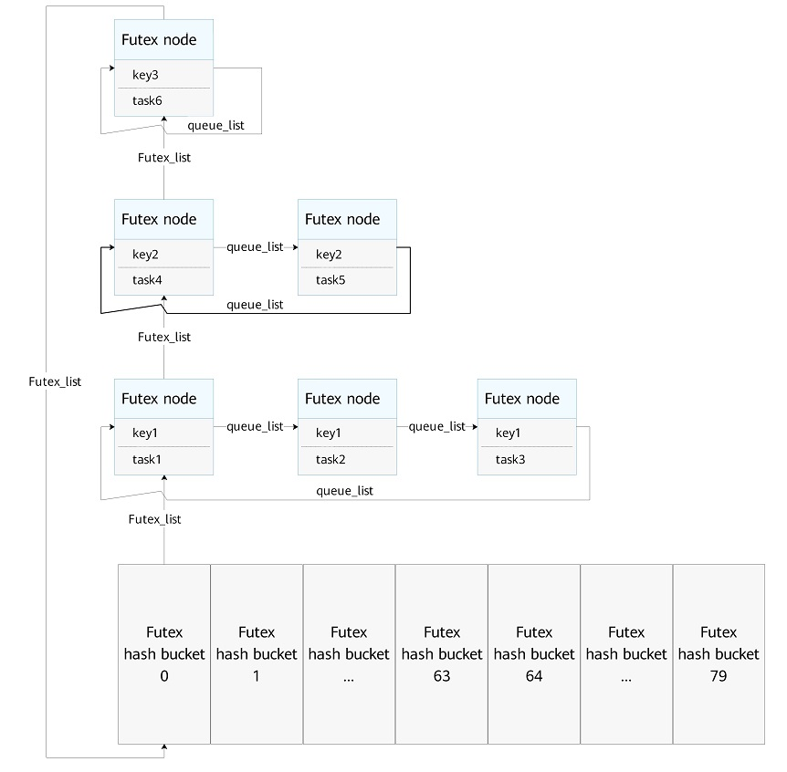

# Futex

## Basic Concepts

Fast userspace mutex (futex) is a system call capability provided by the kernel. It is a basic component that combines with user-mode lock logic to form a user-mode lock. It is a lock working in both user mode and kernel mode, for example, userspace mutex, barrier and cond synchronization lock, and RW lock. The user-mode part implements lock logic, and the kernel-mode part schedules locks.

When a user-mode thread requests a lock, the lock status is first checked in user space. If no lock contention occurs, the user-mode thread acquires the lock directly. If lock contention occurs, the futex system call is invoked to request the kernel to suspend the thread and maintain the blocking queue.

When a user-mode thread releases a lock, the lock status is first checked in user space. If no other thread is blocked by the lock, the lock is directly released in user space. If there are threads blocked by the lock, the futex system call is invoked to request the kernel to wake up the threads in the blocking queue.

## Working Principles

When thread scheduling is required to resolve lock contention or lock release in user space, the futex system call is invoked to pass the user-mode lock address to the kernel. The user-mode locks are distinguished by lock address in the futex of the kernel. The available virtual address space in user space is 1 GiB. To facilitate search and management of lock addresses, the kernel futex uses hash buckets to store the user-mode locks.

There are 80 hash buckets used to store shared locks (hashed based on physical addresses). The private/shared attributes are determined by initialization of user-mode locks and the input parameters in the futex system call.

##  Futex Design

**Figure 1** Futex design

As shown in the above figure, each futex hash bucket stores the futex nodes with the same hash value linked in a futex_list. Each futex node corresponds to a suspended task. The key value of a node uniquely identifies a user-mode lock. The nodes with the same key value added to a queue_list indicate a queue of tasks blocked by the same lock.

## Available APIs

APIs of the futex module

| Category      | API  | Description                                 |
| -------------- | -------------- | ------------------------------------- |
| Putting a thread to wait  | OsFutexWait    | Inserts a node representing a blocked thread into the futex list.|
| Waking up a thread| OsFutexWake    | Wakes up a thread that is blocked by a specified lock.           |
| Modifying the lock address  | OsFutexRequeue | Adjusts the position of a specified lock in the futex list.          |

> **NOTE** 
>  The futex system call and user-mode logic form a user-mode lock. Therefore, you are advised to use the locks via the user-mode POSIX APIs.
