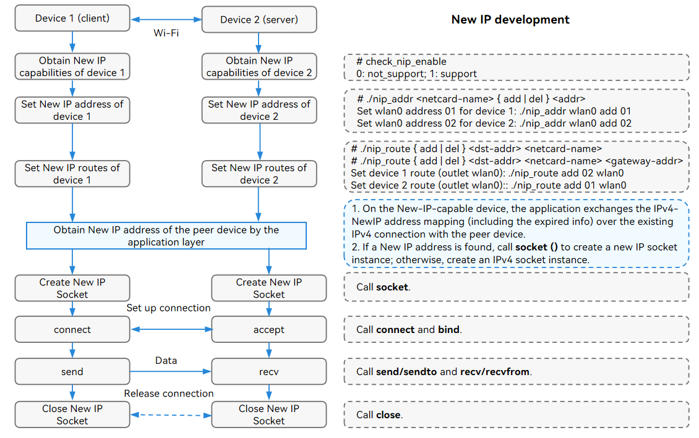
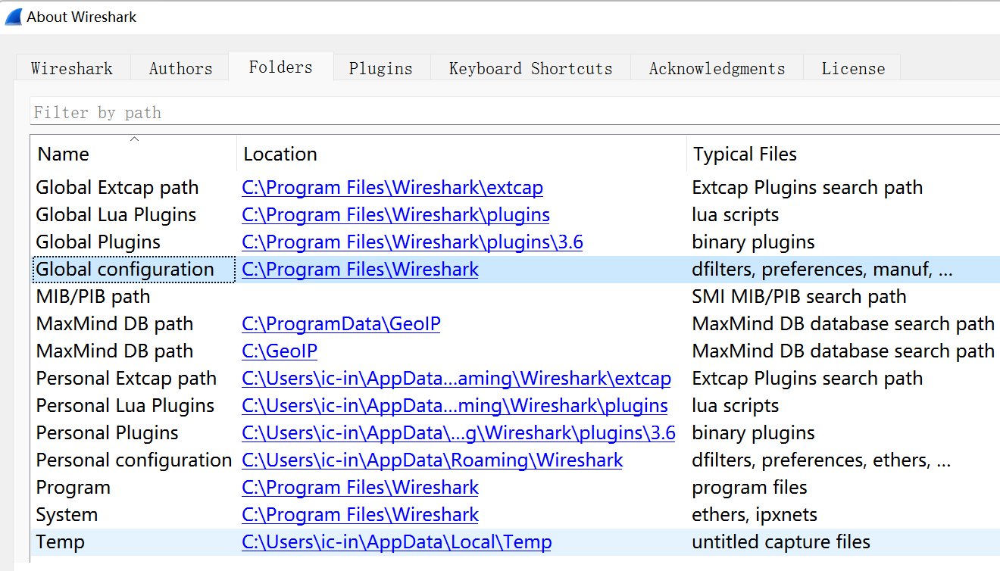
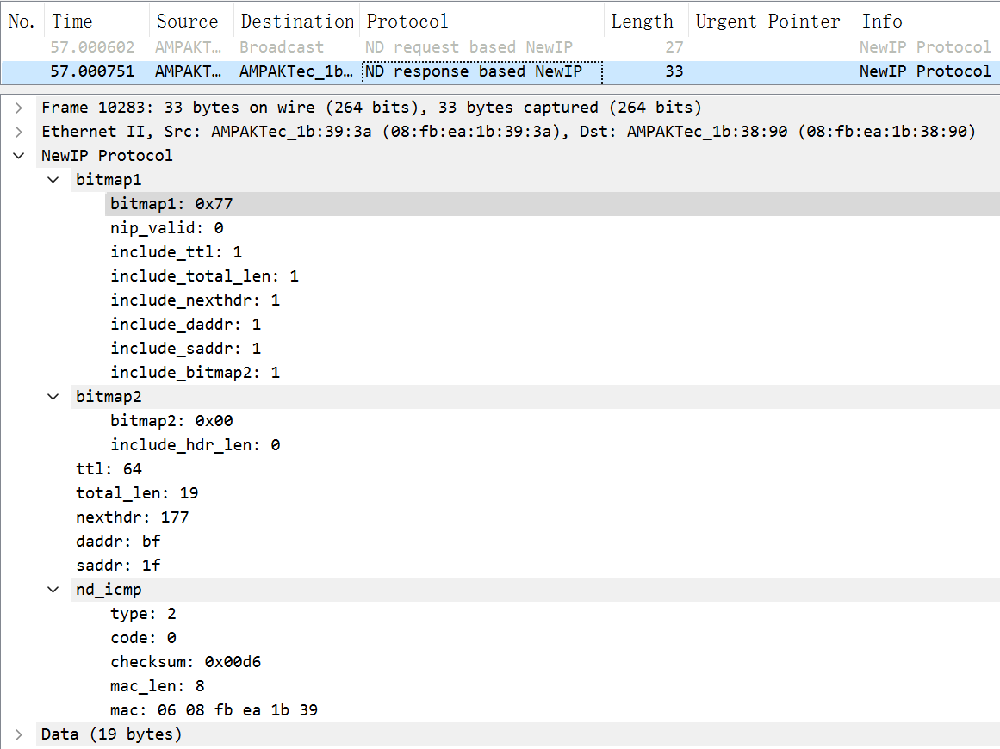
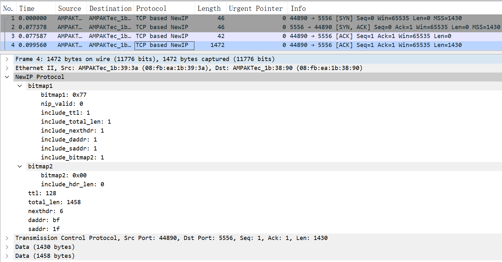

# New IP Kernel Protocol Stack


## Basic Concepts

On basis of the traditional IP, New IP employs lightweight packet headers and variable-length, multi-semantic addresses and integrates Layer 2 and Layer 3 protocols to simplify protocols, reduce redundant bytes, and improve the energy efficiency ratio (EER), net throughput, and communication efficiency. New IP strives to implement end-to-end interconnection between heterogeneous networks to support ultimate experience of Super Device via efficient communication between devices.

The WiFi protocol packets cause low transmission efficiency due to high overheads in Layer 3 packet headers and addressing.


```
An IPv4 address has a fixed length of 4 bytes, and an IPv6 address has a fixed length of 16 bytes.
The network layer header ranges from 20 to 60 bytes for an IPv4 packet and is 40 bytes for an IPv6 packet.
```

New IP supports variable-length multi-semantic addresses (min. 1 byte) and customized header encapsulation (min. 5 bytes). Simplified packet headers reduce overheads and improve transmission efficiency.

New IP provides 25.9% less packet header overheads than IPv4 and 44.9% less than IPv6.

New IP provides at least 1% higher payload transmission efficiency than IPv4 and 2.33% than IPv6.

| Scenario      | Header Overhead (Bytes)    | Payload Transmission Efficiency<br>(WiFi MTU = 1500 Bytes, BT MTU = 255 Bytes)|
| -------------- | ------------ | ------------------------------------------- |
| IPv4 for WiFi  | 30 + 8 + 20 = 58 | (1500 - 58)/1500 = 96.13%                       |
| IPv6 for WiFi  | 30 + 8 + 40 = 78 | (1500 - 78)/1500 = 94.8%                        |
| NewIP for WiFi | 30 + 8 + 5 = 43 | (1500 - 43)/1500 = 97.13%                       |

## Variable-Length Header Format

The figure below shows a New IP WiFi packet header. "EtherType = 0xEADD" in the LLC header identifies the packet. **Bitmap** is a binary sequence. The value of each binary bit indicates the existence of a feature.


- **Dispatch** indicates the encapsulation type. The value **0b0** indicates the New IP encapsulation child class, which is 1 bit long (**0b** indicates that the following values are binary).
- **Bitmap** is of variable length. By default, it is seven bits following the **Dispatch** valid bit. The length of **Bitmap** can be extended contiguously. The last bit **0** of **Bitmap** indicates the end of **Bitmap**. The last bit **1** means to extend the **Bitmap** one byte until the last bit **0**.
- **Value** indicates the field value. The length is an integer multiple of 1 byte. The value type and length are determined by the semantic table of the header field.

The **Bitmap** field is defined as follows:

| Bitmap Identifier            | Bitops | Field Length (Byte)        | Setting      | Remarks                                   |
| -------------------------- | ------ | ---------------- | -------------- | --------------------------------------- |
| Bitmap 1st Byte:           | -      | -                | -              | -                                       |
| Dispatch flag            | 0      | It does not indicate a specific field.  | Set to **0**.           | The value **0** indicates a New IP packet; **1** indicates a non-New-IP packet.                 |
| TTL                        | 1      | 1          | Set to **1**.           | Indicates the number of remaining hops.                             |
| Total Length               | 2      | 2          | Set to **0** for UDP and **1** for TCP.| Total length of a New IP packet (including the header length).      |
| Next Header                | 3      | 1          | Set to **1**.           | Protocol type.                             |
| Reserve                    | 4      | Reserved            | Set to **0**.           | Reserved.                             |
| Dest Address               | 5      | Variable length (1 to 8 bytes)| Set to **1**.           | Destination address.                             |
| Source Address             | 6      | Variable length (1 to 8 bytes)| Determined by the protocol.| Source address.                               |
| Flag bit, indicating whether there is the second byte| 7      | It does not indicate a specific field.  | -              | The value **0** indicates the end of this bitmap. The value **1** indicates another 8-bit bitmap.|
| Bitmap 2nd Byte:           | -      | -                | -              | -                                       |
| Header Length              | 0      | 1          | -              | Length of the New IP packet header.                        |
| Reserve                    | 1      | Reserved            | Set to **0**.           | -                                       |
| Reserve                    | 2      | Reserved            | Set to **0**.           | -                                       |
| Reserve                    | 3      | Reserved            | Set to **0**.           | -                                       |
| Reserve                    | 4      | Reserved            | Set to **0**.           | -                                       |
| Reserve                    | 5      | Reserved            | Set to **0**.           | -                                       |
| Reserve                    | 6      | Reserved            | Set to **0**.           | -                                       |
| Flag bit, indicating whether there is the third byte| 7      | It does not indicate a specific field.  | Set to **0**.           | The value **0** indicates the end of this bitmap. The value **1** indicates another 8-bit bitmap.|

The bitmap fields in New IP are processed as follows:

Only the bitmap fields defined in New IP are parsed. All the bitmap fields with unknown semantics are skipped. The start position of the packet is located for parsing based on the header length. If the packet header contains bitmap fields with unknown semantics and does not contain the header length, the packet will be discarded.

## Variable-Length Address Format

New IP uses variable-length addresses. The address itself indicates the length of the address. The address encoding format is as follows:

| First Byte | Semantics                                                    | Valid Range of Address                                               |
| ---------- | ------------------------------------------------------------ | ------------------------------------------------------------ |
| 0x00       | Address is 0                                                 | [1 byte] 0 to 220 (0x00 to 0xDC)                              |
| 0x01       | Address is 1                                                 | -                                                            |
| 0x02       | Address is 2                                                 | -                                                            |
| ...        | ...                                                          | -                                                            |
| 0xDC       | Address is 220                                               | -                                                            |
| 0xDD       | An 16-bit address, which is 0 + 256 * (0xDD - 0xDD) + the last byte value | [2 bytes] 221 to 255 (0x**DD**DD to 0x**DD**FF)                |
| 0xDE       | An 16-bit address, which is 0 + 256 * (0xDE - 0xDD) + the last byte value | [2 bytes] 256 to 511 (0x**DE**00 to 0x**DE**FF)                |
| 0xDF       | An 16-bit address, which is 0 + 256 * (0xDF - 0xDD) + the last byte value | [2 bytes] 512 to 767 (0x**DF**00 to 0x**DF**FF)                |
| ...        | ...                                                          | -                                                            |
| 0xF0       | An 16-bit address, which is 0 + 256 * (0xF0 - 0xDD) + the last byte value | [2 bytes] 4864 to 5119 (0x**F0**00 to 0x**F0**FF)              |
| 0xF1       | An 16-bit address is followed                                | [3 bytes] 5120 to 65535 (0x**F1** 1400 to 0x**F1** FFFF)       |
| 0xF2       | An 32-bit address is followed                                | [5 bytes] 65536 to 4,294,967,295 (0x**F2** 0001 0000 to 0x**F2** FFFF FFFF)|
| 0xF3       | An 48-bit address is followed                                | [7 bytes] 4,294,967,296 to 281,474,976,710,655 (0x**F3** 0001 0000 0000 to 0x**F3** FFFF FFFF FFFF)|
| 0xFE       | An 56-bit address is followed                                | [8 bytes] 0 to 72,057,594,037,927,935 (0x**FE**00 0000 0000 0000 to 0x**FE**FF FFFF FFFF FFFF)|


## New IP Configuration

Configure related settings and dependencies during kernel compilation to enable New IP. The New IP configuration is as follows:

```c
CONFIG_NEWIP=y          // Enable the New IP kernel protocol stack.
CONFIG_NEWIP_HOOKS=y    // Enable New IP processing with hooks.
```

Set the following dependency:

```c
VENDOR_HOOKS=y          // Enable the kernel function hooking framework.
```

**NOTE**

- Only the Linux 5.10 kernel supports the New IP kernel protocol stack.
- All native kernel code must be intrusively modified by hooks.

```c
/* Register the New IP ehash function with the kernel. */
register_trace_ninet_ehashfn_hook(&ninet_ehashfn_hook, NULL);


/* The following is the general entry function of IPv4 and IPv6 protocol stacks. Add the processing related to the New IP protocol stack to the general entry function. */
static u32 sk_ehashfn(const struct sock *sk)
{
    /* IPv6 */
#if IS_ENABLED(CONFIG_IPV6)
	if (sk->sk_family == AF_INET6 &&
	    !ipv6_addr_v4mapped(&sk->sk_v6_daddr))
		return inet6_ehashfn(sock_net(sk),
				     &sk->sk_v6_rcv_saddr, sk->sk_num,
				     &sk->sk_v6_daddr, sk->sk_dport);
#endif

#if IS_ENABLED(CONFIG_NEWIP_HOOKS)
	if (sk->sk_family == AF_NINET) {
		u32 ret = 0;

        /* ehash function registered by New IP */
		trace_ninet_ehashfn_hook(sock_net(sk), &sk->sk_nip_rcv_saddr, sk->sk_num,
					 &sk->sk_nip_daddr, sk->sk_dport, &ret);
		return ret;
	}
#endif

    /* IPv4 */
	return inet_ehashfn(sock_net(sk),
			    sk->sk_rcv_saddr, sk->sk_num,
			    sk->sk_daddr, sk->sk_dport);
}
```


Run the following command to check whether the New IP protocol stack code is successfully enabled:

```c
find out/ -name *nip*.o
out/rk3568/obj/third_party/glib/glib/glib_source/guniprop.o
out/kernel/OBJ/linux-5.10/net/newip/nip_addrconf_core.o
out/kernel/OBJ/linux-5.10/net/newip/nip_hdr_decap.o
out/kernel/OBJ/linux-5.10/net/newip/nip_addr.o
out/kernel/OBJ/linux-5.10/net/newip/nip_checksum.o
out/kernel/OBJ/linux-5.10/net/newip/tcp_nip_output.o
...
```

Disable the New IP kernel protocol stack, delete **CONFIG_NEWIP** and the **out/kernel** directory, and start the build again.

```c
# CONFIG_NEWIP is not set
# CONFIG_NEWIP_HOOKS is not set
```

## New IP APIs

The user-mode application calls the socket API to create a New IP socket and uses the New IP frame header encapsulation to receive and transmit packets. The following table lists the New IP socket functions.

| Function    | Input                                                        | Output                                          | Return Value          | Function Description                                                |
| -------- | ------------------------------------------------------------ | ---------------------------------------------- | ---------------- | ------------------------------------------------------------ |
| socket   | int **domain**, int type, int **protocol**                   | NA                                             | Socket handle **sockfd**.| Creates a **socket** instance for New IP.<br> **domain** must be **AF_NINET**, which indicates a New IP socket.<br>**protocol** can be **IPPROTO_TCP** or **IPPROTO_UDP**.<br>This function returns the handle of the **socket** instance created.|
| bind     | int sockfd, const **struct sockaddr_nin** *myaddr, socklen_t addrlen | NA                                             | Error code. The value is an integer. | Binds the **socket** instance to the specified IP address and port.<br> **myaddr->sin_family** must be **AF_NINET**.|
| listen   | int socket, int backlog                                      | NA                                             | Error code. The value is an integer. | Listens for the New IP address and port from the server.                                 |
| connect  | int sockfd, const **struct sockaddr_nin** *addr, aocklen_t addrlen | NA                                             | Error code. The value is an integer. | Sets up a connection between the client and the server.                                  |
| accept   | int sockfd, **struct sockaddr_nin** *address, socklen_t *address_len | NA                                             | **sockfd**.  | Accepts the connection request from the client.                              |
| send     | int sockfd, const void *msg, int len, unsigned int flags, const **struct sockaddr_nin** *dst_addr, int addrlen | NA                                             | Error code. The value is an integer. | Sends New IP TCP packets from the socket.                       |
| recv     | int sockfd, size_t len, int flags, **struct sockaddr_nin** *src_addr, | void  **buf, int* *fromlen                     | Error code. The value is an integer. | Receives New IP TCP packets from the socket.                       |
| close    | int sockfd                                                   | NA                                             | Error code. The value is an integer. | Closes the socket to release resources.                                      |
| ioctl    | int sockfd, unsigned long cmd, ...                           | NA                                             | Error code. The value is an integer. | Queries or modifies the information about the New IP protocol stack.                       |
| sendto   | int sockfd, const void *msg, int len, unsigned int flags, const **struct sockaddr** *dst_addr, int addrlen | NA                                             | Error code. The value is an integer. | Sends New IP UDP packets from the socket.                       |
| recvfrom | int sockfd, size_t len, int flags,                           | void *buf, struct sockaddr *from, int *fromlen | Error code. The value is an integer. | Receives New IP UDP packets from the socket.                       |

Structure of New IP short addresses:

```c
enum nip_8bit_addr_index {
	NIP_8BIT_ADDR_INDEX_0 = 0,
	NIP_8BIT_ADDR_INDEX_1 = 1,
	NIP_8BIT_ADDR_INDEX_2 = 2,
	NIP_8BIT_ADDR_INDEX_3 = 3,
	NIP_8BIT_ADDR_INDEX_4 = 4,
	NIP_8BIT_ADDR_INDEX_5 = 5,
	NIP_8BIT_ADDR_INDEX_6 = 6,
	NIP_8BIT_ADDR_INDEX_7 = 7,
	NIP_8BIT_ADDR_INDEX_MAX,
};

enum nip_16bit_addr_index {
	NIP_16BIT_ADDR_INDEX_0 = 0,
	NIP_16BIT_ADDR_INDEX_1 = 1,
	NIP_16BIT_ADDR_INDEX_2 = 2,
	NIP_16BIT_ADDR_INDEX_3 = 3,
	NIP_16BIT_ADDR_INDEX_MAX,
};

enum nip_32bit_addr_index {
	NIP_32BIT_ADDR_INDEX_0 = 0,
	NIP_32BIT_ADDR_INDEX_1 = 1,
	NIP_32BIT_ADDR_INDEX_MAX,
};

#define nip_addr_field8 v.u.field8
#define nip_addr_field16 v.u.field16
#define nip_addr_field32 v.u.field32

#pragma pack(1)
struct nip_addr_field {
	union {
		unsigned char   field8[NIP_8BIT_ADDR_INDEX_MAX];
		unsigned short field16[NIP_16BIT_ADDR_INDEX_MAX]; /* big-endian */
		unsigned int   field32[NIP_32BIT_ADDR_INDEX_MAX]; /* big-endian */
	} u;
};

struct nip_addr {
	unsigned char bitlen;	/* The address length is in bit (not byte) */
	struct nip_addr_field v;
};
#pragma pack()

/* The following structure must be larger than V4. System calls use V4.
 * If the definition is smaller than V4, the read process will have memory overruns
 * v4: include\linux\socket.h --> sockaddr (16Byte)
 */
#define POD_SOCKADDR_SIZE 3
struct sockaddr_nin {
	unsigned short sin_family; /* [2Byte] AF_NINET */
	unsigned short sin_port;   /* [2Byte] Transport layer port, big-endian */
	struct nip_addr sin_addr;  /* [9Byte] NIP address */

	unsigned char sin_zero[POD_SOCKADDR_SIZE]; /* [3Byte] Byte alignment */
};
```

## New IP Development

Only the OpenHarmony Linux-5.10 kernel supports New IP kernel protocol stack. You must manually configure IP address and route data for New IP in user mode, and connect the two devices through the router WiFi. To implement automatic switch to the New IP kernel protocol stack for communication after the IP address and route are is configured, see the description in the blue block in the figure below.



For details about the address and route configuration, see [examples](https://gitee.com/openharmony/communication_sfc_newip/tree/master/examples). Modify the CC definition in Makefile based on the CPU you use, compile the CC definition into a binary file, and push the file to the development board. Refer to the figure above to configure the address and route data for New IP.

| File            | Description                                                  |
| ------------------ | ------------------------------------------------------ |
| nip_addr.c         | Demo code for configuring the variable-length New IP addresses (any valid New IP address can be configured)|
| nip_route.c        | Demo code for configuring the New IP route data (any valid New IP route can be configured)      |
| check_nip_enable.c | Demo code for obtaining the New IP capabilities of the local device.                                     |

Check the New IP address and route information on device 1.

```sh
# cat /proc/net/nip_addr
01          wlan0
# cat /proc/net/nip_route
02      ff09       1 wlan0        # Route to device 2.
01      01      2149580801 wlan0  # Route for sending packets to itself and receiving the packets.
```

Check the New IP address and route information on device 2.

```sh
# cat /proc/net/nip_addr
02          wlan0
# cat /proc/net/nip_route
01      ff09       1 wlan0        # Route to device 1.
02      02      2149580801 wlan0  # Route for sending packets to itself and receiving the packets.
```

## New IP Sample Code for Receiving and Sending Packets

The table below lists the demo code files. For details about how to use the user-mode APIs of the New IP protocol stack, see [examples](https://gitee.com/openharmony/communication_sfc_newip/tree/master/examples). Fixed addresses and routes are configured in the demo code. You do not need to manually specify the addresses and routes when executing the binary program.

| File               | Description                         |
| --------------------- | ----------------------------- |
| nip_addr_cfg_demo.c   | Demo code for configuring the New IP variable-length addresses.  |
| nip_route_cfg_demo.c  | Demo code for New IP route configuration.        |
| nip_udp_server_demo.c | Demo code for the server that sends and receives New IP UDP packets.|
| nip_udp_client_demo.c | Demo code for the client that sends and receives New IP UDP packets.|
| nip_tcp_server_demo.c | Demo code for the server that sends and receives New IP TCP packets.|
| nip_tcp_client_demo.c | Demo code for the client that sends and receives New IP TCP packets.|
| nip_lib.c             | API demo code, for example, obtaining the interface index.|

**Basic Procedure**


1. Copy the demo code to the Linux compiler, and run **make clean** and **make all** to compile the demo code.

2. Upload the generated binary files to device 1 and device 2.

3. Run the **ifconfig wlan0 up** command to start the network adapter.

4. Run the **./nip_addr_cfg_demo server** command on shell of device 1 to configure a variable-length address **0xDE00** (2 bytes) for the server. Run the **./nip_addr_cfg_demo client** command on device 2 to configure a variable-length address **0x50** (1 byte) for the client. Then, run the **cat /proc/net/nip_addr** command to check the kernel address configuration.

5. Run the **./nip_route_cfg_demo server** command on device 1 to configure the server route data. Run the **./nip_route_cfg_demo client** command on device 2 to configure the client route data. Then, run the **cat /proc/net/nip_route** command to check the kernel route configuration.

Now, you can send and receive UDP/TCP packets. By default, the addresses and routes configured are used for sending and receiving packets.


**Sending and Receiving UDP Packets**

Run the **./nip_udp_server_demo** command on the server and then the **./nip_udp_client_demo** command on the client. The client sends 10 New IP packets. After receiving the packets, the server sends them to the client.

```
The following information is displayed in the shell window on the server:
Received -- 1661826989 498038 NIP_UDP #      0 -- from 0x50:57605
Sending  -- 1661826989 498038 NIP_UDP #      0 -- to 0x50:57605
Received -- 1661826990  14641 NIP_UDP #      1 -- from 0x50:57605
Sending  -- 1661826990  14641 NIP_UDP #      1 -- to 0x50:57605
Received -- 1661826990 518388 NIP_UDP #      2 -- from 0x50:57605
Sending  -- 1661826990 518388 NIP_UDP #      2 -- to 0x50:57605
...
Received -- 1661827011 590576 NIP_UDP #      9 -- from 0x50:37758
Sending  -- 1661827011 590576 NIP_UDP #      9 -- to 0x50:37758

The following information is displayed in the shell window on the client:
Received --1661827007  55221 NIP_UDP #      0 sock 3 success:     1/     1/no=     0
Received --1661827007 557926 NIP_UDP #      1 sock 3 success:     2/     2/no=     1
Received --1661827008  62653 NIP_UDP #      2 sock 3 success:     3/     3/no=     2
...
Received --1661827011 590576 NIP_UDP #      9 sock 3 success:    10/    10/no=     9
```


**Sending and Receiving TCP Packets**

Run the **./nip_tcp_server_demo** command on the server and then the **./nip_tcp_client_demo** command on the client. The client sends 10 New IP packets. After receiving the packets, the server sends them to the client.

```
The following information is displayed in the shell window on the server:
Received -- 1661760202 560605 NIP_TCP #      0 --:1024
Sending  -- 1661760202 560605 NIP_TCP #      0 --:1024
Received -- 1661760203  69254 NIP_TCP #      1 --:1024
Sending  -- 1661760203  69254 NIP_TCP #      1 --:1024
Received -- 1661760203 571604 NIP_TCP #      2 --:1024
Sending  -- 1661760203 571604 NIP_TCP #      2 --:1024
...
Received -- 1661760207  86544 NIP_TCP #      9 --:1024
Sending  -- 1661760207  86544 NIP_TCP #      9 --:1024

The following information is displayed in the shell window on the client:
Received --1661760202 560605 NIP_TCP #      0 sock 3 success:     1/     1/no=     0
Received --1661760203  69254 NIP_TCP #      1 sock 3 success:     2/     2/no=     1
...
Received --1661760207  86544 NIP_TCP #      9 sock 3 success:    10/    10/no=     9
```

## SELinux Policy

The SELinux policy must be added for the user-mode process to use New IP sockets. Otherwise, the operation will be intercepted.

```sh
# base\security\selinux\sepolicy\ohos_policy\xxx\xxx.te
# socket operation
# avc:  denied  { create } for  pid=540 comm="thread_xxx" scontext=u:r:thread_xxx:s0 tcontext=u:r:thread_xxx:s0 tclass=socket permissive=0
allow thread_xxx thread_xxx:socket { create bind connect listen accept read write shutdown setopt getopt };

# ioctl operation
# The operation code is defined in linux-xxx\include\uapi\linux\sockios.h.
# 0x8933 : name -> if_index mapping
# 0x8916 : set PA address
# 0x890B : add routing table entry
allowxperm thread_xxx thread_xxx:socket ioctl { 0x8933 0x8916 0x890B };
```

## WireShark Packet Parsing Template

The default packet parsing rules of Wireshark cannot parse New IP packets. You can add a New IP packet parsing template to Wireshark to parse New IP packets. For details about the template, see [New IP packet parsing template](https://gitee.com/openharmony/communication_sfc_newip/blob/master/tools/wireshark_cfg_for_newip.lua).

The procedure is as follows:

Choose **Help** > **About Wireshark** > **Folders**, open the **Global Configuration** directory, and edit the **init.lua** file. Add **dofile (*DATA_DIR*.."newip.lua")** to the end of the file. *DATA_DIR* is the directory where the **newip.lua** plug-in is located.



The following is an example of adding a New IP packet parsing template:

```
Path of the New IP packet parsing template:
D:\tools\WireShark\wireshark_cfg_for_newip.lua

Path of the WireShark configuration file:
C:\Program Files\Wireshark\init.lua

Add the following to the end of the **init.lua** file (Windows 11, for example):
dofile("D:\\tools\\WireShark\\wireshark_cfg_for_newip.lua")
```

### Packet Parsing Example

#### ND Request

The figure below shows the format of the New IP Neighbor Discovery (ND) request packet. The header contains a 1-byte bitmap (0x76), which is followed by the TTL, total packet length, upper-layer protocol type, destination address, and source address. The New IP ND request packet contains the packet type, operation code, checksum, and request address.


#### ND Response

The figure below shows the format of a New IP ND response packet. The header contains two bitmaps (**0x77** and **0x00**). Bitmap 1 is followed by the TTL, total length of the packet, upper-layer protocol type, destination address, and source address. Bitmap2 is used for byte alignment and does not carry any data. (For the rk3568 development board, the data transmitted in the link layer must be of an even number of bytes.) A New IP ND response packet contains the packet type, operation code, checksum, neighbor MAC address length, and neighbor MAC address.




#### TCP Handshake

The figure below shows the format of a TCP three-way handshake SYN packet. The New IP packet header contains two bitmaps (**0x77** and **0x00**). Bitmap1 is followed by the TTL, total packet length, upper-layer protocol type, destination address, and source address. Bitmap2 is used for byte alignment and does not carry any data. (For the rk3568 development board, the data transmitted in the link layer must be of an even number of bytes.)


#### TCP Data Packet

The figure below shows the TCP data format. The New IP header contains two bitmaps (**0x77** and **0x00**). Bitmap 1 is followed by the TTL, total packet length, upper-layer protocol type, destination address, and source address. Bitmap2 is used for byte alignment and does not carry any data. (For the rk3568 development board, the data transmitted in the link layer must be of an even number of bytes.)



