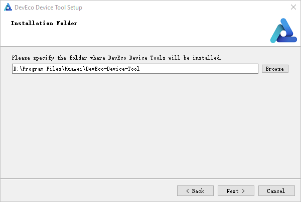
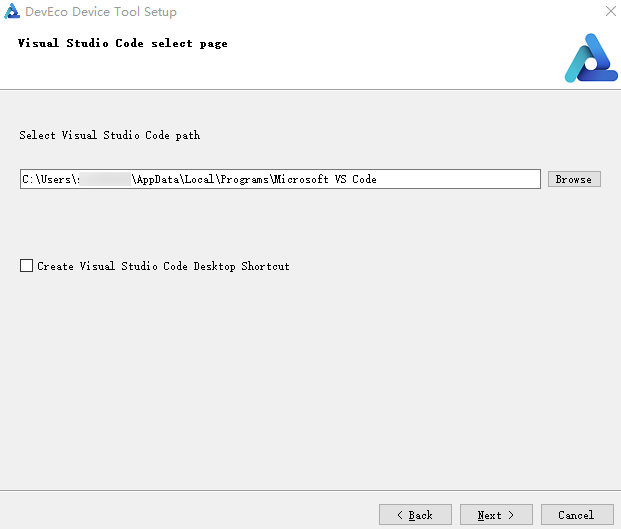
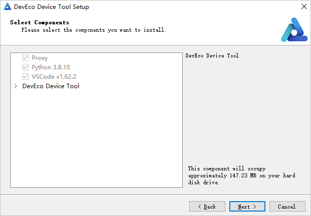
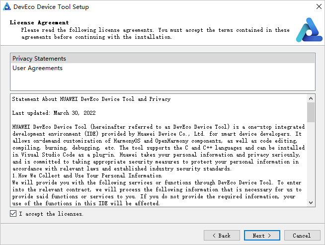

# Setting Up the Windows Environment

In embedded development, Windows-based tools, such as Visual Studio Code, are widely used in code editing. Yet, because the source code of most development boards, such as Hi3861 and Hi3516, cannot be built in Windows, these development boards require the Ubuntu build environment.

In the Windows+Ubuntu hybrid build environment, you can enjoy the benefits of both DevEco Device Tool for Windows and DevEco Device Tool for Ubuntu (where Visual Studio Code is optional).

The following describes how to set up the Windows environment.

## System Requirements

- OS: 64-bit Windows 10

- DevEco Device Tool: 3.1 Beta1

## Procedure

1. Download the [DevEco Device Tool 3.1 Beta1](https://device.harmonyos.com/cn/ide#download) Windows edition.

2. Decompress the DevEco Device Tool package, double-click the installer, and then click **Next**.

3. Set the installation path for DevEco Device Tool and click **Next**. Make sure the path does not contain Chinese characters and is in a drive other than the C drive.

   

4. When prompted, select the tools to be automatically installed.

   1. On the **VSCode installation confirm** page, select **Install VS Code 1.62.2 automatically** and click **Next**.
       >  **NOTE**
       >
       > If Visual Studio Code 1.62 or later has been installed, this step will be skipped.
       

       
       
   2. Select the Visual Studio Code installation path and click Next.

       

   2. On the displayed **Python select page**, select **Download from Huawei mirror** and click **Next**.
       >  **NOTE**
       >
       > If Python 3.8 or 3.9 has been installed, select **Use one of compatible on your PC**.
       
       

5. When the page shown below is displayed, click **Next**.

   

6. On the page shown below, read the user agreement and privacy statement carefully and select **I accept the licenses** before proceeding to the next step.

   

7. Wait for the DevEco Device Tool setup wizard to automatically install DevEco Device Tool. After the installation is complete, click **Finish** to close the setup wizard.

   

8. From Visual Studio Code, access the DevEco Device Tool page. Now you can conduct your development in DevEco Device Tool.

   
