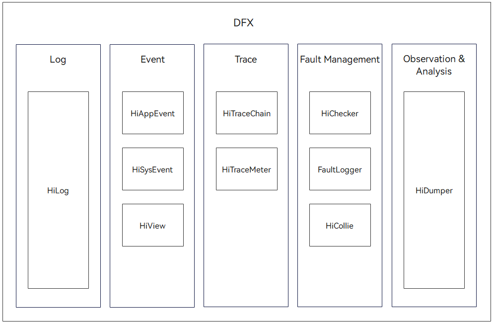

# DFX Overview

[Design for X](https://en.wikipedia.org/wiki/Design_for_X)  \(DFX\) refers to the software design that aims to improve the quality attributes in OpenHarmony. It mainly consists of two parts: design for reliability \(DFR\) and design for testability \(DFT\).

The DFX subsystem provides the following functions:

- HiLog: implements the logging function. It is applicable to mini-system devices \(reference memory ≥ 128 KiB\), small-system devices \(reference memory ≥ 1 MiB\), and standard-system devices \(reference memory ≥ 128 MB\).
- HiTraceChain: implements distributed call chain tracing. It is applicable to standard-system devices \(reference memory ≥ 128 MiB\).
- HiTraceMeter: implements performance trace. It is applicable to standard-system devices \(reference memory ≥ 128 MiB\).
- HiCollie: implements thread suspension detection. It is applicable to standard-system devices \(reference memory ≥ 128 MiB\).
- HiSysEvent: implements system event logging. It is applicable to standard-system devices \(reference memory ≥ 128 MiB\).
- HiDumper: exports system information. It is applicable to standard-system devices \(reference memory ≥ 128 MiB\).
- FaultLogger: implements crash detection. It is applicable to standard-system devices \(reference memory ≥ 128 MiB\).
- Hiview: implements device maintenance across different platforms. It is applicable to standard-system devices \(reference memory ≥ 128 MiB\).
- HiAppEvent and HiChecker are only hap developer oriented。

## Basic Concepts

**Logging**

Logging means to record the log information generated during system running so you can understand the running process and status of the system or applications.

**Distributed call chain tracing**

In a distributed system, the initiation of a service may involve multiple software modules, with control commands and data transmitted over intra-process, inter-process, and inter-device communication interfaces. To help you understand such complex communication processes and locate service faults efficiently, the DFX subsystem provides a distributed call chain tracing framework.

**Thread suspension detection**

If a thread is trapped in an infinite loop or the kernel state \(for example, Uninterruptable Sleep, Traced, Zombie, or synchronous wait\) when it is running, the thread cannot respond to normal service requests and cannot detect and recover from faults by itself. To detect and locate this type of faults, the DFX subsystem provides a simple watchdog mechanism by inserting detection probes to the process nodes that are prone to suspension. This ensures that suspension faults can be detected and logs can be collected.

**Event logging**

Event logging means to collect and log events reported during system running. The log information will help you better analyze the product usage.

**System event**

A system event is an indication of the system status at a given time point during system running. You can use these events to analyze the status change of the system.
<!--no_check-->
