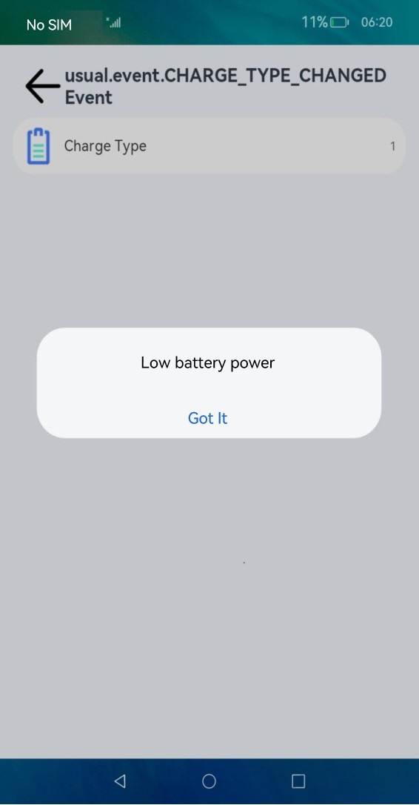

# Charging Type Customization

## Overview

### Introduction

By default, OpenHarmony supports multiple charging types. You can charge devices through different types of charging, for example, wired fast charging and wireless fast charging. OpenHarmony can display appropriate animations or take required service processing based on the charging type. However, the supported charging types vary according to products. To address this issue, OpenHarmony provides the charging type customization function.

### Constraints

The configuration path for battery level customization is subject to the [configuration policy](https://gitee.com/openharmony/customization_config_policy). In this development guide, `/vendor` is used as an example of the configuration path. During actual development, you need to modify the customization path based on the product configuration policy.

## How to Develop

### Setting Up the Environment

**Hardware requirements:**

Development board running the standard system, for example, the DAYU200 or Hi3516D V300 open source suite.

**Environment requirements:**

For details about the requirements on the Linux environment, see [Quick Start](../quick-start/quickstart-overview.md).

### Getting Started with Development

The following uses [DAYU200](https://gitee.com/openharmony/vendor_hihope/tree/master/rk3568) as an example to illustrate charging type customization.

1. Create the `battery` folder in the product directory [/vendor/hihope/rk3568](https://gitee.com/openharmony/vendor_hihope/tree/master/rk3568).

2. Create a target folder by referring to the [default folder of charging type configuration](https://gitee.com/openharmony/powermgr_battery_manager/tree/master/services/native/profile), and install it in `//vendor/hihope/rk3568/battery`. The content is as follows:

    ```text
    profile
    ├── BUILD.gn
    ├── battery_config.json
    ```

3. Write the custom `battery_config.json` file by referring to the `battery_config.json` file in the default folder of charging type configuration. For example:

    ```shell
    {
        "charger": {
            "type": {
                "path": "/data/service/el0/battery/charger_type"
            }
        }
    }
    ``` 

4. Write the `BUILD.gn` file by referring to the `BUILD.gn` in the default folder of charging type configuration to pack the `battery_config.json` file to the `//vendor/etc/battery` directory. The configuration is as follows:

    ```shell
    import("//build/ohos.gni")                # Reference build/ohos.gni.

    ohos_prebuilt_etc("battery_config") {
        source = "battery_config.json"
        relative_install_dir = "battery"
        install_images = [ chipset_base_dir ] # Required configuration for installing the battery_config.json file in the vendor directory.
        part_name = "product_rk3568"          # Set part_name to product_rk3568 for subsequent build.
    }
    ```

5. Add the build target to `module_list` in [ohos.build](https://gitee.com/openharmony/vendor_hihope/blob/master/rk3568/ohos.build) in the `/vendor/hihope/rk3568` directory. For example:

    ```json
    {
    "parts": {
        "product_rk3568": {
        "module_list": [
            "//vendor/hihope/rk3568/default_app_config:default_app_config",
            "//vendor/hihope/rk3568/image_conf:custom_image_conf",
            "//vendor/hihope/rk3568/preinstall-config:preinstall-config",
            "//vendor/hihope/rk3568/resourceschedule:resourceschedule",
            "//vendor/hihope/rk3568/etc:product_etc_conf",
            "//vendor/hihope/rk3568/battery/profile:battery_config" # Add the configuration for building of battery_config.
        ]
        }
    },
    "subsystem": "product_hihope"
    }
    ```
    In the preceding code, `//vendor/hihope/rk3568/battery/` is the folder path, `profile` is the folder name, and `battery_config` is the build target.

6. Build the customized version by referring to [Quick Start](../quick-start/quickstart-overview.md).

    ```shell
    ./build.sh --product-name rk3568 --ccache
    ```

7. Burn the customized version to the DAYU200 development board.

### Debugging and Verification


1. After startup, run the following command to launch the shell command line:
    ```
    hdc shell
    ```

2. Go to the custom battery level configuration directory. The path of DAYU200 is used as an example.
    ```
    cd /data/service/el0/battery/
    ```

3. Modify the charging status, simulate reporting of the charging status, and check whether the displayed animation is correct. The following uses the default charging type and animation mapping as an example.
    1. Modify the charging type.
    ```
    echo 1 > charger_type
    ```
    2. Report the charging status change to trigger mapping between the charging type and animation.
    ```
    hidumper -s 3302 -a -r
    ```
    3. Check the output for the charging type.
    ```
    hidumper -s 3302 -a -i 
    ```
    ```
    -------------------------------[ability]----------------------------
    ------------------------------BatteryService------------------------
    capacity: 11 
    batteryLevel: 4 
    chargingStatus: 1 
    healthState: 1 
    pluggedType: 2 
    voltage: 4123456 
    present: 0 
    technology: Li-ion 
    nowCurrent: 1000 
    currentAverage: 1000 
    totalEnergy: 4000000 
    remainingEnergy: 4000000 
    remainingChargeTime: 0 
    temperature: 222 
    chargeType: 1 
    ```
    


## Reference
During development, you can refer to the [default charging type configuration](https://gitee.com/openharmony/powermgr_battery_manager/blob/tree/services/native/profile/battery_config.json), as shown below:

    ```shell
    {
        "charger": {
            "type": {
                "path": "/data/service/el0/battery/charger_type"
            }
        }
    }
    ``` 

Packing path: /system/etc/battery
